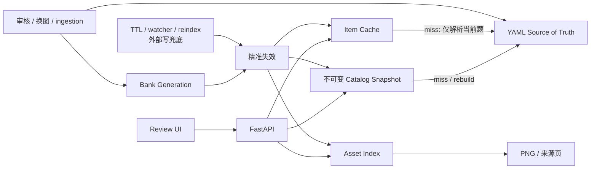

# Question-Bank Review UI 性能重构设计文档

> 状态：已定稿，阶段 0–6 全部实施完成（热态性能达标，回归测试覆盖）
> 适用范围：`.codex/skills/math-topic-question-bank/scripts/question_bank_review_server.py` 及其前端 `static/question-bank-review.js`
> 数据规模基线：76 个题库、约 2000 题、855MB（其中 staging 约 1600 题）
>
> 本文是性能改造的**唯一实施依据**。所有 file:line 引用基于当前 `main` 分支。

---

## 0. TL;DR

当前设计把 YAML 文件系统同时当作**源数据、搜索索引、统计数据库、图片索引**。每个读请求都从源文件重新推导所有结果，导致大量重复计算。本方案的核心是把"源文件"和"读模型"分离：

```text
旧：每个请求 → 从全部源文件重新构建视图
新：源文件变化 → 增量更新读模型；用户请求 → 直接查询已构建的读模型
```

三件最高 ROI 的改动（不改存储格式、风险最低、预计把搜索/刷新从秒级降到百毫秒以内）：

1. **catalog snapshot 缓存**（带粗+细两层失效）
2. **统一 AssetIndex**，让图片路由不再为取一个文件而重建整卷
3. **搜索不重载未变化的题库** + `AbortController`

实施前还必须补三件容易遗漏的事，否则会在"缓存会不会错、并发会不会乱、外部写怎么发现"上翻车：

- (a) 把 **ingestion / 换图 writer 纳入 generation 失效契约**（跨 skill 责任，不是 server 单方面）
- (b) 明确 **generation 的持久化形态**
- (c) AssetIndex、`errors` 走**同一套失效纪律**，并保留 `?v=` 缓存破坏
- (d) 补**并发与换图的回归测试**（当前仓库无任何测试）

---

## 1. 背景：慢在哪里

### 1.1 实测数据（只读实测，main 分支）

| 场景 | 耗时 | 说明 |
|---|---|---|
| catalog 全量扫描与汇总 | ≈ 2.25 s | `discover()` glob 全部 manifest + `summary()` 逐题统计 |
| 单张 25 题试卷详情 | ≈ 0.29 s | `_staging_detail` 每题解析 3 份 YAML |
| 首次加载（facets + 列表 + 详情） | ≈ 4.8 s 起步 | 串行瀑布，facets 和列表各算一遍全量 |
| 一次搜索 | ≈ 2.5 s | 搜索后还会重新加载选中题库 |
| 单次响应体 | ≈ 32KB + 59KB | 网络传输不是主要问题 |

### 1.2 根因：放大器清单（file:line 锚点）

| # | 放大器 | 位置 | 说明 |
|---|---|---|---|
| A1 | `discover()` 每次全量 glob+解析 | `question_bank_review_server.py:306-356` | 每个请求都 glob 全部 `question-bank.yaml` / `paper.yaml` 并解析 YAML |
| A2 | `record(bank_id)` 借 `discover()` 查单条 | `:358-363` | 查单个题库 = 重新全库扫描 |
| A3 | staging summary 逐题读 source/review | `:365-411` | 统计通过/退回/过期要遍历所有题目的 `source.yaml`+`review.yaml`；即使只搜标题也会先读约 1600 道 staging 题 |
| A4 | facets 和 list 各自 discover+summary | `:1345`、`:1363` | 首屏同一份 catalog 连算两遍，且串行 |
| A5 | detail 每题解析三份 YAML | `:588-599` | source + student.resolved + teacher.resolved |
| A6 | **图片路由走 `detail()`** | `:1399-1409` | 取一张图片 = 重建整卷 |
| A7 | **来源页路由走 `record()`→`discover()`** | `:1411-1420` | 同类放大器，A6 的姊妹 |
| A8 | `approve_all_staging` 循环内重复 `record()` | `:1133-1135` | 25 题会重复 discover 25 次（每题 `write_staging_review` 内部各调一次 `record`） |
| A9 | `/healthz` 每次 discover | `:1332-1335` | 健康检查本身是慢路径 |
| F1 | 前端串行 facets→applyFilters | `question-bank-review.js:1015-1016` | `loadBanks` 串行调 `loadFacets()` 再 `applyFilters()` |
| F2 | 搜索后强制 `selectBank()` | `question-bank-review.js:986` | 过滤完成后无条件重载整卷详情 |
| F3 | 过滤期间隐藏整个 layout | `question-bank-review.js:951,985` | 搜索过程中界面消失 |
| F4 | 无 `AbortController` | `question-bank-review.js:829,944` | 仅 token guard 丢弃旧结果，服务端工作并未取消 |

> MathJax 排版（`:716-730`）只排版当前 `#reader`，是题目切换延迟的次要因素，不是搜索/刷新慢的主因。

---

## 2. 目标与非目标

### 2.1 目标

- 首屏（bootstrap）端到端 **< 300ms**（缓存热态）。
- 单次搜索 **< 50ms**（服务端，热态）。
- 图片/来源页请求 **< 5ms**（命中索引）。
- 内部写后（审核、换图）UI 反映新状态 **< 100ms**。
- 不改变 YAML/PNG 存储格式与现有单题审核语义。

### 2.2 非目标（明确不做）

- **不在第一阶段引入 SQLite**。2000 题规模下，进程内缓存 + 显式/mtime 失效足够。SQLite 是题量继续增长后的第二阶段方案。
- **不在第一阶段做浏览器本地搜索**。summary 缓存后，服务端过滤本身已是毫秒级，无需维护两套筛选规则。`search_text` 下沉仅作为"需要离线即时搜索时"的可选后续。
- **不引入多 worker**。本地 Review UI 维持单进程单 worker。这与"暂不引入 SQLite"是耦合决策（单进程内缓存 + `RLock` 即可，无需跨进程同步）。若未来要横向扩展，直接走 SQLite，绕开分布式缓存复杂度。
- **不改变写侧 YAML 的透明性**。YAML 继续是人工可审查的权威源。

---

## 3. 目标架构



核心原则：**写侧保 YAML 透明，读侧为 UI 建立高效索引**——一个轻量版 CQRS。

---

## 4. 读模型分层

| 层 | 内容 | 更新策略 |
|---|---|---|
| Source of truth | YAML、PNG | 审核和图片操作时原子写入 |
| Catalog snapshot | 题库 ID、标题、年级、地区、计数、归一化字段、`errors` | 启动构建，写操作后局部更新 |
| Item cache | 当前题的题干、答案、解析、图片元信息 | 按 generation 失效 |
| Asset index | `(bank, item, role) → Path` + 来源页 `(bank, item, role, index) → Path` | 题目解析时产生，换图后局部刷新 |
| Browser state | summaries、facets、当前选择 | 搜索筛选由服务端完成 |

### 4.1 Catalog Snapshot（不可变快照）

snapshot 是一个**不可变对象**（frozendict / 命名元组 / dataclass(frozen)），包含：

- `records_by_id: dict[str, BankRecord]`
- `summaries: list[dict]` 与 `summaries_by_id: dict[str, dict]`
- `facets: dict`（kinds/grades/years/exam_types）
- `errors: list[str]`
- `generation_by_bank: dict[str, int]`（每个 bank 的版本号）
- 全局 `generation: int`（单调递增，每次重建自增）

读侧只拿引用，**绝不原地修改**；更新时构造新对象，最后一次性替换引用（Python 引用赋值原子）。

### 4.2 归一化字段随 summary 一起缓存

确认事实：`_filter_bank_summaries`（`:1267-1305`）**不做任何归一化**，归一化全部在 `parse_paper_id()`（`:67-97`）和 `summary()`（`:395-409`）上游完成。因此缓存的 summary **自带归一化的 year/exam_type/district 字段**，服务端在内存 summary 上做字段比较 + 子串匹配是零成本。这是"搜索保留服务端、不做本地过滤"成立的关键依据。

### 4.3 errors 必须进 snapshot 并同步失效

当前 `discover()` 返回的 `errors`（重复 id、schema 不符）被 facets、list、healthz 各自消费。缓存后 errors 必须是 snapshot 的一部分，且随 generation 同步更新，否则"修了一个重复 id 后 UI 仍提示报错"。

---

## 5. 一致性与失效契约（最重要的章节）

这是三层评审里补出来的关键部分。**只检查 manifest mtime 无法发现所有外部写入。**

### 5.1 mtime 两层方案的边界

```text
items/Q001/source.yaml 被外部脚本修改
items/Q001/review.yaml 被外部脚本替换
teacher.resolved.assignment.yaml 被重新生成
```

这些操作**不会修改** `paper.yaml` / `question-bank.yaml`，**父目录 mtime 也不可靠**（`os.replace` 写入子目录内文件不更新父目录 mtime）。因此单靠"检查 76 个 manifest 的 mtime"会漏失效。

### 5.2 三类写入路径，三种失效策略

| 写入路径 | 检测手段 | 失效动作 |
|---|---|---|
| **UI 内部写**（审核、换图、删图） | 写完后显式 `invalidate(bank_id, item_id)`，`generation += 1` | 精准失效该 bank 的 summary/item/asset |
| **受控外部写**（ingestion skill、几何图 resolve、重新生成 resolved） | writer 写完 bump `.catalog-version`，或调 `POST /api/admin/reindex?bank=...` | 精准失效 |
| **不受约束的外部写**（手工编辑 YAML） | TTL 扫描兜底（建议 10–30s）或文件 watcher | 重建受影响 bank |

### 5.3 generation 持久化形态（推荐组合）

不要让"预热"和"外部写检测"两个目标互相打架。推荐：

```text
运行时 generation：内存（进程内 RLock 保护）
冷启动：做一次全量 stat → 喂 snapshot
受控 writer：bump artifacts/题库/<bank>/.catalog-version
外部写兜底：watcher / 低频 TTL 扫描
```

- **纯内存计数器** → 进程重启即丢，每次重启都全量重建。后台预热只对单次进程生命周期有效。
- **per-bank `.catalog-version`** → ingestion writer 好 bump，但若每个列表请求 stat 76 个版本文件，又回到线性 stat（虽比 3200 次小一个量级）。
- **bank_root 下单一索引文件** → 一次 stat，但成为写入热点。

推荐组合让**常态请求是 O(1) 内存命中**，只在冷启动付一次全量 stat。

> `.catalog-version` 文件本身也要纳入 git 忽略或视为可重建产物（ingestion 可重建），避免成为合并冲突点。

### 5.4 不要让搜索请求承担 3200 次 stat

粗粒度层只 stat 受影响 bank 的 manifest + 版本文件；未受触碰的 bank summary 直接命中。常态命中是 **O(banks 受影响)** 而不是 O(items)。绝不能退化成"每次搜索 stat 全部 source/review"。

---

## 6. 并发与更新协议（copy-on-write）

FastAPI 同步路由跑在线程池（默认 40 线程），存在真实并发。缓存 + 显式失效需要锁。

### 6.1 选型

`threading.RLock`（单进程足够；多 worker 见 §2.2 非目标）。

### 6.2 不要持锁重建全库

持有 `RLock` 扫描解析 YAML，会让一个慢请求阻塞所有读者。区分两种重建：

- **全量重建（冷启动 / reindex）**：走完整 COW 四步。
- **单 bank 增量失效（内部写后）**：重建对象只是该 bank 的 summary（几十题），持锁窗口短，直接 write-lock 重建 + 原子替换引用即可，不必 generation 重试。

### 6.3 全量重建 COW 四步

```text
1. 锁内读取当前 generation
2. 锁外构建新 snapshot（扫描+解析）
3. 锁内检查 generation 是否变化
4. 未变化 → 原子安装；变化 → 丢弃或重试
```

### 6.4 item cache / asset index 同理

item cache 和 asset index 也不能在无锁状态下原地增删。读侧拿不可变引用，写侧构造新 dict 再替换。

---

## 7. ingestion / 换图 writer 的跨 skill 责任划分

> 这是 server 单方面改不动的部分，**必须写进各 writer skill 的约定**。

### 7.1 受控 writer 清单

| Writer skill | 触发的失效 |
|---|---|
| `math-pdf-question-bank-ingestion` | 写完 staging 后 bump `.catalog-version` |
| `math-docx-question-bank-ingestion` | 同上 |
| `math-geometry-diagram-renderer` | resolve 换图后 bump（替换 `prompt-01.png`、`*.resolved.assignment.yaml`） |
| `math-adaptive-practice-latex-data` / `math-student-explanation-latex-data` | 重新生成 resolved YAML 后 bump |
| Review UI 内部审核 / 换图 | server 自己 `invalidate()`，不需 bump 文件 |

### 7.2 落地动作

1. 在 review server 提供 `POST /api/admin/reindex?bank=<bank_id>`（可选 body 指定 item）。
2. 提供一个轻量 CLI（`scripts/notify_catalog_version.py` 或复用 ingestion 的 helper）写 `.catalog-version`。
3. 在上述每个 writer 的 SKILL.md "写完后"步骤里加一条：调 CLI 或 endpoint 通知 review server。

**如果只改 review server、不约束 ingestion writer**，所有 ingestion 写入都会落到"TTL/watcher 兜底"这条慢路径，generation 机制形同虚设。这是评审第三轮识别的最大落地风险。

---

## 8. 后端 API 变更

### 8.1 新增 `/api/bootstrap`

一次返回 `summaries + facets + errors + number_review_url`，消灭首屏 A4（facets 和 list 各算一遍）。

```json
{
  "banks": [/* summaries */],
  "facets": {"kinds":[], "grades":[], "years":[], "exam_types":[]},
  "errors": [],
  "number_review_url": "..."
}
```

读 snapshot，O(1)。

### 8.2 `/api/banks` 和 `/api/banks/facets` 保留，但读 snapshot

签名不变，行为变成"读 snapshot → 内存过滤"。`_filter_bank_summaries` 原样复用（归一化字段已在 summary 里）。这两个接口在 bootstrap 之后基本不再被首屏调用，但保留用于手动刷新。

### 8.3 拆分卷级与单题详情

当前 `/api/banks/{id}`（`:1391-1397`）一次返回整卷，每题 3 份 YAML。拆为：

- **`GET /api/banks/{id}`** → 卷级信息 + 轻量题目目录：
  ```json
  {
    "id": "...",
    "counts": {"approved":0,"rejected":0,"stale":0,"pending":0},
    "items": [
      {"id":"Q001","title":"第 1 题","review_status":"approved","stale":false}
    ]
  }
  ```
- **`GET /api/banks/{id}/items/{item_id}`** → 单题完整详情（stem/answer/solution_steps/previews）。

item cache 命中则 O(1)；未命中只解析当前题 3 份 YAML（而非整卷）。

> **兼容契约**：前端当前依赖整卷 items 做上一题/下一题（`navigateItem`，`:739-746`）和"找下一题未审核"（`findNextReviewIndex`，`:571-578`）。因此卷级接口**必须返回 item id 目录 + 每题的 review_status**，否则破坏导航。前端在加载卷级目录后逐题懒加载详情。

### 8.4 AssetIndex 统一 assets + source-pages

- `GET /api/assets/{bank_id}/{item_id}/{role}`（`:1399-1409`）：改读 AssetIndex，命中直接 `FileResponse`，**不再调 `detail()`**。
- `GET /api/source-pages/{bank_id}/{item_id}/{role}/{index}`（`:1411-1420`）：改读 AssetIndex（来源页索引），**不再调 `record()`→`discover()`**。

> 数据源差异（注意）：assets 的 `preview_files` 是 `_staging_detail` / `detail` 渲染时的副产物（`dict[(item_id,role),Path]`）；来源页路径来自 `_word_evidence_pages` 读取 `source.word_evidence[].page_image`（`:517-549`），**当前没有进入 `preview_files`**。因此 AssetIndex 必须同时消费这两个数据源，单独构建来源页的 `(bank,item,role,index) → Path` 映射。

> `?v={mtime}` 缓存破坏必须保留（`_asset_url` `:212-215`、来源页 `:546`）。换图后 path 变了或文件被原地替换，URL 的 `v` 必须跟着变，否则浏览器显示旧图。AssetIndex 存 path 时一并存其 mtime_ns 供 URL 生成。

### 8.5 新增 `POST /api/admin/reindex`

```text
POST /api/admin/reindex?bank=<bank_id>      # 精准失效某 bank
POST /api/admin/reindex                      # 全量重建
```

供受控外部 writer 调用。

### 8.6 `/healthz` 改读 snapshot

当前 `:1332-1335` 每次 discover。改为返回 `{ok, ready, banks, errors}`，其中 `ready` 反映预热状态（见 §10.3 冷启动）。健康检查本身不得是放大器（A9）。

---

## 9. 后端 `approve_all_staging` 批量重构（A8）

当前 `:1121-1140` 循环内调 `write_staging_review`，而后者内部 `record(bank_id)`（`:1082`）= 全库 discover。25 题 = 25 次全库扫描。

### 9.1 提取内部方法

```python
def write_staging_review(self, bank_id, item_id, decision):
    record = self.record(bank_id)              # 保留公开入口的完整校验
    return self._write_staging_review_with_record(record, item_id, decision)

def _write_staging_review_with_record(self, record, item_id, decision):
    # 不再 record()；直接用传入的 record
    ...

def approve_all_staging(self, bank_id):
    record = self.record(bank_id)              # 只 discover 一次
    for item_id in self._staging_item_ids(record):
        self._write_staging_review_with_record(record, item_id, approve)
    # 写完后精准失效（generation += 1，刷 counts）
    self._invalidate_bank(bank_id)
    return self._paper_counts(record)          # 见 9.2
```

不能直接删 `write_staging_review` 里的 `record()`，否则单题审核会丢校验。

### 9.2 返回值契约

当前 `approve_all_staging` 返回完整 `detail`（`:1138`），前端 `approveWholePaper`（`js:681`）依赖 `payload.items` 替换 `state.detail.items`。

两种选择：
- **(推荐) 改前端**：bulk approve 后只刷 counts + 当前题 review，不重拉整卷。后端返回 `{counts, updated_reviews: {item_id: review}, errors}`。
- **(兼容) 保留返回整卷**：代价是失去懒加载收益。仅作过渡期 fallback。

文档建议走推荐方案，并在实施时同步改 `approveWholePaper`。

---

## 10. 前端变更

### 10.1 首屏改用 bootstrap（F1）

`loadBanks`（`:1002-1017`）由 `loadFacets()` → `applyFilters()` 串行，改为单次 `GET /api/bootstrap`，然后本地填 facets + 列表，再触发首次 `selectBank`。

### 10.2 搜索行为（F2、F3、F4）

`applyFilters`（`:943-992`）：

- 只有当选中的 `bank_id` **真正变化**时才调 `selectBank()`（当前 `:986` 无条件重载）。
- 搜索过程中**不隐藏整个 `review-layout`**（当前 `:951,985`）。
- 引入 `AbortController`：旧请求在浏览器侧取消；配合 server 端短路（token guard 已有，`requestToken`/`filterToken` 保留作为第二道防线）。

### 10.3 单题懒加载 + 预取（配合 §8.3）

- 加载卷级目录后，先加载当前题（`state.itemIndex`），空闲预取前后各一题。
- `navigateItem`（`:739-746`）逻辑不变，仍走 `state.itemIndex`，但目标题若未加载则触发单题请求（期间显示骨架）。
- `submitReview`（`:596-644`）当前已不重拉整卷、就地用返回的 review 更新——**保留这个良好行为**，只需把"单题接口返回的 review"喂回去。

### 10.4 冷启动态

`/healthz` 增加 `ready` 后，UI 在 `warming` 时显示"正在建立题库索引"。

---

## 11. 分阶段实施计划

> 顺序经过三轮评审调整，每阶段可独立合入并验证。
>
> **实施状态**：阶段 0–6 全部完成，热态性能对照 §12.3 全部达标（见 `bench_review_server.py`
> 跑出的实测：bootstrap p95≈0.9ms、搜索≈1.0ms、卷级≈1.8ms、单题≈1.9ms、资产≈2.4ms）。
> 回归测试见 `tests/test_question_bank_review_cache.py`（bootstrap/目录/单题/reindex/
> catalog-version/指纹/TTL watcher 共 10 个阶段 4/5/6 测试）。

### 阶段 0：基线与可观测（先做）

- [x] 引入 pytest 配置（当前仓库无 `pytest.ini`/`pyproject.toml`，需新建）。
- [x] 在 `discover` / `summary` / `_staging_detail` / `preview_asset` / `source_page_asset` 加耗时埋点 + 计数器（YAML parse 次数、discover 次数、cache hit/miss）。
- [x] 写一个 `bench_review_server.py`：冷热态下各接口 p50/p95。
- 改造前后对比，**光靠体感不行**。

### 阶段 1：消灭重复 discover（A1、A2、A4、A9）

- [x] 引入不可变 Catalog Snapshot + `records_by_id` + `RLock`。
- [x] `/healthz` 改读 snapshot（A9）。
- [x] `/api/banks` 和 `/api/banks/facets` 改读 snapshot（A4）。
- 验证：search/list 降到毫秒级。

### 阶段 2：统一 AssetIndex（A6、A7）

- [x] 构建 assets + source-pages 两个映射（注意数据源差异，§8.4）。
- [x] 图片/来源页路由改读索引，保留 `?v=`。
- 验证：单图请求 < 5ms。

### 阶段 3：批量审核修复（A8）

- [x] 提取 `_write_staging_review_with_record`（§9.1）。
- [x] bulk approve 走精准失效 + counts 刷新（§9.2 推荐方案）。
- [x] 同步改前端 `approveWholePaper`。

### 阶段 4：前端搜索/取消（F1–F4）

- [x] bootstrap 接口 + 前端首屏改造。
- [x] `applyFilters` 不重载未变化 bank、不隐藏 layout、加 `AbortController`。

### 阶段 5：单题懒加载（A5）

- [x] 拆卷级目录 / 单题详情接口（§8.3）。**兼容开关**：`/api/banks/{id}?directory=1`
  返回轻量目录；默认仍返回整卷（§14 反向命名，保已提交测试与未升级前端）。
- [x] Item cache + 前端懒加载 + 预取。

### 阶段 6：外部写兜底（§5、§7）

- [x] `.catalog-version` + `POST /api/admin/reindex`。
- [x] ingestion / geometry / resolved writer 联动 bump（写进各 SKILL.md）。
- [x] TTL/watcher 兜底（`--external-write-ttl`，默认关）。
- [x] 并发与换图回归测试（§12）+ reindex/catalog-version/TTL 测试。

---

## 12. 测试与验证策略

> 当前仓库**无任何 review server 测试**，无 pytest 配置。测试是新建项。

### 12.1 正确性单测

- `discover` / `summary` / `_review_state` / `_filter_bank_summaries` / `parse_paper_id` 的纯函数行为（先冻结当前行为作为回归基线）。
- AssetIndex 在文件被**原地替换**后仍返回新内容（回归 `?v=` 缓存破坏）。
- errors 进 snapshot 且随 generation 更新。

### 12.2 并发与失效测试（最关键）

并发错和陈旧数据错是"过单测、在生产偶发"的典型，必须显式覆盖：

- 模拟"外部写 + 并发读"，断言在 TTL/契约窗口内不返回陈旧数据。
- 模拟"边审核边搜索"：审核线程持锁更新 snapshot，读线程始终拿到完整一致的快照（不出现 counts 与 items 不匹配）。
- COW 全量重建期间读者不被阻塞（用耗时注入验证）。
- `approve_all_staging` 期间 `record()` 只调用 1 次（断言 discover 计数）。

### 12.3 性能基准（阶段 0 建立，每阶段对比）

| 接口 | 冷态目标 | 热态目标 |
|---|---|---|
| `/api/bootstrap` | < 2.5s（首次构建） | < 50ms |
| `/api/banks?q=...` | < 2.5s | < 50ms |
| `/api/banks/{id}`（卷级目录） | < 300ms | < 30ms |
| `/api/banks/{id}/items/{item}` | < 100ms | < 20ms |
| `/api/assets/...` | < 50ms | < 5ms |
| `/api/source-pages/...` | < 50ms | < 5ms |

运行：`./.venv/bin/python -m pytest`（通用工具）。

---

## 13. 风险与约束

| 风险 | 缓解 |
|---|---|
| 外部 writer 不 bump 版本 → generation 失效 | TTL/watcher 兜底 + §7 跨 skill 契约写进各 SKILL.md |
| `.catalog-version` 成为合并冲突点 | git 忽略或标记可重建 |
| 单 worker 限制未写清 → 误开多 worker 缓存不同步 | 写进部署说明；多 worker 时强制走 SQLite |
| 冷启动阻塞首请求 | 后台预热 + `/healthz.ready` |
| 批量 approve 改返回值破坏前端 | §9.2 同步改 `approveWholePaper`，或过渡期保留整卷返回 |
| 拆单题接口破坏导航 | §8.3 卷级目录必须含 item id + review_status |
| mtime 漏失效（父目录 mtime 不可靠） | §5 不依赖父目录 mtime；用 generation + per-file stat |

---

## 14. 回滚策略

每阶段独立合入。若某阶段出问题：

- 阶段 1（snapshot）：保留 `discover()` 路径作为 `?fallback=1` 开关，一键切回。
- 阶段 2（AssetIndex）：索引未命中时回退到 `detail()`（过渡期双写）。
- 阶段 5（单题接口）：卷级接口在 query `?expand=1` 时仍返回整卷（兼容旧前端）。

---

## 附录 A：评审演进（三轮）

1. **第一轮**：识别 P0（catalog 缓存、图片路由去 detail、搜索不重载）+ P1（bootstrap、单题懒加载）+ P2（增量计数）。方向正确。
2. **第二轮**：补 `/api/source-pages` 同类放大器、`approve_all_staging` 提取内部方法、不可变快照 + COW、卷级轻量目录。
3. **第三轮**：补外部写一致性契约（generation + ingestion 联动）、generation 持久化形态、AssetIndex/errors 同套失效、并发与换图回归测试、冷启动按产品行为选。

本文档为三轮合并后的定稿。
