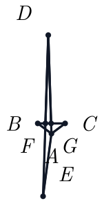
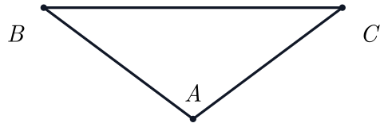
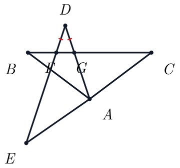

# 第 18 题几何图链路 Benchmark（2026-07-17）

## 范围

- 输入：`2026-07-16-第18题旋转相似等腰分类` 的原题图与 `DF=DG` 讲解图。
- 老链路：独立 clean `main` worktree，commit `d45089f`，原题图完成后才运行讲解图。
- 新链路：commit `9926f7d`，主 Agent 编写 scene payload，依次执行 `render → preview → finalize_round`。
- Wolfram 始终串行；未运行 10 题反 A 型任务。

## 结果

| 指标 | 老链路 | 新链路 |
| --- | ---: | ---: |
| 原题图 wall time | 28.47 s | 5.55 s |
| 讲解图 wall time | 40.77 s | 6.46 s |
| 合计 wall time | 69.24 s | 12.01 s |
| 相对速度 | 1.00× | 5.77× |
| 耗时下降 | — | 82.7% |
| 嵌套 SDK scene generation | 64.20 s | 0 s |
| Wolfram 求解器内部 solve time | 0.33 s | 0.54 s |
| 首轮视觉正确率 | 1/2 | 1/2 |
| 最终视觉正确率 | 1/2 | 2/2 |
| 图形退化 | 1 | 0 |
| 缺失/错误标记 | 1 | 0 |
| 严重标签问题（最终） | 1 | 0 |
| 人工确认 | 0 | 0 |

新链路计时包括一次讲解图 preview 失败、一次 visual patch 和第二次 preview；visual patch 没有重新调用 Wolfram。主 Agent 在对话中编写 scene payload 的思考时间无法由子进程 profile 单独计量，因此 wall time 对比主要反映链路执行时间和被移除的嵌套 SDK 时间。

## 质量观察

- 老原题图可用，且没有泄露讲解标注。
- 老讲解图明显纵向退化，F/G/A/E 标签拥挤，并且 SDK 生成了不受支持的 `equal_length` marker；老 audit 仍误判为通过。
- 新原题图保持干净。
- 新讲解图复用原题图 A/B/C 坐标，几何关系正确并显示 `DF=DG` 等长刻痕。
- 新讲解图第一次 preview 被确定性审核以 `blocking:label_overlap:F:G` 拦截；一次标签 visual patch 后通过。

## 新讲解图 WL

```wl
GeometricScene[
  {A, B, C, D, E, F, G},
  {
    GeometricAssertion[
      {Triangle[{A, B, C}], Triangle[{A, D, E}]},
      "Congruent"
    ],
    Element[F, Line[{A, D}]],
    Element[F, Line[{B, C}]],
    Element[G, Line[{D, E}]],
    Element[G, Line[{B, C}]],
    EuclideanDistance[D, F] == EuclideanDistance[D, G]
  }
]
```

运行时只由 host 注入已锁定的 A/B/C 坐标；没有额外添加角度、方向、非退化或旋转推导约束。

## 图片

| | 原题图 | 讲解图 |
| --- | --- | --- |
| 老链路 |  |  |
| 新链路 |  |  |
