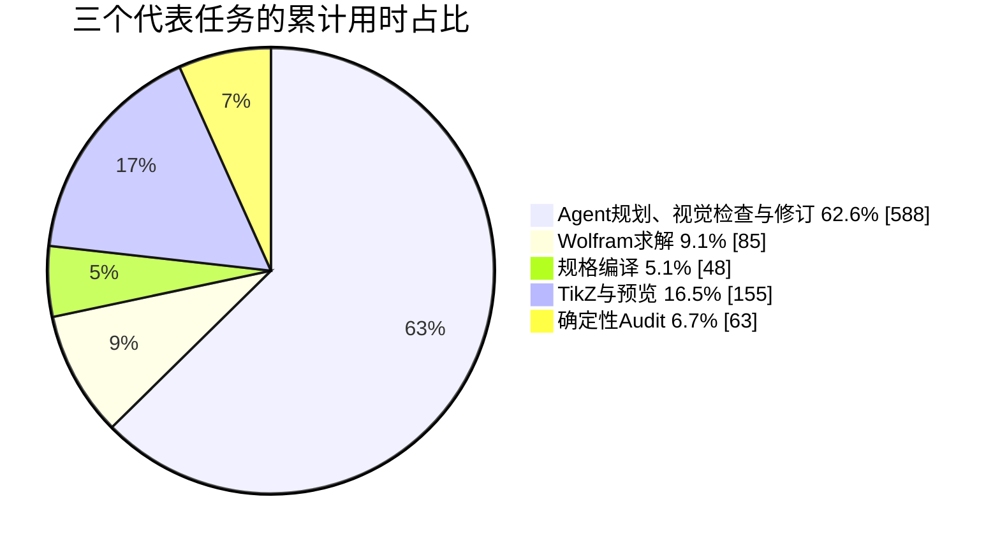
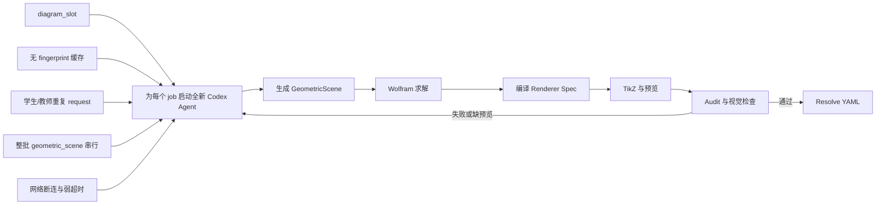
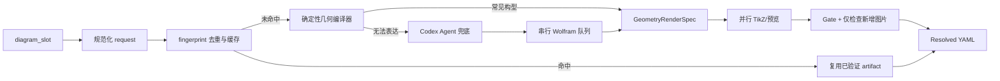

# 生图工作流耗时分步与瓶颈报告

生成日期：2026-07-11
样本：`artifacts/专题/2026-07-09-比例辅助线边比/build/diagram/jobs`

## 1. 结论摘要

- 正常成功任务单次耗时集中在 **3.3～5.6 分钟**，说明“每图约 4～5 分钟”是当前架构的稳定固定成本。
- 两次异常失败分别耗时 **70.3 分钟**和 **43.3 分钟**，合计浪费 **113.6 分钟**，远高于正常成功任务的总耗时。
- 对三个连续、产物时间戳完整的教师版任务做分步统计后，**Agent 规划、读结果、视觉检查和修订决策占 62.6%**；Wolfram 求解只占 **9.1%**。主要瓶颈不是 Wolfram 数学求解。
- 学生版和教师版 q1/q2/q3 的规范化 request 完全一致，却分别生成；仅这三组重复任务就可确认浪费约 **11.4 分钟**。
- 现有历史 round 中有 **6 次 audit 仅因为 `missing_preview_png` 被阻断**，说明预览环境故障正在被错误地当作内容质量问题重试。

## 2. 单任务耗时

为避免 70 分钟异常值把正常任务压扁，正常成功任务和失败异常分开显示。

### 2.1 正常成功任务

```mermaid
xychart-beta
    title "正常成功任务耗时（分钟）"
    x-axis [讲解1, 讲解2, 讲解3, 讲解4, 学生Q1, 学生Q2, 学生Q3重跑, 教师Q1, 教师Q2, 教师Q3]
    y-axis "分钟" 0 --> 6
    bar [4.1, 5.6, 3.3, 5.4, 4.8, 4.6, 4.1, 5.4, 3.6, 5.6]
```

### 2.2 异常失败任务

```mermaid
xychart-beta
    title "异常失败任务耗时（分钟）"
    x-axis [讲解5网络断连, 学生Q3超时]
    y-axis "分钟" 0 --> 75
    bar [70.3, 43.3]
```

| 任务 | 耗时 | 状态 | 直接原因 |
|---|---:|---|---|
| explanation-step5-solution | 70.3 分钟 | 失败 | Codex response stream 断连，端到端超时未及时收口 |
| practice-student-q3-prompt | 43.3 分钟 | 失败 | Agent 超时；之后重跑 4.1 分钟成功 |

## 3. 单图生成过程的分步用时

分步统计选取三个连续完成、文件时间戳完整的教师版任务。阶段定义如下：

1. **Agent/视觉决策**：启动到生成 scene、round 间读图修订、最终检查和 finalize。
2. **Wolfram**：`scene_payload.json` 到 `render_result.json`。
3. **规格编译**：`render_result.json` 到 `final_renderer_spec.json`。
4. **TikZ/预览**：renderer spec 到 `renderer_result.json`，包含 Agent 工具调度等待。
5. **确定性 audit**：`renderer_result.json` 到 `audit_result.json`。

| 任务 | Agent/视觉 | Wolfram | 规格编译 | TikZ/预览 | Audit | 合计 |
|---|---:|---:|---:|---:|---:|---:|
| 教师 Q1 | 242 秒 | 34 秒 | 22 秒 | 23 秒 | 25 秒 | 346 秒 |
| 教师 Q2 | 111 秒 | 15 秒 | 8 秒 | 90 秒 | 10 秒 | 234 秒 |
| 教师 Q3 | 235 秒 | 36 秒 | 18 秒 | 42 秒 | 28 秒 | 359 秒 |
| **合计** | **588 秒** | **85 秒** | **48 秒** | **155 秒** | **63 秒** | **939 秒** |



这组分步数据说明：即使不考虑网络异常，主要时间仍花在 Agent 的多轮规划、读文件、看图、修订和工具调用往返；Wolfram 本身不是主要耗时项。Q2 的 TikZ/预览阶段出现 90 秒异常，也表明预览工具链需要独立的超时和 preflight，不能把环境故障交给 Agent 自行猜测。

## 4. 瓶颈位置



### 瓶颈一：每图一个完整 Agent 循环

当前 Agent 不只生成几何规格，还负责启动 Wolfram、调用渲染器、读 audit、打开图片、判断、修订和 finalize。正常任务中约 62.6% 的时间消耗在这一层。

### 瓶颈二：没有真正的缓存与去重

collector 虽然生成 `content_hash`，执行器仍会无条件运行 job。学生版和教师版三个完全相同的练习图被重复生成；同一 plan 再次执行时也不会复用已经 gate 通过的结果。

```mermaid
xychart-beta
    title "完全相同 request 去重后的可确认收益"
    x-axis [当前成功Agent耗时, 去重后]
    y-axis "分钟" 0 --> 40
    bar [38.0, 26.6]
```

这里只计算已经用 fingerprint 确认的三组学生/教师重复任务，尚未计入 explanation 步骤图真正复用、失败重跑和重复执行整批工作流可节省的时间。

### 瓶颈三：复用只做校验，没有复用计算结果

explanation 第 2～5 步都引用第 1 步，但当前实现仍重新生成 scene、重新求解坐标，最后才校验基础点是否漂移。正确结构应该是：

```text
base_geometry = 一次求得的点和线
step_2 = base_geometry + 辅助点/平行线 overlay
step_3 = step_2 + 共线关系显示 overlay
step_4 = step_2 + 相似三角形高亮 overlay
step_5 = step_2 + 比例链标注 overlay
```

### 瓶颈四：串行边界过粗

Wolfram kernel 当前必须串行是合理约束；问题是调度器把包含 `geometric_scene` 的整个 level 都设为单 worker，因此 Codex 网络等待、TikZ 编译和 audit 也全部被串行化。

### 瓶颈五：基础设施失败进入内容修订循环

预览器只查找 `tectonic`，机器上实际可用的是 XeLaTeX。本次任务通过临时 shim 才恢复预览。`missing_preview_png` 不应消耗 Agent repair round；应在工作流启动前失败并给出明确环境错误。

## 5. 建议的目标流程



实施顺序：

1. XeLaTeX/Tectonic 预览选择、preflight、独立硬超时。
2. 规范化 request fingerprint、跨学生/教师去重、增量跳过。
3. base geometry 与 overlay 分离，solution 步骤不再重新求解基础图。
4. 为三角形分点、交点、平行线等常见模型建立 typed deterministic compiler。
5. 将 Codex 规划、Wolfram 求解、TikZ 编译拆成独立调度阶段；只串行 Wolfram。

## 6. 数据口径说明

- 单任务耗时来自该 thread 已整理的 `agent.start`、`workflow.finalize`、`agent.end` 事件。
- 分阶段耗时来自三个连续教师版任务的 round 文件修改时间；因此它是外部可观测 wall-clock 分配，阶段之间的 Agent 工具调度等待归入相邻阶段。
- 当前 artifact 目录包含多次追加运行，同一 job 的 `agent_result.json` 会被后一次运行覆盖；因此报告分别使用 thread 事件做单次任务图、使用最新成功结果做去重收益统计，避免把覆盖后的结果误当成首轮耗时。
