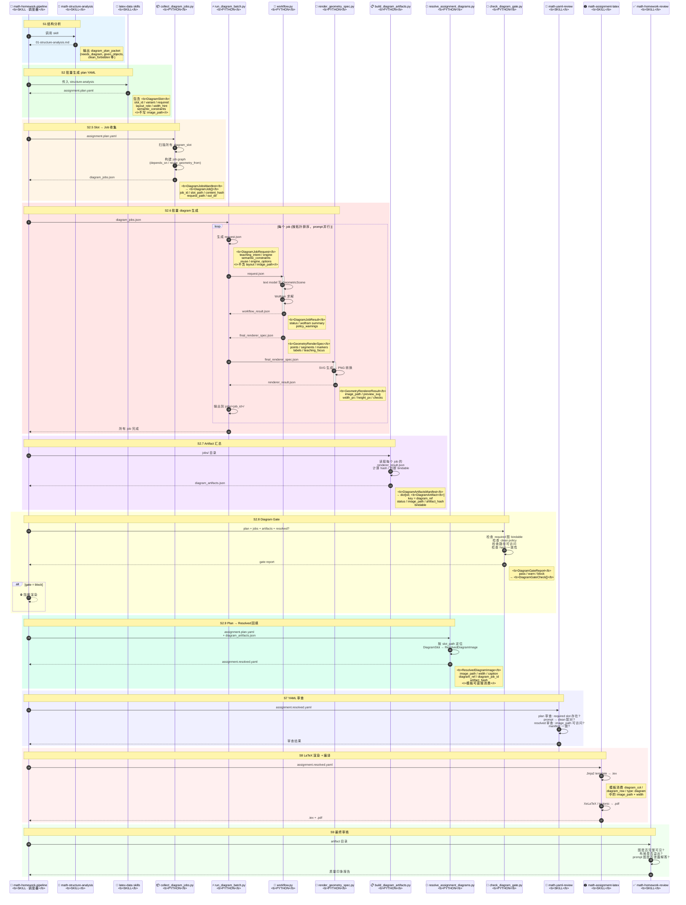
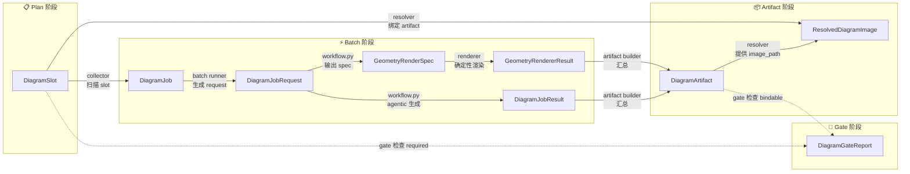

# Diagram Workflow 时序图

## 参与者分类

| 类型 | 参与者 | 说明 |
|------|--------|------|
| **Skill** | `math-structure-analysis` | 结构分析 |
| **Skill** | `math-student-explanation-latex-data` / `math-practice-latex-data` | 生成 plan YAML + DiagramSlot |
| **Skill** | `math-homework-pipeline` | 端到端调度器，编排所有 diagram 阶段 |
| **Skill** | `math-yaml-review` | 渲染前 YAML 审查 |
| **Skill** | `math-assignment-latex` | resolved YAML → TeX/PDF |
| **Skill** | `math-homework-review` | 最终独立审核 |
| **Python** | `collect_diagram_jobs.py` | slot → jobs manifest |
| **Python** | `run_diagram_batch.py` | 按 job graph 调度单图任务 |
| **Python** | `workflow.py` | 单图 agentic 生成（Wolfram GeometricScene） |
| **Python** | `render_geometry_spec.py` | spec → SVG/PNG 确定性渲染 |
| **Python** | `build_diagram_artifacts.py` | 汇总所有 job 结果为 artifact manifest |
| **Python** | `resolve_assignment_diagrams.py` | plan YAML + artifacts → resolved YAML |
| **Python** | `check_diagram_gate.py` | required 图 / policy / 路径检查 |

## 时序图



## 数据结构流转总览



## 关键模块边界

### Skill 与 Python 的分工原则

| 原则 | Skill 负责 | Python 负责 |
|------|-----------|------------|
| **决策权** | 判断"哪里需要图"、"图的教学用途"、"失败策略" | 执行"生成这一张图"、"渲染这个 spec"、"检查这些路径" |
| **数据所有权** | 写入 DiagramSlot（声明意图） | 写入 DiagramJob / Artifact / GateReport（事实记录） |
| **可审计性** | skill 输出的 YAML 是人类可审查的计划 | Python 输出的 JSON 是机器可验证的 manifest |
| **幂等性** | skill 可能产生不同措辞 | Python 脚本对相同输入必须产生相同输出 |

### 调用方向

```text
math-homework-pipeline (skill, 调度器)
  │
  ├── S1  调用 math-structure-analysis (skill)
  │       └── 输出: diagram_plan_packet
  │
  ├── S2  调用 latex-data skills (skill)
  │       └── 输出: assignment.plan.yaml [DiagramSlot]
  │
  ├── S2.5 调用 collect_diagram_jobs.py (python)
  │        └── 输出: diagram_jobs.json [DiagramJobsManifest]
  │
  ├── S2.6 调用 run_diagram_batch.py (python)
  │        ├── 内部调 workflow.py (python) × N
  │        └── 内部调 render_geometry_spec.py (python) × N
  │        └── 输出: per-job files [DiagramJobRequest → DiagramJobResult + GeometryRenderSpec → GeometryRendererResult]
  │
  ├── S2.7 调用 build_diagram_artifacts.py (python)
  │        └── 输出: diagram_artifacts.json [DiagramArtifactsManifest]
  │
  ├── S2.8 调用 check_diagram_gate.py (python)
  │        └── 输出: gate report [DiagramGateReport]
  │        └── ⛔ block → 终止流水线
  │
  ├── S2.9 调用 resolve_assignment_diagrams.py (python)
  │        └── 输出: assignment.resolved.yaml [ResolvedDiagramImage]
  │
  ├── S7  调用 math-yaml-review (skill)
  │       └── 审查 plan + resolved YAML
  │
  ├── S8  调用 math-assignment-latex (skill)
  │       └── 输出: .tex → .pdf
  │
  └── S9  调用 math-homework-review (skill)
          └── 输出: 质量印象报告
```
