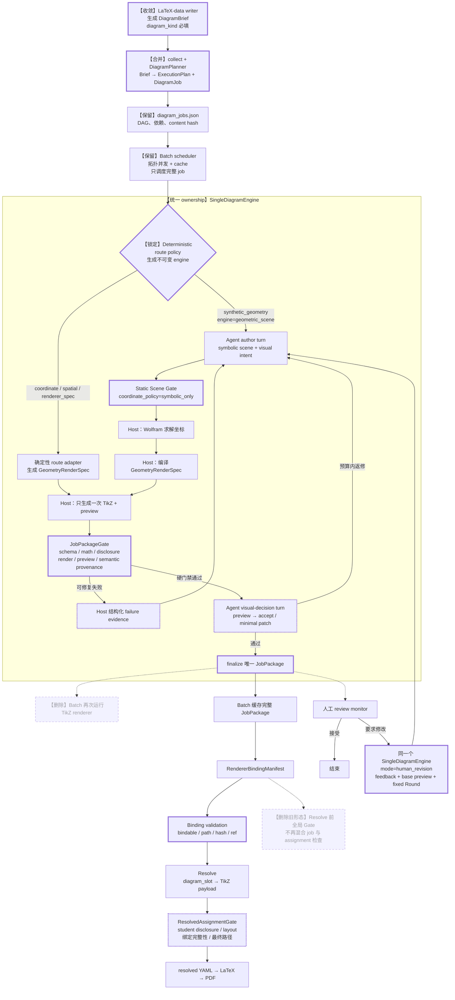
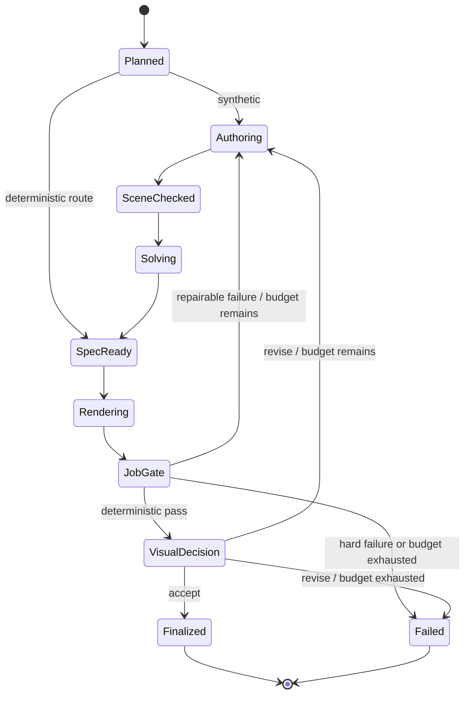

# Diagram Workflow Harness 优化计划

状态：Proposed  
日期：2026-07-17  
范围：`diagram_slot -> collect -> batch -> single-job workflow -> gate -> resolve`

## 1. 结论与关键决策

本次优化不重写 Wolfram、TikZ compiler 或 assignment renderer。目标是收敛
diagram harness 的 ownership，消除重复执行，并在 Host 保持执行权的前提下，
恢复 Agent 对预览图的受控视觉判断能力。

已经锁定的设计决策如下：

1. `diagram_kind` 继续由 LaTeX-data writer 必填，用于表达题目的几何语义分类。
2. `engine` 不交给 Agent 自由选择。它从 plan-stage brief 移到
   `DiagramExecutionPlan`，由确定性 route policy 在 Agent 启动前生成，且在 job
   生命周期内不可修改。
3. `synthetic_geometry` 默认并强制路由到
   `engine: geometric_scene + coordinate_policy: symbolic_only`。Agent 只写符号化
   `GeometricScene` 和 visual intent，Wolfram 是求解实例坐标的唯一正常来源。
4. 单个 job 只渲染一次。SingleDiagramEngine 负责
   `solve -> compile -> render -> audit -> finalize`，Batch 只负责 DAG、并发、缓存和汇总。
5. 正常生成与人工返修共用同一状态机。Agent 不运行 Wolfram、Python、TeX 或
   finalize 命令；所有副作用都由 Host 执行。
6. deterministic audit 通过后增加受控的 Agent visual-decision turn。Agent 只能
   `accept` 或返回最小 scene/spec patch，不能操作路径、命令、Round 或 engine。
7. 现有全局 Gate 拆为 per-job `JobPackageGate` 与 resolve 后的
   `ResolvedAssignmentGate`。
8. `DiagramBrief` / `DiagramExecutionPlan` 的 schema 迁移最后进行，前几阶段继续兼容
   当前 `DiagramSlot`，避免一次改动同时波及 writer、collector、workflow 和 resolver。

## 2. Source truth

- `.codex/skills/math-geometry-diagram-renderer/SKILL.md`：当前 collect/batch/gate/resolve
  的用户级工作流和 Wolfram/TikZ 边界。
- `scripts/diagram_workflow/assignment_pipeline.py`：当前 assignment 级
  collect -> batch -> gate -> resolve 调度顺序。
- `scripts/diagram_workflow/run_diagram_batch.py`：DAG、并发、cache、route 分发以及当前
  二次 TikZ renderer 调用。
- `scripts/diagram_workflow/geometry_diagram_workflow/core/workflow.py`：当前 synthetic
  Host lifecycle 与 human-revision 特殊分支。
- `scripts/diagram_workflow/geometry_diagram_workflow/core/agent_prompt.py`：普通 scene-writer
  prompt 和旧式 full-loop human-revision prompt。
- `scripts/diagram_workflow/geometry_diagram_workflow/core/tools.py`：Wolfram solve、spec
  compile、audit、finalize 和 solution reuse 检查。
- `scripts/diagram_workflow/diagram_contracts.py`：DiagramSlot、DiagramJobRequest、
  GeometryRenderSpec、renderer binding 和 gate contracts。
- `scripts/diagram_workflow/diagram_gate/`：当前 artifact、policy、layout、preview、
  analytic、spatial、semantic checks。
- `scripts/diagram_monitor/human_review.py`：人工接受、返修 request、Round 不可变性与
  revision subprocess。
- `docs/diagram-generation-timing-report.md`：历史耗时、Agent 往返、重复 request、
  preview 环境故障和缓存收益基线。

## 3. 当前状态与剩余问题

### 3.1 已经合理的边界

- plan YAML 只声明 slot，resolved YAML 才绑定 TikZ artifact。
- synthetic geometry 使用 Codex 写符号场景、Wolfram 求解、确定性 TikZ compiler 出图。
- prompt/clean 与 solution/annotated 分离；solution 必须复用 prompt 构型。
- GeometricScene/Wolfram 保持子进程隔离。
- Batch 已有拓扑调度、content-addressed cache 和按 route 分发。
- renderer result、preview、audit、events 和 Round 产物可审计。

### 3.2 需要修复的 ownership 问题

1. Synthetic workflow 已经生成 TikZ、preview、audit 并 finalize，Batch 成功后仍会再次
   调用 TikZ renderer。同一个 artifact 有两个执行 owner。
2. 正常生成由 Host 驱动，但人工返修仍由 Agent 运行完整命令链，形成两套 control plane。
3. 普通 scene-writer 看不到 preview，只能根据 deterministic failure 进行一次修复；标签遮挡、
   构图别扭和视觉误导只能留给人工发现。
4. 当前全局 Gate 同时承担 job artifact、几何语义、preview、layout 和 resolved assignment
   policy；默认 pipeline 又在 resolve 前运行它，无法正常检查最终 student resolved YAML。
5. 当前 DiagramSlot 同时携带教学语义、layout、engine、runtime options 和部分 backend spec，
   让 writer 过早承担 execution planning。
6. scene、request、spec 和 gate 之间通过文本 token/regex 反推部分语义覆盖，缺少可追踪的
   typed provenance。

## 4. 不可破坏约束

### 4.1 Engine 与 Wolfram 约束

- `diagram_kind: synthetic_geometry` 必须解析为 `engine: geometric_scene`；普通 route
  policy 不得自动降级到 `renderer_spec`、手写坐标或 Python 几何求解。
- `DiagramExecutionPlan.engine` 必填、不可变，并进入 content hash/cache identity。
- repair turn、human revision 和 visual decision 都不得修改 engine。
- synthetic job 默认使用 `coordinate_policy: symbolic_only`：
  - Agent 不得输出 solved point-coordinate map；
  - `diagram_spec` 不得携带求解后坐标；
  - scene 中默认禁止 `P == {x, y}`；
  - 在线点、交点、中点、垂足、内外分点、中心和辅助点必须由 Wolfram 原生约束构造；
  - 版面控制优先使用单条基准边的 `Horizontal` / `Rightward` assertion。
- 若极少数 scene 必须消除平移自由度，只能由 execution policy 明确授权
  `coordinate_policy: allow_single_anchor`，并列出允许的 anchor；Agent 不能自行升级权限。
- `engine: renderer_spec` 对 synthetic geometry 只能通过显式、可审计的
  `execution_override` 使用，主要面向固定图 catalog 和回归 fixture。

### 4.2 教学与 artifact 约束

- prompt 图只能显示题干已知对象和必要标签，不得泄露推导结论。
- solution 图复用 prompt 已解出的基础构型，只能添加辅助对象和 annotation。
- `points3d` 必须保留到 spatial TikZ compiler，不能在 writer 或 planner 阶段预投影为二维点。
- TikZ fragment 是唯一 bindable artifact；PNG/SVG/PDF 是 preview/diagnostic。
- required slot 只有在 JobPackage 完整且 bindable 时才能 resolve。
- 单图失败、环境失败、视觉返修和人工返修必须保持现有事件可观测性。

## 5. 目标真实流程

图中“删除”节点保留在图上，用于明确迁移时需要移除的旧 ownership。



## 6. 目标 contracts

### 6.1 DiagramBrief

Plan-stage contract，只表达教学与排版意图。

```yaml
diagram_slot:
  slot_id: q1.prompt
  diagram_kind: synthetic_geometry
  variant: prompt
  disclosure_policy: clean
  required: true
  on_failure: fail_assignment

  teaching_intent: practice_prompt
  problem_context: {}
  semantic_constraints:
    given_objects: []
    given_constraints: []
    must_show: []
    must_not_show: []

  placement: diagram_col
  layout_role: question_sidecar
  width_hint: 60mm
```

`diagram_kind` 是语义分类，因此继续必填。Plan 中不提供 Agent 可修改的 engine。

### 6.2 DiagramExecutionPlan

由 deterministic DiagramPlanner 在 Agent 启动前生成。

```yaml
schema_version: diagram-execution-plan/v1
job_id: q1-prompt
slot_id: q1.prompt
diagram_kind: synthetic_geometry
engine: geometric_scene
engine_source: route_policy
coordinate_policy: symbolic_only
allowed_coordinate_anchors: []
max_candidate_rounds: 2
requires_visual_decision: true
```

强制规则：

- `engine` 必填；
- `engine_source` 只能是 `route_policy` 或显式 `execution_override`；
- synthetic + geometric_scene 默认 symbolic-only；
- repair/human revision 继承 execution plan，不重新 route；
- execution plan 的 canonical hash 进入 job content hash。

### 6.3 Route policy

| diagram_kind | 默认 engine | 坐标来源 | Agent 是否可改 engine |
|---|---|---|---|
| `synthetic_geometry` | `geometric_scene` | Wolfram GeometricScene | 否 |
| `coordinate_geometry` | `coordinate_renderer` 或按确定性 IR 规则选择 `wolfram_client` | typed coordinate IR / WolframClient | 否 |
| `spatial_geometry` | `spatial_renderer` | validated `points3d` | 否 |
| fixed catalog / regression fixture | 显式 `renderer_spec` override | reviewed fixed spec | 否 |

### 6.4 VisualDecision

Agent 接收 request 摘要、deterministic audit 和真实 preview image，只能返回：

```yaml
decision: accept
reason: 图形满足题意且标签无明显遮挡
```

或：

```yaml
decision: revise
reason: 点 E 标签遮挡线段 AC
patch:
  scene_payload: {}
```

Host 校验 patch 后才执行下一 candidate。VisualDecision 不包含命令、路径、engine、
Round index 或 finalize action。

### 6.5 JobPackage

SingleDiagramEngine 的唯一成功输出：

```text
request.json
execution_plan.json
scene_payload.json              # synthetic only
final_renderer_spec.json
renderer_result.json
rendered/<variant>.fragment.tex
rendered/<variant>.preview.*
audit_result.json
semantic_provenance.json
workflow_result.json
workflow_events.jsonl
```

Batch 只能缓存或绑定通过 JobPackageGate 的完整 package，不再追加第二次 renderer 调用。

## 7. 统一状态机



`mode=initial` 与 `mode=human_revision` 只改变输入和 Round policy，不改变状态节点：

- initial：从新 brief 开始，默认最多两个 candidate；
- human revision：继承原 execution plan，输入 teacher feedback 和 base preview，只允许
  写 requested Round，历史 Round 不可修改；
- deterministic route：跳过 Authoring/SceneChecked/Solving 中不适用的节点；
- environment/preflight failure：直接 Failed，不消耗 Agent repair budget。

## 8. Gate 重组

### 8.1 JobPackageGate

在 finalize 前运行，输入 request、execution plan、scene/spec、renderer result 和 preview。

- engine/kind/coordinate-policy 一致；
- synthetic scene 没有未经授权的固定坐标；
- constructed/auxiliary 点具有原生 Wolfram 约束；
- solution 基础点与 prompt 构型无漂移；
- renderer spec、TikZ fragment 和 preview 存在且合法；
- prompt/solution disclosure policy 正确；
- analytic/spatial 专属不变量通过；
- required stem relation 可追踪到 scene constraint、spec object 或 rendered marker；
- environment failure 与 content failure 分开分类。

### 8.2 ResolvedAssignmentGate

在 resolve 后运行，输入 plan、bindings 和 resolved YAML。

- required slot 全部绑定；
- `diagram_ref`、job id、hash 和 TikZ path 一致；
- student resolved YAML 不包含 solution/annotated diagram；
- resolved YAML 不残留 `diagram_slot`；
- placement、width 和 layout profile 合法；
- 最终 LaTeX 可访问 TikZ fragment。

## 9. Out of scope

- 不用 Python 或 Agent 取代 Wolfram 作为 synthetic geometry 的坐标求解器。
- 不把 Wolfram、TikZ compiler 或 LaTeX renderer 合并为一个不可测试模块。
- 不在本次计划中建立新的常见构型 deterministic geometry compiler。
- 不改变 prompt/solution disclosure 和 solution reuse 的教学边界。
- 不删除 process-isolation 调试入口或单阶段 CLI。
- 不在计划阶段修改现有 artifact、重新生成作业或批量迁移历史 resolved YAML。
- 不把人工 review monitor 变成远程服务或多用户队列。

## 10. 执行步骤

| Step | Do | Mode | Depends on | Can run with | Locks / owner | Next role |
|---|---|---|---|---|---|---|
| step1 | 冻结当前 artifact contract、事件序列、renderer 调用次数和代表性 golden jobs；补充 engine-lock、symbolic-only、single-render、student-disclosure 的失败测试 | serial | none | none | tests + contract fixtures / test owner | workflow implementer |
| step2 | 让每条 route 都通过共同的 single-job tail 产出完整 JobPackage；移除 Batch 的二次 renderer；保持现有磁盘路径兼容 | serial | step1 | none | `run_diagram_batch.py`, route entry points / workflow implementer | test auditor |
| step3 | 定义统一状态枚举和 transition contract；让普通 synthetic generation 走 Host-owned SingleDiagramEngine，保留现有 Wolfram subprocess isolation | serial | step2 | none | `workflow.py`, `agent_runner.py`, `diagram_contracts.py` / state-machine owner | parallel branches step4.x |
| step4.1 | 增加结构化 VisualDecision turn、preview image 输入、repair budget 和 hard-failure bypass；Agent 无命令与 artifact 写权限 | parallel | step3 | step4.2 | Agent prompt/runner / agent-loop owner | step5 integrator |
| step4.2 | 将 per-job checks 收敛为 JobPackageGate，并新增 resolve 后 ResolvedAssignmentGate；修正 assignment pipeline 顺序 | parallel | step3 | step4.1 | `diagram_gate/`, `assignment_pipeline.py`, resolver tests / gate owner | step5 integrator |
| step5 | 集成 step4.1/4.2，统一 progress events、failure taxonomy、workflow_result 与 cache acceptance；运行 single-job 和 assignment E2E | serial integrator | step4.1, step4.2 | none | workflow state + gate ledger / integrator | monitor owner |
| step6 | 将 human revision 改为同一 SingleDiagramEngine 的 `mode=human_revision`；保留 fixed requested Round、历史 Round hash 和 base/current preview 证据 | serial | step5 | none | `human_review.py`, workflow revision adapter / monitor owner | contract migration owner |
| step7 | 引入 DiagramBrief -> DiagramExecutionPlan planner；engine 在 execution plan 中必填并锁定；提供当前 DiagramSlot v1 normalize 兼容层 | serial | step6 | none | `diagram_contracts.py`, collector/planner, latex-data contract / contract migration owner | documentation integrator |
| step8.1 | 更新 math geometry、explanation、practice、homework pipeline skills 和当前架构文档；将旧 image/pre-TikZ 主流程文档移入 archive 或增加统一权威入口 | parallel | step7 | step8.2 | skills + docs / documentation owner | final verifier |
| step8.2 | 跑 contract、cache、host orchestration、gate、monitor、TikZ、analytic、spatial 和 assignment E2E；对 golden jobs 做 preview/PDF 抽查 | parallel | step7 | step8.1 | tests + artifact verification / verification owner | final verifier |
| step9 | 移除旧 full-loop prompt 和废弃 gate/batch compatibility branch；只在所有 gate ledger 项连续通过后执行 | serial | step8.1, step8.2 | none | legacy deletion / integrator | final handoff |

## 11. Shared locks 与集成规则

- `scripts/diagram_workflow/diagram_contracts.py` 是全流程共享 lock；并行步骤不得同时修改。
  step3 先冻结 VisualDecision、JobPackage、GateReport 和 ExecutionPlan 所需的类型壳，
  step4.x 只消费这些 contracts。
- `workflow.py` 是状态机唯一 owner；Batch、monitor 和 CLI 只能调用公开 single-job API，
  不得复制 transition logic。
- `renderer_result.json` 与 TikZ fragment 只有 SingleDiagramEngine 可以生成；Batch、gate、
  resolver 和 monitor 都是只读消费者。
- `assignment_pipeline.py` 是 assignment stage 顺序唯一 owner；单阶段 CLI 保持同一库函数语义。
- `human_review.py` 只拥有 review record、idempotency 和 Round mutation guard，不拥有几何生成步骤。
- step5 是 step4.x 的强制 serial integrator；在此之前不得把任一并行分支视为完整 workflow。
- step9 的 legacy deletion 必须独立提交，便于在现场回退旧 prompt/gate adapter。

## 12. Gate ledger seed

| Gate | 必须证明的行为 | 证据 |
|---|---|---|
| G1 Engine lock | synthetic job 在 Agent 启动前解析为 `geometric_scene`，所有 repair/revision 保持同一 engine | execution plan hash + transition tests |
| G2 Wolfram ownership | symbolic-only synthetic scene 不能通过固定坐标或直接 point map 绕过 Wolfram | negative fixtures + Scene Gate report |
| G3 Single render | 每个 cache miss 的成功 job 只调用一次 TikZ renderer；cache hit 调用零次 | renderer spy/counter test |
| G4 Single state machine | initial 与 human revision 使用同一 transition table，差异仅在 mode/input/Round policy | state transition tests |
| G5 Host side effects | Agent output 不含命令、路径写入、engine 修改、Round 或 finalize 动作 | strict response schema tests |
| G6 Visual loop | deterministic pass 后 preview 真实进入 visual turn；accept/fix/budget-exhausted 三条路径可复现 | mocked image turn + E2E evidence |
| G7 Failure taxonomy | preflight/network/Wolfram/render/audit/visual failures 不混为 content repair，硬失败不消耗 repair budget | event and workflow-result assertions |
| G8 Job package | finalize 前所有 bindable 文件、hash、audit 和 provenance 齐全 | JobPackageGate report |
| G9 Post-resolve policy | student resolved YAML 引用 solution/annotated diagram 时 pipeline block | assignment E2E negative test |
| G10 Reuse safety | solution 保持 prompt 基础点坐标且辅助点由原生约束构造 | reuse drift + constraint tests |
| G11 Spatial safety | spatial spec 保留 `points3d` 和合法 projection 到 TikZ compiler | spatial contract/E2E tests |
| G12 Cache safety | engine policy、brief、scene/spec 和 renderer version 变化会使 cache identity 失效 | cache regression tests |
| G13 Observability | live progress 仍能区分 Agent、Wolfram、compile、preview、audit、visual、finalize | workflow event tests + monitor scan |
| G14 Backward compatibility | 当前 plan YAML 可通过 normalize 层得到等价 execution plan 和 resolved YAML | existing fixture regression |

## 13. Rollout 与回退

### 13.1 Rollout 顺序

1. 先落 single-render JobPackage，保持旧 Agent prompt 与 plan schema 不变。
2. 再切统一状态机，但先关闭 visual turn，只验证 artifact 与事件等价。
3. 开启 visual turn，先用于 synthetic prompt 的 opt-in live regression，再扩展到 required
   synthetic/spatial jobs。
4. 切换 Gate 顺序，并以 post-resolve negative tests 作为上线条件。
5. 最后迁移 DiagramBrief/ExecutionPlan；当前 DiagramSlot 保留一个兼容窗口。
6. human revision 稳定后再删除旧 full-loop prompt。

### 13.2 回退边界

- step2 失败：恢复 Batch renderer 调用，JobPackage contract 不发布。
- step3-5 失败：恢复旧 normal-generation adapter，但保留 single-render 修复。
- visual turn 失败：关闭 visual policy，继续 Host deterministic audit + 人工 review。
- step6 失败：恢复旧 human-revision adapter，保留 Round mutation guard。
- step7 失败：继续读取当前 DiagramSlot，不启用 DiagramBrief writer 输出。
- Gate 重组失败：保留 JobPackageGate，临时恢复旧全局 gate CLI，同时禁止删除 post-resolve
  student policy test。

## 14. 完成标准

本优化只有同时满足以下条件才算完成：

- 一个 cache-miss job 只有一个 renderer owner 和一次 renderer invocation；
- normal generation 与 human revision 没有两套 workflow prompt/control plane；
- Agent 能看到真实 preview，但不能执行命令、写 artifact、选择 engine 或绕过 Wolfram；
- synthetic geometry 的实例坐标只能来自 Wolfram 或显式审核过的 fixture override；
- Batch 只调度、缓存和汇总完整 JobPackage；
- job-level failure 在 resolve 前被拦截，assignment-level disclosure/layout 在 resolve 后被拦截；
- current plan YAML、analytic、spatial、solution reuse、monitor 和 LaTeX/TikZ E2E 全部回归通过；
- authoritative docs/skills 与当前 TikZ-only 实现一致，不再把历史 PNG artifact 流程作为主路径。
