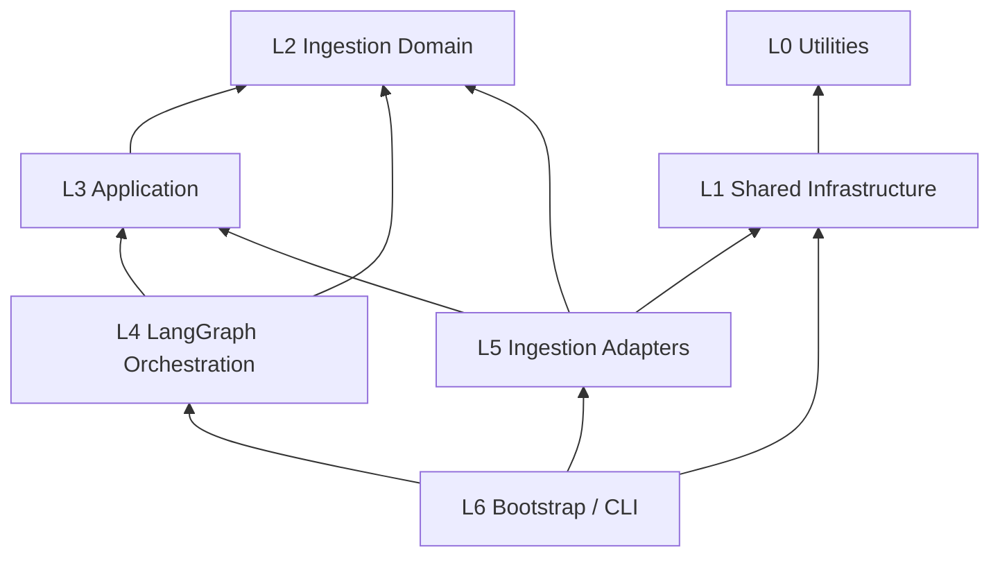
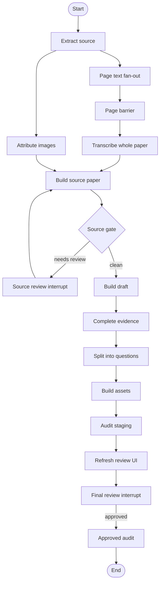

# 题库录入架构

## 0. 文档状态

- 状态：当前架构真源（source of truth）
- 更新日期：2026-07-31
- 适用范围：`scripts/question_transcription/workflow/` 及其计划抽取的共享 utility / infrastructure
- 实现迁移：见 `docs/question-ingestion-implementation-plan.md`

本文同时记录两件事：

1. **当前实现事实**：代码现在如何组织、已经有哪些端口和工作流阶段；
2. **目标分层**：在不改变题目录入业务语义的前提下，代码应迁移到什么边界。

凡是“目标”目录或契约，都不表示当前代码已经完成迁移。旧的端口设计和首轮实施方案已被本文与新的实施计划取代。

## 1. 系统目标与边界

题库录入系统把 DOC/DOCX/PDF/页图原卷转换为可逐题审核的 staging，并且只有在人工批准后才进入正式题库目录。

系统需要保证：

- 页级文字提取忠实抄录可见文字与公式，不在单页阶段猜题目结构；
- 整卷转写根据有序页文本恢复题目、答案和解答步骤；
- 图片归属由来源结构与确定性脚本完成，不交给整卷文字模型猜测；
- 大对象写入文件 artifact，LangGraph state 只保存小型状态和引用；
- provider 选择只发生在 composition root；
- transport retry 不切换 provider；
- 原卷疑点和最终单题审核都是显式 gate；
- 未经批准的 staging 不得写入正式题库。

系统不负责：

- 修改权威题目 schema 的业务含义；
- 在 provider 层决定审核、发布或题库目录；
- 用 LangSmith annotation 直接修改仓库 artifact；
- 在失败时偷偷切换 OpenCode、Claude Code、Qwen 或 MiMo。

## 2. 当前实现事实

当前实现集中在：

```text
scripts/question_transcription/workflow/
├── contracts.py / state.py / graph.py
├── config.py / dependencies.py / composition.py / cli.py
├── artifact_store.py / checkpoint.py / tracing.py
├── ports/
├── nodes/
├── adapters/
│   ├── page_text/{qwen,mimo}.py
│   ├── whole_paper/{opencode,claude_code}.py
│   ├── docx_or_pdf.py
│   ├── source_build.py
│   ├── downstream.py
│   └── review.py
├── prompts/whole_paper.py
└── testsupport/fakes.py
```

已经存在的正确边界：

- `composition.py` 是唯一选择页级和整卷 provider 的模块；
- graph node 依赖业务 Protocol，而不是 provider discriminator；
- `WorkflowState` 主要保存 `ArtifactRef`，不保存 PDF、页图或完整模型响应；
- 页级 fan-out 使用 LangGraph `Send` 和 reducer；
- OpenCode 与 Claude Code 实现相同的 `WholePaperTranscriber` 业务端口；
- OpenCode 与 Claude Code 都以 `provider=None` 的 PydanticAI `Model` 驱动
  `Agent(output_type=QuestionTranscriptionBundle)`，共享自动校验与 `ModelRetry` 语义；
- fake dependencies 可以驱动离线 graph lifecycle；
- run artifact 位于 `build/question-ingestion/<paper-id>/<run-id>/`。

当前结构仍存在的分层问题：

- ~~OpenCode/Claude 的通用 client、PydanticAI bridge 与题目录入 transcriber 混在 provider 文件中~~
  （M1 已完成：通用 transport 与 PydanticAI bridge 迁入
  `scripts/infrastructure/ai/{opencode,claude_code}/{client,pydantic_model}.py`，provider
  中立 failure 由 `scripts/infrastructure/ai/contracts.py` 的 `ModelFailure`/`ModelFailureError`
  承担；题目录入 transcriber 只保留 prompt build、artifact commit 与 failure 映射）；
- ~~graph node 同时承担 LangGraph state 转换和 application stage 行为~~
  （M4 已完成：纯业务决策/校验拆入 `application/stages/{page_text,source,whole_paper}.py`，
  LangGraph state/reducer 拆入 `orchestration/langgraph/{state,reducers,routing}.py`，
  graph node 退化为 thin wrapper，拓扑与 outcome 不变）；
- ~~`ports/downstream.py` 使用相对位置命名，没有表达 staging 业务含义~~
  （M3 已完成：稳定业务名 `ports/staging.py` 为真源，`ports/downstream.py` 退化为
  re-export shim）；
- ~~image attribution 在 `WorkflowDependencies` 中仍以 `object` 表示，没有正式端口~~
  （M3 已完成：`ports/image_attribution.py` 定义 `ImageAttributor` Protocol，
  `DeterministicPorts.image_attribution` 改为类型化字段）；
- ~~`interleaved / separated` 是试卷布局语义，却暂存在 runtime adapter config~~
  （M3 已完成：`domain/paper_layout.py` 定义 `PaperLayout` request/domain 类型，
  `WorkflowDependencies.whole_paper_prompt_mode` 类型化为 `PaperLayout`，config 仍可
  暂存原始字符串并在装配时 coerce）；
- `artifact_store/checkpoint/tracing`、配置装配和领域契约平铺在同一级；
- `testsupport/fakes.py` 聚合所有 fake，已经形成单文件多职责。

## 3. 中央架构决定

系统采用分层的 ports-and-adapters 架构。LangGraph 是 orchestration adapter；OpenCode、Claude Code、PydanticAI 和模型 SDK 是共享 infrastructure；题目录入 adapter 负责把共享 infrastructure 转换为 application port。



层号表示从稳定、通用的内核走向具体装配，不表示所有依赖都必须逐层经过。

### 3.1 L0 Utilities

`scripts/utilities/` 只包含纯通用能力：

- hashing；
- 原子文件替换；
- 通用 JSON 文本清理；
- retry policy 和无领域含义的 resilience 算法。

Utilities 不得：

- 导入 `question_transcription`；
- 导入 LangGraph、PydanticAI 或 provider SDK；
- 读取 API key 或发起网络请求；
- 认识 `QuestionTranscriptionBundle`、review issue 或 ingestion run layout。

### 3.2 L1 Shared Infrastructure

`scripts/infrastructure/` 封装可跨工作流复用的外部技术能力：

- OpenCode HTTP client；
- OpenCode PydanticAI model bridge；
- Claude Agent SDK client；
- Claude Code PydanticAI model bridge；
- 后续可复用的 Qwen/MiMo transport。

Shared infrastructure 可以依赖 SDK、HTTP 和 utilities，但不得导入题目录入领域类型。

```fsharp
module SharedInfrastructure.AI

type ModelFailure =
    | AuthenticationFailure of detail: string
    | RateLimited of detail: string
    | ProviderUnavailable of detail: string
    | TimedOut of detail: string
    | ProtocolFailure of detail: string

type OutputSchema<'Output>

type StructuredModel =
    abstract Run<'Output>:
        prompt: string * schema: OutputSchema<'Output>
        -> Async<Result<'Output, ModelFailure>>
```

`OutputSchema<'Output>` 保留输入 schema 与输出类型之间的关系；Python 实现由
Pydantic model class 和 runtime validation 承担这一约束。基础设施本身不知道
`'Output` 是数学题、图形 spec 还是其他业务模型。

### 3.3 L2 Ingestion Domain

`workflow/domain/` 表达题目录入生命周期和稳定值对象，不导入 LangGraph、provider、文件系统或 subprocess。

```fsharp
module QuestionIngestion.Domain

type PaperLayout =
    | Interleaved
    | QuestionsAndSolutionsSeparated

type ArtifactRef = {
    path: string
    sha256: string
    schema: string
}

type WorkflowOutcome =
    | Running
    | WaitingForSourceReview
    | WaitingForFinalReview
    | Completed
    | Failed of errors: WorkflowFailure list
```

权威业务 schema 仍由现有模块负责：

- `scripts.question_transcription.contracts`
- `scripts.question_transcription.source_contracts`
- `scripts.question_transcription.review_issue_contracts`

Workflow domain 不重新导出这些 schema，以免制造第二个权威入口。

### 3.4 L3 Application

`workflow/application/` 定义业务端口和与编排框架无关的 stages。

```fsharp
module QuestionIngestion.Application

type SourcePorts = {
    extract: SourceInput -> Result<ExtractedSource, SourceFailure>
    attributeImages: ExtractedSource -> Result<ImageAttribution, SourceFailure>
    buildSourcePaper: SourceBuildRequest -> Result<SourceBuildResult, SourceFailure>
}

type PageTextExtractor =
    abstract Extract:
        PageTextJob
        -> Async<Result<PageTextExtract, PageTextFailure>>

type WholePaperTranscriber =
    abstract Transcribe:
        WholePaperRequest
        -> Async<Result<WholePaperTranscription, WholePaperFailure>>

type WorkflowStages = {
    extractSource: WorkflowContext -> Async<StageResult>
    extractPageText: PageTextJob -> Async<StageResult>
    transcribeWholePaper: WorkflowContext -> Async<StageResult>
    buildSourcePaper: WorkflowContext -> Async<StageResult>
    buildStaging: WorkflowContext -> Async<StageResult>
    readFinalReview: WorkflowContext -> Async<StageResult>
}
```

Application stage 负责业务前置条件、端口调用、contract validation 和业务 failure 映射；它不知道调用者是不是 LangGraph。

### 3.5 L4 LangGraph Orchestration

`workflow/orchestration/langgraph/` 只负责：

1. 从 graph state 读取 stage 输入；
2. 调用 application stage；
3. 把 stage result 投影为 state update；
4. 定义 fan-out、reducer、edge、interrupt 和 checkpoint 恢复语义。

Graph node 不直接实例化 provider，不拼 provider payload，也不直接运行现有题库脚本。

### 3.6 L5 Ingestion Adapters

`workflow/adapters/` 实现 application ports，并允许依赖 shared infrastructure。

整卷转写不再按 provider 复制完整业务 adapter，而使用一个领域 adapter：

```fsharp
module QuestionIngestion.Adapters.WholePaper

type StructuredWholePaperTranscriber =
    SharedInfrastructure.AI.StructuredModel
    -> PromptBuilder
    -> ArtifactStore
    -> Application.WholePaperTranscriber
```

它负责：

- 根据 `PaperLayout` 构造整卷 prompt；
- 请求已绑定的 structured model；
- 校验 `QuestionTranscriptionBundle`；
- 执行题目录入专属 normalization；
- 提交 transcription artifact；
- 将通用 model failure 映射为 `WholePaperFailure`。

它不负责选择 OpenCode 或 Claude Code。

### 3.7 Workflow Infrastructure

`workflow/infrastructure/` 保存只对题目录入 workflow 有意义的技术实现：

- `RunLayout` 和 `ArtifactStore`；
- LangGraph checkpoint factory；
- ingestion trace sink；
- run manifest。

如果某个实现移除题目录入依赖后可以被多个工作流复用，再提升到 `scripts/infrastructure/` 或 `scripts/utilities/`；不为了目录对称提前抽象。

### 3.8 L6 Bootstrap

`workflow/bootstrap/` 是唯一认识具体实现和 provider choice 的区域。

```fsharp
module QuestionIngestion.Bootstrap

type WholePaperProvider =
    | OpenCode
    | ClaudeCode

type PageTextProvider =
    | Qwen
    | MiMo

val compose:
    RuntimeConfig
    -> RunLayout
    -> WorkflowRunner
```

装配链路：

```text
OpenCodeClient
  -> OpenCodePydanticModel
  -> StructuredWholePaperTranscriber
  -> WholePaperTranscriber port

ClaudeCodeClient
  -> ClaudeCodePydanticModel
  -> StructuredWholePaperTranscriber
  -> WholePaperTranscriber port
```

## 4. 目标代码布局

```text
scripts/
├── utilities/
│   ├── files/{atomic_write,hashing}.py
│   ├── serialization/json_text.py
│   └── resilience/{policy,retry}.py
│
├── infrastructure/
│   └── ai/
│       ├── contracts.py
│       ├── opencode/{client,pydantic_model}.py
│       ├── claude_code/{client,pydantic_model}.py
│       ├── qwen/client.py
│       └── mimo/client.py
│
└── question_transcription/
    ├── contracts.py
    ├── source_contracts.py
    ├── review_issue_contracts.py
    └── workflow/
        ├── domain/{lifecycle,artifacts,failures}.py
        ├── application/
        │   ├── ports/{source,page_text,whole_paper,staging,review}.py
        │   └── stages/{source,page_text,whole_paper,source_review,staging,final_review}.py
        ├── orchestration/langgraph/{state,reducers,routing,nodes,graph}.py
        ├── adapters/
        │   ├── source/{extraction,image_attribution,source_paper}.py
        │   ├── page_text/{qwen,mimo}.py
        │   ├── whole_paper/structured_transcriber.py
        │   ├── staging/existing_pipeline.py
        │   └── review/filesystem.py
        ├── infrastructure/{artifact_store,run_layout,checkpoint,tracing}.py
        ├── bootstrap/{config,dependencies,composition,cli}.py
        ├── prompts/whole_paper.py
        └── testing/{scenario,adapters}.py
```

`__init__.py` 和测试文件在树中省略。

## 5. 工作流拓扑

当前业务拓扑继续保留；分层迁移不得改变其含义。



### 5.1 页级 fan-out

- `ExtractSource` 产生有序页图引用；
- router 为每页产生一个 `Send`；
- reducer 必须对完成顺序不敏感；
- barrier 要求页面覆盖精确、无空文本、无失败；
- 页级失败形成显式 terminal error，不允许带缺页输入进入整卷转写。

### 5.2 文字与图片 join

整卷文字和图片归属是独立分支。`BuildSourcePaper` 只有在两者都形成可引用 artifact 后才能构建权威 source paper。实现不得依赖“图片分支通常更快”作为正确性条件；迁移时应为 join 建立显式可验证语义。

### 5.3 审核环路

- source gate 处理转写、图片归属和来源结构冲突；
- final gate 处理逐题 staging 的人工批准；
- `resume` 只唤醒，不等于批准；
- 批准必须来自持久化 review/resolution artifact；
- rejected、pending、approved 是不同状态，不能用 `None` 隐藏生命周期。

## 6. 状态与 Artifact

Graph checkpoint 只保存：

- run/paper/version/source 标识；
- `ArtifactRef`；
- 页级小型结果集合；
- review state；
- structured failure 摘要。

不得保存：

- PDF/DOCX bytes；
- 页图 bytes/base64；
- 完整 prompt 或模型响应；
- 完整 `paper.source.yaml` 内容；
- provider client、SDK session 或不可序列化对象。

当前 run layout 保持：

```text
build/question-ingestion/<paper-id>/<run-id>/
├── run-manifest.yaml
├── source/
├── pages/
├── structured/
├── review/
├── reports/
└── cache/provider-results/
```

Artifact commit 必须先写临时文件、完成 schema validation、计算 SHA-256，再原子替换为最终文件。

## 7. Provider 与重试边界

### 7.1 Provider isolation

- provider choice 只存在于 bootstrap config/composition；
- application port 不暴露 Host、provider choice 或 fallback list；
- retry 总是调用同一个已绑定实例；
- provider 失败不会自动切换另一 provider；
- provenance 写入 manifest/artifact sidecar，不用于业务路由。

### 7.2 Transport retry

以下属于通用 resilience/infrastructure：

- HTTP 临时失败；
- provider unavailable；
- rate limit；
- request timeout；
- 可重试 SDK transport failure。

Transport retry 对 application stage 不可见，只返回最终 success/failure。

### 7.3 Structured-output repair

结构修复是 application 可见的业务动作：

- 由权威 Pydantic contract validation 失败触发；
- 携带 validation errors；
- 使用同一个已绑定 provider/session；
- 有独立且有限的 repair budget；
- 不与 transport retry 共用计数；
- repair 耗尽后形成 `invalid_structured_output`。

### 7.4 试卷布局

`Interleaved` 与 `QuestionsAndSolutionsSeparated` 是 source/request 语义，不是 provider 配置。两个 provider 使用相同 `PaperLayout` 和 prompt builder。

## 8. 命名与所有权

### 8.1 `downstream` 改为 `staging`

`downstream` 只是相对位置；稳定业务名称是 staging pipeline。目标命名统一为：

```text
ports/downstream.py    -> application/ports/staging.py
nodes/downstream.py    -> application/stages/staging.py + orchestration node wrapper
adapters/downstream.py -> adapters/staging/existing_pipeline.py
```

### 8.2 Normalization 所有权

Provider 层不允许通过手工补字段绕过权威输出校验。若未来确有题目录入 normalization，目标位置属于 `application/stages/whole_paper.py` 或题目录入 `structured_transcriber.py`，且必须由 contract test 约束。

### 8.3 Fake 所有权

Fake mode 是 CLI 和离线生命周期测试使用的正式开发能力，保留在 workflow 的 `testing/`，但按 scenario 和 adapter 责任拆分；不移入共享 infrastructure。

## 9. Composition Root

Composition root 执行以下步骤：

1. 校验 runtime config；
2. 创建 run layout、artifact store、checkpoint 与 trace sink；
3. 选择一个 page-text infrastructure/adapter；
4. 选择一个 whole-paper structured model；
5. 用同一个 `StructuredWholePaperTranscriber` 包装已选择 model；
6. 绑定 source、staging、review adapters；
7. 生成 application stages；
8. 把 stages 注入 LangGraph graph builder；
9. 记录 provenance；
10. 返回 runner。

Graph build 和 node 执行期间不得再次读取 provider choice。

## 10. CLI 契约

对外操作保持三个概念：

```fsharp
module QuestionIngestion.Cli

type WorkflowRunner =
    abstract Start:
        WorkflowRequest
        -> Async<Result<string, SubmissionFailure>>

    abstract Status:
        runId: string
        -> Async<WorkflowOutcome>

    abstract Resume:
        runId: string
        -> Async<WorkflowOutcome>
```

- `start` 必须真正提交或开始执行，不能只写初始 state；
- `status` 只观察持久化事实；
- `resume` 恢复已有 checkpoint，不隐式写 review approval；
- CLI 输出使用稳定 outcome，不暴露 LangGraph 内部 node 名。

## 11. 测试结构与门禁

测试按责任分组：

```text
tests/question_transcription/workflow/
├── domain/
├── application/
├── orchestration/
├── adapters/
├── infrastructure/
├── integration/
└── canary/
```

门禁：

- domain/application 单元测试不需要 API key；
- shared infrastructure 使用注入的 fake transport 测试；
- graph lifecycle 使用 workflow fake dependencies；
- integration 测试覆盖 artifact 和 review gate；
- canary 必须显式标记且逐 provider 运行；
- 普通 pytest 不得意外加载模型 SDK、读取密钥或联网。

## 12. 架构不变量

1. `utilities` 不依赖 provider、workflow 或题目领域。
2. `scripts/infrastructure` 不依赖 `question_transcription`。
3. domain/application 不依赖 LangGraph、provider SDK 或具体 adapter。
4. orchestration 只驱动 application stage，不实现 provider transport。
5. ingestion adapter 可以依赖 application port 与 shared infrastructure，反向依赖禁止。
6. bootstrap 是唯一选择具体实现的模块。
7. graph state 不携带大对象、provider client 或 provider choice。
8. PageText 输出不包含题目、答案、解析或图片归属结构。
9. WholePaper 输出不猜 DOCX/PDF 图片归属。
10. transport retry、structured repair 和人工 review 是三个不同生命周期。
11. source review 未解决时不产生正式 staging。
12. final review 未批准时不晋升题库。
13. artifact 路径、哈希、schema 和 provenance 可追踪。
14. 同一输入、配置和已接受 resolution 应产生可重复的确定性 artifact。

## 13. 当前到目标的迁移映射

| 当前模块 | 目标模块 |
|---|---|
| `workflow/contracts.py` | `workflow/domain/{lifecycle,artifacts,failures}.py` |
| `workflow/state.py` | `workflow/orchestration/langgraph/{state,reducers}.py` |
| `workflow/graph.py` | `workflow/orchestration/langgraph/{graph,routing}.py` |
| `workflow/nodes/*.py` | application stages + LangGraph thin wrappers |
| `workflow/ports/*.py` | `workflow/application/ports/*.py` |
| `workflow/config.py` | `workflow/bootstrap/config.py` |
| `workflow/dependencies.py` | `workflow/bootstrap/dependencies.py` |
| `workflow/composition.py` | `workflow/bootstrap/composition.py` |
| `workflow/cli.py` | `workflow/bootstrap/cli.py`，根入口可保留兼容 shim |
| `workflow/artifact_store.py` | `workflow/infrastructure/{artifact_store,run_layout}.py` |
| `workflow/checkpoint.py` | `workflow/infrastructure/checkpoint.py` |
| `workflow/tracing.py` | `workflow/infrastructure/tracing.py` |
| `adapters/whole_paper/opencode.py` | shared OpenCode client/model + ingestion structured transcriber |
| `adapters/whole_paper/claude_code.py` | shared Claude client/model + ingestion structured transcriber |
| `adapters/docx_or_pdf.py` | `adapters/source/{extraction,image_attribution}.py` |
| `adapters/source_build.py` | `adapters/source/source_paper.py` |
| `adapters/downstream.py` | `adapters/staging/existing_pipeline.py` |
| `adapters/review.py` | `adapters/review/filesystem.py` |
| `testsupport/fakes.py` | `testing/{scenario,adapters}.py` |

迁移顺序和每阶段门禁由新的 implementation plan 定义。
