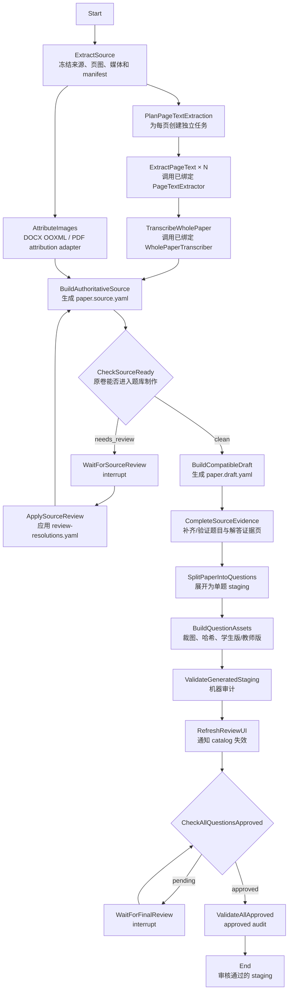

# 题库录入 LangGraph / LangSmith 工作流设计报告

## 0. 文档状态

- 状态：设计草案，待实现
- 分支：`codex/langgraph-question-ingestion-design`
- 基线提交：`b15a2b7a`
- 范围：DOC/DOCX、PDF、扫描页到可审核题库 staging 的完整生命周期
- 权威原卷：`paper.source.yaml`（`math_exam_source_paper/v2`）
- 兼容下游：`paper.draft.yaml` 和现有 expand/materialize/audit/Review UI

相关现有设计与契约：

- `docs/question-ingestion-langgraph-ports-design.md`
- `docs/question-transcription-architecture.md`
- `docs/question-transcription-docx-design.md`
- `docs/question-transcription-pdf-design.md`
- `docs/question-span-index-redesign.md`
- `scripts/question_transcription/source_contracts.py`
- `scripts/question_transcription/review_issue_contracts.py`

## 1. 核心决定

重新设计后，题库录入的**完整控制流由 LangGraph 管理**：

- 启动、分支、逐页并发、汇合；
- 重试、缓存、失败恢复；
- 原卷问题审核暂停与恢复；
- staging 生成；
- 最终人工审核暂停与恢复；
- 成功结束条件。

现有确定性脚本不重写为 Agent，也不把全部逻辑塞进 graph state。它们继续作为
LangGraph 节点内部的执行器：

```text
LangGraph
  ├── 控制流程和生命周期
  ├── 调用模型 provider
  ├── 调用现有确定性脚本
  └── 在需要人工决定时 interrupt

文件系统 artifact
  ├── 保存页图、转写、YAML、报告和 staging
  └── 是可审核、可重建的事实产物

LangSmith
  ├── tracing、成本、延迟、错误分析
  └── dataset、离线评测、线上质量指标

Review UI
  ├── 原卷疑点裁决
  └── staging 逐题批准
```

LangSmith 不是 checkpoint 数据库，也不是生产审核决定的事实来源。审核决定仍落入
仓库约定的 `review-resolutions.yaml`、`review.yaml` 等 artifact。

## 2. 模型适配与依赖装配

本流程区分两种完全不同的模型调用边界：

1. **页图文字提取**通过普通多模态 API 完成；
2. **整卷 Transcription**通过 `WholePaperTranscriber` 业务端口完成。

qwen/MiMo 和 OpenCode/Claude Code/direct API 的选择属于 composition root，不属于
LangGraph 节点业务逻辑。启动入口读取运行配置，选择并装饰具体 adapter，再用已经绑定
好的端口构建 graph。`ExtractPageText` 和 `TranscribeWholePaper` 节点都看不到选择用的
discriminated union，也不根据 provider/host 类型分支。

### 2.1 页图文字提取不是 PageTranscription

旧的 `PageTranscription` 数据结构带有题目、答案、解答步骤、置信度等结构化语义，
不再用于新流程。页级 worker 只做 OCR 式文字提取：

- 按视觉阅读顺序抄录页面上可见的全部文字；
- 数学公式转成 LaTeX；
- 保留必要换行；
- 不识别题目边界；
- 不判断题型；
- 不组装答案和解答步骤；
- 不输出 question_ref、bbox 或 SourceQuestion。

页级产物是一个 UTF-8 文本文件和最小元数据 sidecar：

```text
page-001.txt
page-001.extract.yaml
```

其中 `.txt` 是后续 GLM-5.2 的主要输入；sidecar 只记录页码、来源页、哈希、provider、
model、prompt 版本和调用状态。本文使用 `PageTextExtract` 指代这对 artifact。

### 2.2 Provider 分工

| 任务 | 可装配 adapter | 输入 | 输出 |
|---|---|---|---|
| 页图文字提取 | `UseQwen`：qwen3.7-flash API | 单页 PNG + 纯转写提示 | `PageTextExtract` |
| 页图文字提取 | `UseMimo`：MiMo v2.5 API | 单页 PNG + 同语义提示 | `PageTextExtract` |
| 整卷 Transcription | `UseOpenCode` / `UseClaudeCode` / `UseApi` 调用 GLM-5.2 | 全部 `page-NNN.txt`、manifest、卷级元数据 | `QuestionTranscriptionBundle` + issues |

每次运行由 composition root 静态绑定一个页级 extractor。重试装饰器只重新调用这个
已绑定实例；耗尽后页面节点收到失败，不自动切换模型。

### 2.3 GLM-5.2 的整卷业务端口

`UseOpenCode` 不由本仓库直接调用模型 API，而是参考相邻仓库
`/Users/gaochong/develop/opencode-agent` 的实现：

```text
OpencodeModel
  → PydanticAI Agent(output_type=QuestionTranscriptionBundle)
  → OpenCode /session
  → 配置为 glm-5.2 的 transcription agent
```

LangGraph 的 `TranscribeWholePaper` 节点向已注入的 `WholePaperTranscriber` 提供：

- 只读工作目录；
- 有序页面文本文件；
- source manifest；
- paper metadata；
- `QuestionTranscriptionBundle`/issue schema；
- 输出 artifact 路径和权限边界。

具体 adapter 负责让 GLM-5.2 读取全部页文本并生成整卷 Transcription。它不读取
页图，不负责 Word 原媒体图片归属，也不直接写 staging。`UseApi` adapter 由本地先按
页码读取文本，再构造 API 请求。

OpenCode、Claude Code 和直接 API 都实现同一个 `WholePaperTranscriber` 端口。
composition root 每次运行静态选择 `UseOpenCode`、`UseClaudeCode` 或 `UseApi`，并在
注入 graph 前套上 retry/cache/limiter 装饰器。节点只调用端口，不知道当前宿主；失败
时装饰器只 retry 已绑定 adapter，不在运行中自动换宿主。首个 adapter 复用
opencode-agent 的 PydanticAI
`OpencodeModel`。参考实现当前的
`OpencodeProvider.send()` 并未消费 `ProviderRequest.model_id`，而
`OpencodeModel.request()` 写入 metadata 的 agent 信息也没有直接赋给
`ProviderRequest.agent_type`；当前 message payload 也没有携带工作目录和权限配置。
首版 adapter 必须扩展这条传递链，或使用经过验证的 OpenCode server-side agent
配置。实现前必须用集成测试证明请求确实路由到 `glm-5.2` transcription agent，并且
只拥有声明的目录权限，不能只相信本地配置对象中的 model name。

`UseClaudeCode` 由 Claude Code adapter 执行；`UseApi` 才由本仓库直接调用 GLM-5.2
API。三种方式共享同一输入输出 contract。

模型名称、prompt 版本、输出 schema 版本和 agent 配置版本都进入 artifact 和缓存键。

## 3. 目标拓扑

### 3.1 业务命名拓扑



### 3.2 “完全走在 LangGraph 上”的定义

以下每个状态转换都必须出现在 graph 中，不再由 Agent 临时阅读 SKILL.md 后手工决定：

1. 来源提取成功后才允许 fan-out。
2. 页面集合由提取 manifest 确定。
3. 每页只产生一个可接受的 `PageTextExtract`，其中正文只是 OCR 式纯文本。
4. 全部页文字提取完成且页覆盖检查通过后才允许整卷 Transcription。
5. 图片归属分支和文字结构化分支都完成后才允许构建 `paper.source.yaml`。
6. 存在 unresolved blocking issue 时 graph 必须暂停。
7. `paper.source.yaml` 通过 gate 后才允许投影 draft。
8. expand、materialize、audit 任一步失败都不得继续。
9. Review UI 缓存通知完成后，graph 等待逐题批准。
10. `audit_staging.py --require-approved-review` 通过后才到达 `End`。

节点内部仍可执行现有 Python 函数或 CLI。是否由 LangGraph 管理，判断标准是
“生命周期和下一步由谁决定”，不是“脚本文件放在哪里”。

## 4. 阶段含义

### 4.1 读取原卷阶段

| 节点 | 业务含义 | 主要输出 |
|---|---|---|
| `ExtractSource` | 将输入冻结为可重复使用的页图、媒体和 manifest | `word-source.yaml` 或 PDF source manifest |
| `PlanPageTextExtraction` | 根据 manifest 建立恰好 N 个页面文字提取任务 | `PageTextJob[]` |
| `ExtractPageText` | 通过 qwen API 抄录单页可见文字和公式；不做题目结构化 | `page-NNN.txt` + sidecar |
| `TranscribeWholePaper` | 调用已绑定的整卷转写端口读取全部页文本，生成整卷题目、答案和解答 | transcription bundle + issues |
| `AttributeImages` | 从已有确定性结构产生图片资产和归属 | image attribution bundle |
| `BuildAuthoritativeSource` | 将文字和图片精确合成权威原卷 | `paper.source.yaml` |
| `CheckSourceReady` | 判断权威原卷是否仍有未解决问题 | clean 或 waiting-for-review |

`CheckSourceReady` 不是模型质量评分。它是基于 Pydantic contract 和 review issue 的
确定性放行门禁，可以作为 `BuildAuthoritativeSource` 节点末尾的内部检查实现。

### 4.2 制作题库阶段

| 节点 | 业务含义 | 现有实现 |
|---|---|---|
| `BuildCompatibleDraft` | 把 SourcePaper v2 投影成旧下游需要的 draft | `project_source_paper.py` |
| `CompleteSourceEvidence` | 补齐/验证每题题干和官方解答的完整来源页 | `word_evidence_pages.py` 等 |
| `SplitPaperIntoQuestions` | 将整卷 draft 展开成单题目录 | `expand_staging_draft.py` |
| `BuildQuestionAssets` | 裁图、刷新哈希、生成学生版和教师版 | `materialize_staging.py` |
| `ValidateGeneratedStaging` | 检查 schema、文件、图片、答案隔离和 review sidecar | `audit_staging.py` |
| `RefreshReviewUI` | bump `.catalog-version`，使 Review UI 读取最新数据 | `notify_catalog_version.py` |

### 4.3 人工批准阶段

`WaitForFinalReview` 使用 LangGraph interrupt 暂停，而不是轮询占用进程。用户在现有
Review UI 中逐题批准后，以相同 `thread_id` 恢复 graph。恢复后必须重新读取实际
staging review 状态并执行 approved audit，不能只信任 resume 请求中的布尔值。

本设计中的 `End` 表示“已生成整卷审核通过的 staging”。正式晋升题库不在本期范围。
如果需要自动晋升，后续显式增加：

```text
ValidateAllApproved
  → PromoteExamPaper
  → RefreshProductionCatalog
  → End
```

不能把 staging 审核通过和正式发布静默合并。

## 5. Graph 状态契约

graph state 只保存小型、可序列化的生命周期状态和 artifact 引用，不保存页图二进制、
完整 PDF、完整模型响应或整个 `paper.source.yaml` 内容。

下面的 F# 声明是架构契约，不是拟实现语言：

```fsharp
module QuestionIngestionWorkflow

type ArtifactRef = {
    path: string
    sha256: string
    schema: string
}

type SourceKind =
    | Doc
    | Docx
    | Pdf
    | PageImages

type PageTextJob = {
    pageNumber: int
    image: ArtifactRef
    sourceSha256: string
    inputFingerprint: string
}

type ExecutionProvenance = {
    adapterId: string
    model: string
    promptVersion: string
}

type PageTextArtifact = {
    pageNumber: int
    text: ArtifactRef
    metadata: ArtifactRef
    provenance: ExecutionProvenance
}

type PageTextExtract = {
    artifact: PageTextArtifact
}

type ReviewState =
    | NoReviewPending
    | WaitingForSourceReview of issues: ArtifactRef
    | SourceReviewResolved of resolutions: ArtifactRef
    | WaitingForFinalReview of stagingDirectory: string
    | AllQuestionsApproved

type WorkflowState = {
    runId: string
    paperId: string
    graphVersion: string
    sourceKind: SourceKind
    sourceArchive: string
    extractedSource: ArtifactRef option
    pageTextJobs: PageTextJob list
    pageTextExtracts: PageTextExtract list
    wholePaperTranscription: ArtifactRef option
    imageAttribution: ArtifactRef option
    sourcePaper: ArtifactRef option
    draft: ArtifactRef option
    stagingDirectory: string option
    review: ReviewState
    terminalErrors: string list
}

type WorkflowOutcome =
    | WaitingForSourceReview of issues: ArtifactRef
    | WaitingForFinalReview of stagingDirectory: string
    | Completed of stagingDirectory: string
    | Failed of errors: string list

type WorkflowRunner =
    abstract Start:
        paperId: string
        * sourcePath: string
        * sourceKind: SourceKind
        -> Async<Result<string, string>>

    abstract Resume:
        runId: string
        -> Async<Result<WorkflowOutcome, string>>

    abstract Status:
        runId: string
        -> Async<Result<WorkflowOutcome, string>>
```

### 5.1 Reducer 规则

页面 fan-out 使用 LangGraph `Send`。每个 `ExtractPageText` 只返回一个
`PageTextExtract`，
graph reducer 只负责追加。汇总前必须执行确定性规范化：

- 按 `pageNumber` 排序；
- `pageNumber` 不得重复；
- 实际结果集合必须恰好等于 manifest 页集合；
- `Failed` 不能进入 `TranscribeWholePaper`；
- `.txt` 为空或只含空白视为 contract failure；
- reducer 的到达顺序不得影响 artifact 字节内容。

## 6. 端口与依赖方向

端口契约、composition root 分支、重试装饰器和页面并发策略单独定义在：

- `docs/question-ingestion-langgraph-ports-design.md`

依赖方向固定为：

```text
CLI / deployment config
  → composition.py
    → 选择 adapter，并套上 retry/cache/limiter
      → build_graph(bound WorkflowDependencies)

graph nodes
  → business ports
    ← bound provider/script adapters

Pydantic source/review contracts
  ← provider outputs
  ← file inputs
```

graph 不 import 具体模型 SDK，也不读取 provider/host 选择。节点只调用已绑定业务端口；
具体 adapter 类型只存在于 composition root、运行 manifest 和观测元数据中。

## 7. Artifact 布局

建议运行产物统一位于已被 `.gitignore` 忽略的 `build/`：

```text
build/question-ingestion/<paper-id>/<run-id>/
├── run-manifest.yaml
├── source/
│   └── source-ref.yaml
├── pages/
│   ├── page-001.txt
│   ├── page-001.extract.yaml
│   ├── page-002.txt
│   ├── page-002.extract.yaml
│   └── ...
├── structured/
│   ├── transcription.yaml
│   ├── image-attribution.yaml
│   ├── paper.source.yaml
│   └── paper.draft.yaml
├── review/
│   ├── review-issues.yaml
│   └── review-resolutions.yaml
├── reports/
│   ├── assembly-report.yaml
│   ├── audit-report.yaml
│   └── trace-summary.yaml
└── cache/
    └── provider-results/
```

正式单题 staging 仍写现有目标目录，不搬进 build。artifact 写入规则：

1. 先写同目录临时文件；
2. Pydantic/schema 校验；
3. 计算 SHA-256；
4. 原子替换正式路径；
5. state 只记录 `ArtifactRef`。

同一节点不得同时把“部分成功内容”写入正式 artifact 并返回成功。

## 8. 并发、缓存和恢复

### 8.1 页面 fan-out

`PlanPageTextExtraction` 根据冻结 manifest 返回 N 个 `Send`：

```text
Send("extract_page_text", PageTextJob(page=1))
Send("extract_page_text", PageTextJob(page=2))
...
Send("extract_page_text", PageTextJob(page=N))
```

并发受两层限制：

- LangGraph executor 的 `max_concurrency`；
- provider 侧按 RPM/TPM 的共享 rate limiter。

重试时重新获取 provider permit，不能在退避等待期间长期占用并发许可。

### 8.2 缓存键

每页 API 文字提取缓存键至少包含：

```text
page_sha256
+ model_id
+ prompt_version
+ output_schema_version
+ provider_parameters
```

整卷 Transcription adapter 缓存键至少包含：

```text
ordered(page_text_sha256[])
+ source_manifest_sha256
+ transcriber_adapter_id
+ adapter_config_version
+ model_id
+ prompt_version
+ transcription_contract_version
+ resolution_sha256_or_empty
```

### 8.3 错误分类

| 错误 | 处理 |
|---|---|
| 429、连接超时、provider 5xx | 有界指数退避重试 |
| qwen/MiMo API 返回空文本或不可接受内容 | 已绑定 extractor 的 retry 装饰器有界重试；耗尽后节点失败 |
| GLM 输出非 JSON / schema 不合法 | 节点通过同一个已绑定 transcriber 最多请求两次结构修复 |
| 页图损坏、manifest 哈希不符 | 终止，不重试模型 |
| 缺页、重复页 | 终止 `TranscribeWholePaper` |
| 题号/公式/跨页内容冲突 | review issue，不作为基础设施异常 |
| 确定性脚本非零退出 | 节点失败，保留 stdout/stderr 摘要 |
| Review UI 尚未批准 | interrupt，不算失败 |

所有计费 API 调用和 coding-agent session 调用都必须封装在可恢复 task 中。即使任务
在服务端完成、客户端未收到响应，恢复时也可能重试，因此 provider cache、agent-run
cache 和幂等 artifact commit 都是强制要求。

### 8.4 Checkpointer

- 本地开发：SQLite checkpointer；
- 自动化测试：InMemorySaver；
- 多进程/生产：Postgres checkpointer 或 LangGraph Agent Server；
- `thread_id = runId`；
- checkpoint 中禁止保存图片 base64、PDF bytes 和 API key。

## 9. 两个审核环路

### 9.1 原卷审核

原卷审核发生在 `paper.source.yaml` 生成后、staging 制作前。

触发条件包括：

- `SourcePaper` schema/cross-reference 不合法；
- `needs_review` attribution；
- 图片 target 不存在；
- 题号缺失或重复；
- 页面结果不一致；
- 公式、符号、答案或解答步骤存在 blocking conflict；
- review resolution 已过期或候选哈希不匹配。

Graph 行为：

```text
BuildAuthoritativeSource
  → 写 review-issues.yaml
  → interrupt
  → 人工写 review-resolutions.yaml
  → resume
  → ApplySourceReview
  → 重新 BuildAuthoritativeSource
```

resume 请求只用于唤醒。节点必须从 artifact 中读取并验证 resolution，不能接受
`{"approved": true}` 直接绕过门禁。

### 9.2 staging 最终审核

最终审核发生在 materialize、普通 audit、catalog refresh 之后。

Graph 行为：

```text
CheckAllQuestionsApproved
  ├── 尚未全部批准 → interrupt
  └── 已全部批准 → audit --require-approved-review
                         ├── 失败 → Failed
                         └── 通过 → End
```

原卷审核解决“我们有没有正确读懂原卷”；最终审核解决“加工出的学生版/教师版和图片
是否可以进入题库”。二者不能合并。

## 10. LangSmith 设计

### 10.1 Trace 结构

- project：`question-ingestion-dev`、`question-ingestion-canary`、
  `question-ingestion-prod`
- thread metadata：`thread_id = runId`
- root run：`question_ingestion`
- 子 run：
  - `extract_source`
  - `extract_page_text`
  - `transcribe_whole_paper`
  - `attribute_images`
  - `build_authoritative_source`
  - `build_compatible_draft`
  - `complete_source_evidence`
  - `split_paper_into_questions`
  - `build_question_assets`
  - `validate_generated_staging`
  - `refresh_review_ui`
  - `validate_all_approved`

统一 metadata：

```text
paper_id
run_id
source_kind
source_sha256
graph_version
node_version
model_id
adapter_id
adapter_config_version
prompt_version
schema_version
page_number
cache_hit
retry_count
review_issue_count
```

页面 trace 默认不上传原始图片或完整页面文字，只记录哈希、尺寸、页码、token、延迟、
adapter identity 和脱敏错误摘要。GLM trace 记录 transcriber adapter、session/request
id 和配置版本，但默认不复制整卷文字。是否允许把真实试卷内容发送到 LangSmith 应由
部署环境单独配置。上述 identity 是基础设施 provenance，不进入节点路由分支。

### 10.2 评测

首批离线 dataset：

- 杨浦 Q18：prompt/solution 图片归属和六个解答步骤；
- 宝山 Q15：review issue/resolution；
- DOCX v2 canary set；
- PDF region Q24；
- 跨页题干；
- 题卷/答案分文件；
- 含图选项或 choice panel；
- 图片归属状态机失败的文本-only 路径。

确定性 evaluator：

- `schema_valid`
- `page_coverage_exact`
- `question_ref_exact`
- `solution_step_preserved`
- `accepted_attribution_consumed_once`
- `blocking_issue_blocks_projection`
- `draft_byte_stable`
- `student_answer_isolation`
- `approved_audit_passed`

内容 evaluator：

- 数学公式字符准确率；
- 题干/答案/解析与 reference 的字段级差异；
- blocking issue recall；
- 人工 review 率；
- 每页成本和整卷延迟。

人工修正后的生产 trace 可以进入 dataset，但不能由 LangSmith annotation 直接修改
仓库 staging。生产状态改变仍必须经过本地 resolution/review artifact。

## 11. 代码布局

工作流主体属于跨 DOCX/PDF 的题目转录基础设施，放在公共目录：

```text
scripts/question_transcription/workflow/
├── __init__.py
├── state.py
├── graph.py
├── composition.py
├── artifact_store.py
├── tracing.py
├── cli.py
├── ports/
│   ├── page_text.py
│   ├── whole_paper.py
│   └── deterministic.py
├── adapters/
│   ├── qwen_page_text_api.py
│   ├── mimo_page_text_api.py
│   ├── opencode_glm_transcriber.py
│   ├── claude_code_glm_transcriber.py
│   ├── glm_api_transcriber.py
│   ├── retry.py
│   ├── rate_limit.py
│   └── cache.py
├── nodes/
│   ├── extract_source.py
│   ├── extract_page_text.py
│   ├── transcribe_whole_paper.py
│   ├── attribute_images.py
│   ├── build_source_paper.py
│   ├── source_review.py
│   └── downstream.py
└── testsupport/
    ├── fake_page_text.py
    └── fake_whole_paper.py
```

来源专属和下游确定性实现继续保留在所属 skill：

```text
.codex/skills/math-docx-question-bank-ingestion/
├── SKILL.md
└── scripts/
    ├── extract_docx_source.py
    ├── probe_ooxml_attribution.py
    └── word_evidence_pages.py

.codex/skills/math-pdf-question-bank-ingestion/scripts/
├── expand_staging_draft.py
├── materialize_staging.py
└── audit_staging.py
```

skill 可增加一个薄入口，但不得复制 graph 实现：

```text
.codex/skills/math-docx-question-bank-ingestion/scripts/
└── run_ingestion_workflow.py
```

该入口只解析 skill 友好的参数并调用公共 workflow CLI。

测试布局：

```text
tests/question_transcription/workflow/
├── test_graph_routing.py
├── test_page_fanout.py
├── test_page_coverage.py
├── test_page_text_contract.py
├── test_composition.py
├── test_whole_paper_node_contract.py
├── test_opencode_adapter_routing.py
├── test_provider_cache.py
├── test_resume.py
├── test_source_review_interrupt.py
├── test_final_review_interrupt.py
├── test_artifact_atomicity.py
└── test_end_to_end.py
```

## 12. CLI 契约

首版只需要三个稳定操作：

```bash
./.venv/bin/python -m scripts.question_transcription.workflow.cli start \
  --paper-id <paper-id> \
  --source <doc|docx|pdf|pages-manifest> \
  --source-kind <doc|docx|pdf|pages> \
  --page-provider <qwen|mimo> \
  --agent-host <opencode|claude-code|api>

./.venv/bin/python -m scripts.question_transcription.workflow.cli status \
  --run-id <run-id>

./.venv/bin/python -m scripts.question_transcription.workflow.cli resume \
  --run-id <run-id>
```

`start` 返回稳定 `run-id`。`status` 和 `resume` 的业务结果只能是：

```text
running
waiting_for_source_review
waiting_for_final_review
completed
failed
```

CLI 不暴露“跳过 source gate”“假装已经审核”“从任意中间节点强行继续”等生产参数。
开发环境需要单节点 replay 时使用独立调试命令，不污染正式运行契约。

`--page-provider` 和 `--agent-host` 是外层装配参数。CLI 在调用 `WorkflowRunner.Start`
之前用它们构造 `WorkflowDependencies`；参数值不进入 graph state，节点也不能读取。

## 13. Skill 改造

改造前，SKILL.md 负责指导 Agent 手工串联多条命令。改造后，skill 只负责：

1. 判断来源应使用 DOCX 还是 PDF ingestion；
2. 检查前置工具和环境变量；
3. 调用 workflow `start`；
4. 根据返回状态展示产物或打开 Review UI；
5. 用户审核完成后调用 `resume`；
6. 报告最终 staging 路径。

Skill 不再：

- 自己决定哪一页要重跑；
- 自己判断图片分支是否已经完成；
- 手工串联 projector/expand/materialize/audit；
- 在上下文中记忆工作流走到哪一步；
- 通过自然语言声明“审核已完成”绕过文件门禁。

## 14. 实施阶段

### P0：依赖与可运行骨架

- 新增独立、锁定的 workflow requirements；
- 增加 StateGraph、state contract、SQLite checkpointer；
- 增加 `start/status/resume`；
- 节点先使用 fake provider；
- 测试 interrupt/resume。

退出条件：测试 graph 能完成 clean、source-review、final-review 三条路径。

### P1：包装现有确定性链路

- `ExtractSource` adapter；
- `AttributeImages` adapter；
- projector/evidence/expand/materialize/audit/notify 节点；
- 原子 artifact store；
- stdout/stderr 报告。

退出条件：不调用新模型时，现有 fixture 能通过 graph 完成下游 staging。

### P2：逐页 OCR 式文字提取

- 删除新主链对旧 `PageTranscription` contract 的依赖；
- 新增 `PageTextExtract` 最小 contract；
- qwen3.7-flash API adapter；
- MiMo v2.5 API adapter；
- `Send` fan-out 和 reducer；
- provider rate limiter；
- 缓存、重试和页覆盖 gate；
- LangSmith page traces。

退出条件：N 页产生恰好 N 组 `.txt + sidecar`，正文不包含题目结构化字段；单页失败
恢复不重跑成功页。

### P3：GLM-5.2 整卷 Transcription

- 复用 opencode-agent `OpencodeModel + PydanticAI Agent(output_type=...)`；
- 定义不暴露宿主类型的 `WholePaperTranscriber` 业务端口；
- 增加 OpenCode、Claude Code 和 direct API adapter；
- 在 composition root 实现启动配置 `UseOpenCode` / `UseClaudeCode` / `UseApi`；
- graph 构建时注入已绑定 transcriber，节点不得匹配宿主类型；
- 验证 OpenCode 请求真实路由到 glm-5.2 transcription agent；
- whole-paper transcription prompt 和严格输出 contract；
- 已绑定 transcriber 读取全部页 `.txt`、manifest 和 OOXML 定位提示；
- 结构冲突转换成 review issues；
- resolution 后可重建；
- agent session/run cache。

退出条件：canary 卷可生成 `paper.source.yaml`，blocking issue 不会漏过 gate。

### P4：两个人工环路

- source review interrupt/resume；
- final review interrupt/resume；
- 过期 resolution 检测；
- approved audit；
- Review UI 打开/状态提示。

退出条件：resume 请求本身不能绕过任何审核 artifact。

### P5：LangSmith 评测与 canary

- 建立 dev/canary projects；
- 上传冻结 reference dataset；
- 确定性 evaluator；
- prompt/model 实验；
- 成本、延迟、人工审核率看板。

退出条件：关键 canary 全部满足验收阈值。

### P6：切换 skill 主入口

- 更新 DOCX/PDF skill 固定流程；
- 保留旧 CLI 作为节点实现和故障诊断工具；
- 新流程先 shadow run，再切默认；
- 文档标记旧手工编排为 deprecated。

退出条件：正常使用只需要 `start`、审核和 `resume`。

## 15. 测试与验收

### 15.1 单元测试

- state 可序列化；
- reducer 到达顺序不影响最终页序；
- source gate 分类正确；
- cache key 包含全部语义版本；
- artifact commit 是原子的；
- subprocess 非零退出映射为节点失败；
- resolution 候选哈希过期时拒绝继续。

### 15.2 Graph 集成测试

- clean 路径直接进入 staging；
- source review 路径 interrupt 后从同一 `thread_id` 恢复；
- final review 路径 interrupt 后执行 approved audit；
- 并行页中一个失败，成功页不重跑；
- graph 进程退出后从 SQLite checkpoint 恢复；
- notify 重复执行不破坏 staging。

### 15.3 端到端回归

必须覆盖：

1. DOCX 普通纯文字卷；
2. DOCX 含 prompt/solution 原媒体；
3. DOCX 题卷/答案分文件；
4. PDF region 图片；
5. 跨页题干和跨页解析；
6. 选择题图片面板；
7. 图片 attribution failed、文字仍可观察；
8. 需要人工 resolution 的冲突卷。

### 15.4 完成标准

工作流只有同时满足以下条件才算完成：

- 输入来源指纹与页图指纹冻结；
- 每个页面恰好有一个已接受转写；
- `paper.source.yaml` 通过 schema 和 cross-reference；
- 不存在 unresolved blocking issue；
- 兼容 draft 成功生成；
- evidence 完整；
- expand/materialize/audit 全部成功；
- Review UI 已看到最新 catalog；
- 所有题目已批准；
- approved audit 返回 0；
- graph 状态为 `completed`。

## 16. 关键不变量

1. **LangGraph 管控制流，artifact 管事实。**
2. **所有大对象通过路径和哈希引用，不进入 checkpoint。**
3. **逐页并发完成顺序不得影响整卷结果。**
4. **同一缓存键不得重复产生计费调用，无法确认时必须以幂等方式重试。**
5. **模型输出必须在边界经过 Pydantic 校验。**
6. **图片归属不由整卷文本模型重新猜测。**
7. **任何 unresolved blocking issue 都阻止 draft 和正常 staging。**
8. **resume 只唤醒工作流，不等于批准。**
9. **LangSmith feedback 不直接改变生产 artifact。**
10. **只有 approved audit 成功后才能到达 End。**
11. **现有脚本是节点执行器，不再承担跨步骤生命周期。**
12. **staging 完成不自动等于正式晋升题库。**
13. **adapter 绑定在 composition root 冻结；业务状态和节点不得感知 adapter 类型。**
14. **retry 装饰器只重试已绑定 adapter，不做 provider 或宿主切换。**

## 17. 风险与缓解

| 风险 | 缓解 |
|---|---|
| 每页独立文字提取缺少跨页上下文 | page text 保留完整可见文字；跨页结构只由整卷 GLM Transcription 判断 |
| 旧 PageTranscription 诱导页级模型过度结构化 | 页级 contract 只允许 `.txt` 和最小 sidecar |
| 全卷文字过长 | WholePaperTranscriber adapter 预检 token，超限时按明确策略阻断或分段 |
| OpenCode 配置写了 glm-5.2 但请求未真实路由 | 集成测试检查 server trace/响应 metadata；路由不明时硬失败 |
| provider 浮动版本导致漂移 | 固定 dated model、prompt version、schema version |
| checkpoint 过大 | state 只保存 ArtifactRef |
| crash 后重复计费 | provider cache + idempotent task |
| 并发触发限流 | graph max concurrency + provider rate limiter |
| review resume 被伪造 | 从实际 resolution/review 文件重新验证 |
| LangSmith 泄露卷面 | 默认不上传图片和完整正文，部署级脱敏策略 |
| 新 graph 与旧脚本语义不一致 | 先包装现有脚本，shadow/canary 对比后切主入口 |
| 自动完成被误认为已发布 | End 明确定义为 approved staging，promotion 另建阶段 |

## 18. 仍需决策

实现前需要冻结以下选择：

1. 本地首版只支持 SQLite，还是同时提供 Postgres/Agent Server 配置；
2. qwen API adapter 使用 OpenAI-compatible API 还是 DashScope 原生多模态 SDK；
3. composition root 的页级默认绑定使用 `UseQwen` 还是 `UseMimo`；
4. composition root 的 GLM-5.2 默认绑定使用 `UseOpenCode`、`UseClaudeCode` 还是 `UseApi`；
5. GLM 超过单次上下文预算时采用章节 map-reduce 还是直接阻断；
6. LangSmith 是否允许记录真实页文字，还是只记录脱敏摘要；
7. workflow 的默认并发数和 qwen/MiMo API 限流配置；
8. staging approved 后是否在第二期加入原子 promotion。

这些选择不会改变本报告的核心边界：LangGraph 负责全生命周期，模型和现有脚本通过
节点端口执行具体工作，文件 artifact 保持权威和可审核。
