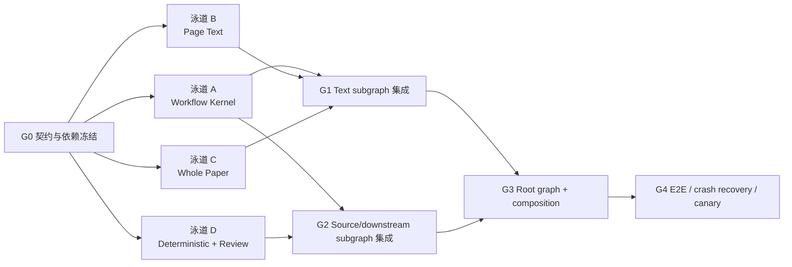

# 题库录入 LangGraph 实施方案

## 0. 文档状态

- 状态：实施计划草案；G0 + 泳道 A/B/C/D + 根图集成 + 离线 E2E + 真实 canary 已落地
- 对应设计：
  - `docs/question-ingestion-langgraph-design.md`
  - `docs/question-ingestion-langgraph-ports-design.md`
- 设计文档提交：`7bf773e1`
- 实现提交：
  - `f70db28e` G0 契约/依赖/端口骨架
  - `b5f81580` 泳道 A 工作流内核 + 根图 + CLI + 离线生命周期
  - `ad4abe3b` 泳道 B 真实页级 OCR adapter（qwen3.5-ocr + MiMo，真实 canary 通过）
  - `ca070d34` 泳道 C 整卷 GLM-5.2 adapter（直接 API + OpenCode + 桩）+ 泳道 D 确定性 adapter
  - `999b93ac` OpenCode glm-5.2 路由 canary + provider 绑定修复
- 真实模型 canary：
  - 页级 qwen3.5-ocr（DASHSCOPE_API_KEY）实测通过
  - 整卷直接 GLM-5.2 API（ZHIPUAI_API_KEY，answer=B）实测通过
  - OpenCode glm-5.2 路由打通（provider 绑定修复后 glm-5-turbo 验证 token + 文本；glm-5.2 reasoning 输出待调优）
- 目标：把设计拆成可交付、可并行、可独立验收的开发任务
- 实现语言：Python 3.11+、Pydantic v2、LangGraph、LangSmith
- 建议并行度：四条开发泳道

本文只规划实现，不重新解释业务拓扑。

## 1. 仓库现状

### 1.1 已有能力

以下能力应包装复用，不应重写：

| 能力 | 现有实现 |
|---|---|
| DOC/DOCX 规范化、页图、OOXML、媒体提取 | `.codex/skills/math-docx-question-bank-ingestion/scripts/extract_docx_source.py` |
| PDF 页图渲染 | `.codex/skills/math-pdf-question-bank-ingestion/scripts/render_pdf_pages.py` |
| DOCX 图片归属适配 | `scripts/question_transcription/adapt_docx_images.py` |
| PDF 图片归属适配 | `scripts/question_transcription/adapt_pdf_images.py` |
| 旧版整卷结构化契约 | `scripts/question_transcription/contracts.py` 中的 `QuestionTranscriptionBundle` |
| 权威原卷契约 | `scripts/question_transcription/source_contracts.py` 中的 `SourcePaper` |
| review issue/resolution 契约 | `scripts/question_transcription/review_issue_contracts.py` |
| source review gate | `scripts/question_transcription/source_review_validation.py` |
| SourcePaper 到兼容 draft | `scripts/question_transcription/project_source_paper.py` |
| draft 展开 | `.codex/skills/math-pdf-question-bank-ingestion/scripts/expand_staging_draft.py` |
| 资产物化 | `.codex/skills/math-pdf-question-bank-ingestion/scripts/materialize_staging.py` |
| staging audit 与 approved audit | `.codex/skills/math-pdf-question-bank-ingestion/scripts/audit_staging.py` |
| 页级纯文字调用、原子写与缓存参考 | `scripts/question_transcription/prescan_pdf_pages.py`、`bailian_ocr_client.py` |
| MiMo HTTP 与缓存参考 | `scripts/question_transcription/mimo_client.py` |
| DOCX/PDF 收敛与审核回归测试 | `tests/question_transcription/` |

### 1.2 需要新增或改造

- 当前没有 `scripts/question_transcription/workflow/`。
- 当前没有 LangGraph、LangSmith 依赖；现有主仓库虚拟环境只能确认 Pydantic v2 可用。
- 当前没有统一的仓库级 Python dependency manifest。
- `prescan_pdf_pages.py` 已接近纯页 OCR，但仍是串行循环、使用旧模型默认值，且不是业务端口。
- `MimoClient` 只有 JSON 输出方法，缺少纯文本调用。
- 旧 `PageTranscription`/window observation 不能作为新页级结果契约。
- OpenCode、Claude Code、direct API 三个整卷 adapter 尚不存在。
- graph checkpoint、interrupt/resume、composition root、LangSmith tracing 尚不存在。

## 2. 中央实施决定

先冻结小而稳定的端口和 artifact contract，再并行开发四条泳道。并行开发期间，各泳道
只能修改自己负责的目录；root graph 和 composition root 由单一集成人维护，避免多个
分支同时修改 `graph.py` 或 `composition.py`。



## 3. 实现边界契约

以下 F# 声明只表达 Python 模块最终必须提供的公共边界：

```fsharp
module QuestionIngestionImplementation

type ArtifactRef = {
    path: string
    sha256: string
    schema: string
}

type PageTextJob
type PageTextExtract
type PageTextFailure
type WholePaperRequest
type WholePaperTranscription
type WholePaperFailure
type WorkflowState
type WorkflowOutcome
type RuntimeAdapterConfig
type DeterministicPorts
type ArtifactStore
type TraceSink
type CompiledWorkflow
type ConfigurationFailure

type PageTextExtractor =
    abstract Extract:
        PageTextJob
        -> Async<Result<PageTextExtract, PageTextFailure>>

type WholePaperTranscriber =
    abstract Transcribe:
        WholePaperRequest
        -> Async<Result<WholePaperTranscription, WholePaperFailure>>

    abstract RepairStructuredOutput:
        executionId: string
        * validationErrors: string list
        -> Async<Result<WholePaperTranscription, WholePaperFailure>>

type WorkflowDependencies = {
    pageTextExtractor: PageTextExtractor
    wholePaperTranscriber: WholePaperTranscriber
    deterministicPorts: DeterministicPorts
    artifactStore: ArtifactStore
    traceSink: TraceSink
}

type WorkflowFactory =
    abstract Build:
        WorkflowDependencies
        -> CompiledWorkflow

type CompositionRoot =
    abstract Bind:
        RuntimeAdapterConfig
        -> Result<WorkflowDependencies, ConfigurationFailure>

type WorkflowRunner =
    abstract Start:
        paperId: string
        * sourcePath: string
        * sourceKind: string
        -> Async<Result<string, string>>

    abstract Resume:
        runId: string
        -> Async<Result<WorkflowOutcome, string>>

    abstract Status:
        runId: string
        -> Async<Result<WorkflowOutcome, string>>
```

不变量：

1. `RuntimeAdapterConfig` 只进入 `CompositionRoot`。
2. `WorkflowState`、graph node 和 subgraph 不包含 provider/host choice。
3. fake adapter 与真实 adapter 实现同一端口。
4. transport retry/cache/limiter 是 adapter decorator。
5. 节点只处理业务前置条件、业务结果和 artifact commit。

## 4. 工作包与依赖

### G0：短串行关口——依赖、契约和目录骨架

G0 必须由一个 owner 完成，其他泳道只做只读调研，避免在公共契约未冻结时各自发明类型。

| ID | 任务 | 主要文件 | 验收条件 |
|---|---|---|---|
| G0.1 | 建立 workflow 独立依赖清单和 worktree 虚拟环境说明 | `workflow/requirements.txt`、开发文档 | 固定兼容的 LangGraph/LangSmith/Pydantic 版本；新 worktree 可按说明创建 `./.venv` |
| G0.2 | 建立 package 和公共领域 contract | `workflow/__init__.py`、`state.py`、`contracts.py` | Pydantic schema 可 dump；state 不含大对象和 adapter choice |
| G0.3 | 建立业务端口 | `workflow/ports/*.py` | fake adapter 可通过 Protocol/contract 测试 |
| G0.4 | 建立配置类型，但不选择 adapter | `workflow/config.py` | CLI/deployment 配置可校验；不被 state import |
| G0.5 | 增加基础测试目录和 marker | `tests/question_transcription/workflow/` | offline、integration、live 三类测试可区分 |

退出门禁：

- 公共 contract review 通过；
- `WorkflowState` 序列化 round-trip；
- 端口没有 Host 属性；
- 测试导入不需要 API key；
- LangGraph 与 LangSmith 能在新虚拟环境中 import。

### 泳道 A：Workflow Kernel

所有任务在 G0 后开始。

| ID | 任务 | 主要所有权 | 依赖 | 可并行对象 |
|---|---|---|---|---|
| A1 | 原子 artifact store、哈希和 run layout | `workflow/artifact_store.py` | G0 | B、C、D |
| A2 | SQLite/InMemory checkpointer factory | `workflow/checkpoint.py` | G0 | A1、B、C、D |
| A3 | fake-only StateGraph 骨架 | `workflow/graph.py` | G0 | A1、A2 |
| A4 | interrupt/resume 生命周期测试 | `test_resume.py`、review interrupt tests | A2、A3 | B、C、D |
| A5 | CLI `start/status/resume` 外壳 | `workflow/cli.py` | A2、A3 | B、C、D |
| A6 | LangSmith trace sink 与默认脱敏 | `workflow/tracing.py` | G0 | A1-A5、B、C、D |

A3 只接 fake ports，不等待真实模型 adapter。这样 graph 生命周期不会被 OpenCode 或 API
联调阻塞。

### 泳道 B：Page Text

| ID | 任务 | 主要所有权 | 依赖 | 可并行对象 |
|---|---|---|---|---|
| B1 | `PageTextExtract` fixture 与纯文本 post-condition 测试 | `test_page_text_contract.py` | G0 | A、C、D |
| B2 | qwen3.7-flash API adapter | `adapters/page_text/qwen.py` | G0、B1 | B3、A、C、D |
| B3 | MiMo v2.5 纯文本 API adapter | `adapters/page_text/mimo.py` | G0、B1 | B2、A、C、D |
| B4 | page cache decorator | `adapters/page_text/cache.py` | B1 | B2、B3 |
| B5 | page retry/rate-limit decorator | `adapters/page_text/resilience.py` | B1 | B2、B3、B4 |
| B6 | LangGraph `Send` fan-out、reducer、barrier node | `nodes/page_text.py`、`subgraphs/text_pages.py` | B1、A3 | C adapter |
| B7 | 随机完成顺序、单页失败、恢复缓存测试 | `test_page_*.py` | B2-B6 | C、D |

复用要求：

- 从 `prescan_pdf_pages.py` 复用纯文字 prompt 方向、页码来源、原子写和 cache-key 思路；
- 不直接复用其串行循环；
- 新 adapter 不修改 `BailianOcrClient` 的旧默认模型，避免影响现有测试；
- MiMo 新增纯文本 transport 时保留现有 `complete_json` 行为。

### 泳道 C：Whole Paper Transcription

| ID | 任务 | 主要所有权 | 依赖 | 可并行对象 |
|---|---|---|---|---|
| C0 | OpenCode 路由/权限 spike | 临时集成测试和调查报告 | 可与 G0 并行 | A、B、D |
| C1 | whole-paper prompt、输入 manifest、输出 contract | `prompts/whole_paper.py`、contract tests | G0 | A、B、D |
| C2 | direct GLM API adapter | `adapters/whole_paper/glm_api.py` | C1 | C3、C4 |
| C3 | OpenCode/PydanticAI adapter | `adapters/whole_paper/opencode.py` | C0、C1 | C2、C4 |
| C4 | Claude Code adapter | `adapters/whole_paper/claude_code.py` | C1 | C2、C3 |
| C5 | whole-paper retry/cache decorator | `adapters/whole_paper/resilience.py`、`cache.py` | C1 | C2-C4 |
| C6 | `TranscribeWholePaper` 业务 node | `nodes/whole_paper.py` | C1、A3 | C2-C5 |
| C7 | fake-port、schema repair、无 Host 分支测试 | `test_whole_paper_*.py` | C6 | adapter live tests |

C0 是风险验证，不修改 graph。它必须证明：

- `model_id=glm-5.2` 到达实际 OpenCode 请求；
- transcription agent type 到达 server；
- cwd、只读输入和可写输出权限真实生效；
- system prompt/output contract 没有在 provider 层丢失。

如果 C0 未通过，C3 保持 experimental，但 A、B、C1/C2/C6、D 和 fake graph 集成仍可继续。

### 泳道 D：确定性脚本、Join 与审核

| ID | 任务 | 主要所有权 | 依赖 | 可并行对象 |
|---|---|---|---|---|
| D1 | DOCX/PDF SourceExtractor wrapper | `adapters/source/*.py` | G0 | A、B、C |
| D2 | DOCX/PDF ImageAttribution wrapper | `adapters/image_attribution/*.py` | G0 | D1、A、B、C |
| D3 | 实现 transcription + attribution 到 authoritative SourcePaper 的确定性 assembler | `adapters/source_build.py` | G0 | D1、D2 |
| D4 | source review gate 与 resolution wrapper | `nodes/source_review.py` | D3、A3 | B、C |
| D5 | project/evidence/expand/materialize/audit wrappers | `adapters/downstream.py` | G0 | D1-D4、A、B、C |
| D6 | final review reader、catalog version bump | `adapters/review.py` | G0 | D5 |
| D7 | deterministic adapter regression tests | `test_deterministic_ports.py` | D1-D6 | A、B、C |

D1-D6 优先 import 现有 Python 函数。只有没有稳定函数入口的脚本才使用 subprocess，并
必须捕获 exit code、stdout/stderr 摘要和 report artifact。

## 5. 集成波次

### Wave 0：契约冻结

只能串行：

```text
G0.1 → G0.2 → G0.3/G0.4 → G0.5
```

G0 完成后给四条泳道打同一个 contract baseline tag 或提交 SHA。后续修改公共 contract
必须由集成人批准。

### Wave 1：四泳道并行

可以同时执行：

```text
Lane A: A1 + A2 → A3 → A4/A5
Lane B: B1 → B2/B3/B4/B5 → B6/B7
Lane C: C0 + C1 → C2/C3/C4/C5/C6 → C7
Lane D: D1/D2/D5/D6 → D3/D4/D7
```

其中：

- A1 与 A2 可并行；
- B2、B3、B4、B5 可在 B1 后并行；
- C0 可在 G0 期间启动，不写公共 contract；
- C2、C3、C4 可并行；
- D1、D2、D5、D6 修改不同 adapter 文件时可并行；
- A6 observability 可与所有模型和确定性 adapter 同时开发。

### Wave 2：两个 subgraph 并行集成

| 集成任务 | 依赖 | 所有权 | 是否可并行 |
|---|---|---|---|
| I1 Text subgraph：fan-out → barrier → whole-paper | A3、B6、C6 | text integrator | 可与 I2 并行 |
| I2 Source subgraph：extract/image → Join → review → downstream | A3、D1-D6 | source integrator | 可与 I1 并行 |
| I3 LangSmith evaluator/dataset harness | A6、G0 contracts | observability owner | 可与 I1/I2 并行 |

I1 和 I2 分别写 `subgraphs/text_branch.py` 与 `subgraphs/source_branch.py`，不得同时修改
root `graph.py`。

### Wave 3：root 集成

必须由单一集成人串行完成：

1. 合并 I1 和 I2；
2. 实现 `composition.py` 的唯一 adapter 选择；
3. 将已绑定 `WorkflowDependencies` 注入 `build_graph`；
4. 接通 CLI；
5. 验证 run manifest 记录 adapter provenance，但 state 不记录 choice；
6. 接通 source-review 和 final-review interrupt/resume。

### Wave 4：端到端验收

端到端测试文件可以分人并行编写，但要在同一个 root graph baseline 上运行：

| ID | 场景 | 关键断言 |
|---|---|---|
| E1 | fake clean DOCX | N 页精确覆盖、Join、staging、pending final review |
| E2 | fake clean PDF | 页图、attribution、SourcePaper、下游 audit |
| E3 | source needs review | interrupt；无 resolution 不能继续；fresh resolution 可恢复 |
| E4 | final review pending/rejected/approved | resume 不等于批准；approved audit 才 End |
| E5 | crash after provider success | cache 命中，不重复计费；artifact 字节稳定 |
| E6 | randomized page completion | GLM 输入始终按页码排序 |
| E7 | provider/host isolation | retry 只调用已绑定 adapter |
| E8 | OpenCode live canary | routing、权限、输出 contract、trace 均有证据 |
| E9 | qwen/MiMo live canary | 纯文字输出，无旧 PageTranscription 字段 |

E1-E7 必须完全 offline。E8-E9 使用 pytest marker 和显式环境开关，默认测试不得发起
外部调用。

## 6. 哪些任务不能并行

以下任务强制串行：

1. 公共 contract 冻结与各泳道实现。
2. root `graph.py` 合并 I1/I2。
3. composition root 与 root graph 的最终接线。
4. schema migration 与使用该 schema 的 fixture 更新。
5. live model canary 与 production-ready 标记。
6. source review resolution 应用与 downstream staging。
7. final review approval与 `audit_staging.py --require-approved-review`。

同一时间只能有一个 owner 修改：

- `workflow/state.py`
- `workflow/contracts.py`
- `workflow/composition.py`
- root `workflow/graph.py`
- `workflow/cli.py`

这些文件是并行开发的冲突热点。

## 7. 推荐四人/四 Agent 分工

| Owner | 负责范围 | 不负责 |
|---|---|---|
| A：Kernel/Integrator | G0、A、root graph、composition、CLI | 真实模型 SDK |
| B：Page Text | B 全部、页级 live canary | whole-paper prompt |
| C：Whole Paper | C 全部、OpenCode 路由证明 | graph lifecycle |
| D：Deterministic/Review | D、I2、现有脚本回归 | provider 选择 |

合并顺序：

1. G0 contract commit；
2. A/B/C/D 各自独立提交；
3. I1、I2 subgraph commits；
4. root integration commit；
5. E2E/canary commit。

提交不得把 live 产物、API 响应或试卷正文缓存加入 Git。

## 8. 测试策略

### 8.1 每次提交

```text
contract tests
fake adapter tests
node unit tests
existing question_transcription regression tests
```

### 8.2 每个集成波次

```text
LangGraph route tests
checkpoint/replay tests
interrupt/resume tests
artifact determinism tests
DOCX/PDF convergence tests
```

### 8.3 合并前

```text
full offline pytest
approved audit fixture
LangSmith trace redaction test
one explicitly approved live canary per enabled adapter
```

API key 不得出现在 fixture、trace、异常字符串或 snapshot 中。live 测试执行前按仓库
约定加载 shell 环境并只检查 key 是否存在，不打印 key 值。

## 9. 交付门禁

### M1：Fake graph

- clean、source review、final review 三条路径可运行；
- SQLite 恢复成功；
- 无 LangSmith 配置时仍可运行；
- graph state 无大对象、无 adapter choice。

### M2：Page Text

- qwen/MiMo 都实现同一端口；
- N 页对应 N 组 `.txt + sidecar`；
- 页级输出不含题目结构；
- retry/cache/限流经过故障注入测试。

### M3：Whole Paper

- fake、direct API、OpenCode/Claude Code 中已启用的 adapter 通过同一 contract；
- node 不匹配 Host 类型；
- schema repair 使用同一已绑定端口；
- OpenCode routing/权限有集成证据。

### M4：Full staging

- DOCX/PDF 都能生成 `paper.source.yaml`；
- blocking issue 必须 interrupt；
- expand/materialize/audit 失败会终止；
- final approval 后 approved audit 通过。

### M5：Canary

- LangSmith trace、成本和延迟可观察；
- trace 默认不包含页图和完整正文；
- crash recovery 不重复计费；
- 与现有 fixture 的关键字段和图片归属一致。

## 10. 关键路径与最早可交付版本

关键路径：

```text
G0
  → A3 fake graph
  → B6 page subgraph
  → C6 whole-paper node
  → I1 text subgraph
  → I2 source/downstream subgraph
  → root integration
  → E1/E3/E4
```

最早可交付版本不等待所有真实 adapter：

1. fake PageTextExtractor；
2. fake WholePaperTranscriber；
3. 真实 DOCX/PDF 确定性脚本；
4. SQLite checkpoint；
5. 两个 review interrupt；
6. offline E2E。

这个版本先证明 graph 生命周期正确。之后 qwen/MiMo/OpenCode/Claude Code/direct API
adapter 可以按端口逐个启用，不改变业务节点。

## 11. 实现前仍需冻结

1. workflow dependency manifest 采用单个 pinned `requirements.txt`，还是
   `requirements.in + requirements.txt`；
2. 首版 production 启用哪些 whole-paper adapter；
3. qwen3.7-flash 的正式 API model id；
4. direct GLM API 的 endpoint 与鉴权环境变量名；
5. Claude Code 非交互执行的权限和输出协议；
6. OpenCode server-side transcription agent name；
7. 每个 adapter 的 timeout、max attempts、并发、RPM、TPM；
8. LangSmith dev/canary project 命名和正文脱敏策略；
9. 超长整卷先阻断还是在首版实现 section map-reduce。

这些冻结项不阻塞 fake graph 和确定性 adapter 开发；它们只阻塞对应真实 adapter 的
production-ready 门禁。
