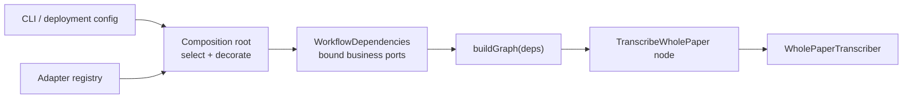
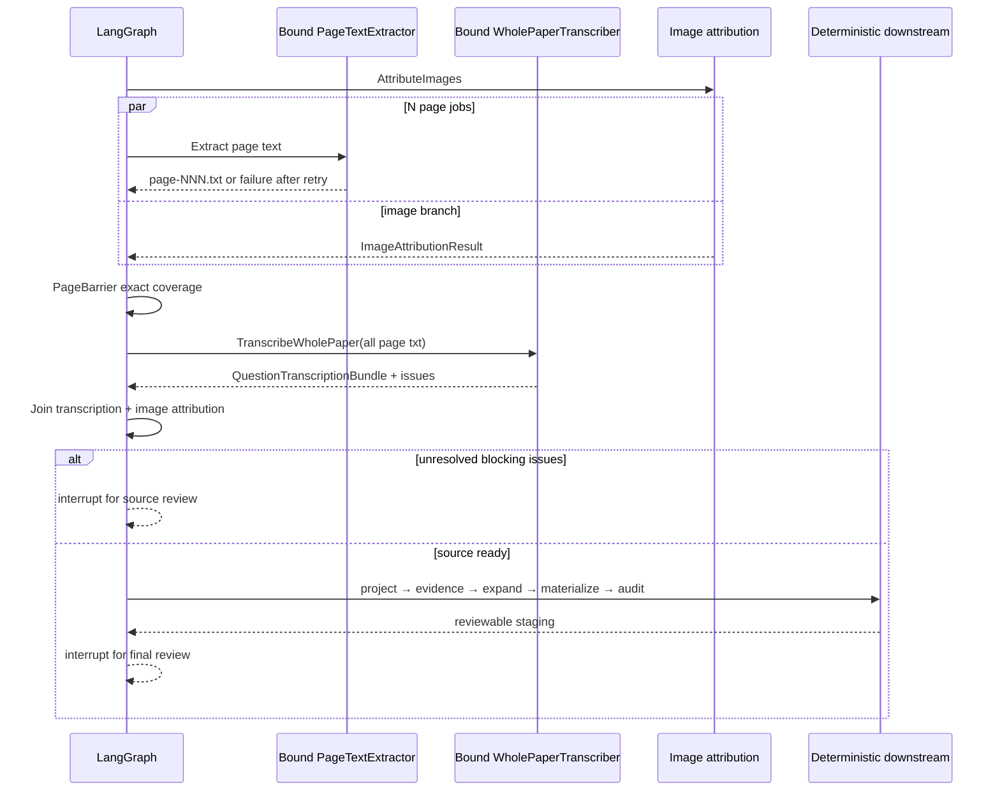

# 题库录入 LangGraph 端口、分支与并发设计

## 0. 文档目的

本文只定义题库录入工作流的端口边界和关键行为，不重复总体拓扑。总体设计见：

- `docs/question-ingestion-langgraph-design.md`

本文使用 F# 风格伪代码表达：

- 哪些组件属于领域端口；
- composition root 如何静态选择 qwen3.7-flash 或 MiMo v2.5 API；
- composition root 如何静态选择 OpenCode、Claude Code 或 direct API；
- 业务节点为什么完全感知不到上述选择；
- retry/cache/limiter 如何装饰已选择 adapter；
- 页面 fan-out 的并发、限流、重试和汇合；
- 文字分支与图片分支如何 Join；
- review 与下游失败如何路由。

F# 只用于清楚表达类型和分支。正式实现语言仍是 Python + LangGraph。

## 1. 中央决定

三个模型边界必须分开：

```text
页图
  → PageTextExtractor（已绑定；实现可为 qwen/MiMo API）
  → page-NNN.txt

全部 page-NNN.txt
  → WholePaperTranscriber（已绑定；实现可为 OpenCode/Claude Code/API）
  → GLM-5.2
  → QuestionTranscriptionBundle

Word/PDF 图片结构
  → ImageAttributionPort（确定性脚本/adapter）
  → ImageAttributionBundle
```

`PageTextExtractor` 不输出题目结构。`WholePaperTranscriber` 不读取页图、不猜 Word
原媒体归属。
`ImageAttributionPort` 不转写题干或解答。

LangGraph 依赖这些端口，不依赖 DashScope、MiMo、OpenCode、Claude Code、GLM API
或 subprocess 的具体 SDK。只有进程入口的 composition root 可以读取
`UseQwen / UseMimo / UseOpenCode / UseClaudeCode / UseApi`。

## 2. 共享类型

```fsharp
module QuestionIngestion.Domain

type ArtifactRef = {
    path: string
    sha256: string
    schema: string
}

type SourceKind =
    | Doc
    | Docx
    | Pdf
    | PageImages

type SourceInput = {
    paperId: string
    sourceKind: SourceKind
    sourcePath: string
    sourceArchive: string
}

type ExtractedSource = {
    manifest: ArtifactRef
    pages: ArtifactRef list
    mediaDirectory: string option
    sourceSha256: string
}

type PageTextJob = {
    runId: string
    paperId: string
    pageNumber: int
    image: ArtifactRef
    inputFingerprint: string
}

type ExecutionProvenance = {
    adapterId: string
    model: string
    promptVersion: string
}

type PageTextFailureKind =
    | AuthenticationFailure
    | RateLimited
    | ProviderUnavailable
    | RequestTimedOut
    | InvalidResponse
    | EmptyText
    | SourceHashMismatch
    | CacheCorrupt

type PageTextFailure = {
    adapterId: string option
    kind: PageTextFailureKind
    attempts: int
    detail: string
}

type PageTextArtifact = {
    pageNumber: int
    text: ArtifactRef
    metadata: ArtifactRef
    provenance: ExecutionProvenance
}

type PageTextExtract = {
    artifact: PageTextArtifact
}

type WholePaperTranscription = {
    transcription: ArtifactRef
    issues: ArtifactRef option
    executionId: string
    model: string
    promptVersion: string
}

type ImageAttributionResult = {
    bundle: ArtifactRef option
    issues: ArtifactRef option
    structureStatus: string
}

type SourceBuildResult = {
    sourcePaper: ArtifactRef
    issues: ArtifactRef option
}
```

### 2.1 `PageTextExtract` 不变量

`text` 引用 UTF-8 `.txt`，内容只能是页面可见文字和 LaTeX 公式。以下信息禁止进入页级
文本 contract：

- `question_ref`；
- 题型；
- `answer`；
- `solution_steps`；
- 图片归属；
- SourceQuestion；
- 模型对题意的解释或纠错。

sidecar 可以记录 adapter identity、页码、哈希、调用时间、token 和错误历史，但不
承载题目结构。identity 只用于 provenance、缓存和观测，业务节点不得据此分支。

## 3. 来源提取端口

```fsharp
module QuestionIngestion.SourcePorts

open QuestionIngestion.Domain

type SourceExtractionError =
    | UnsupportedSourceKind of SourceKind
    | SourceNotFound of path: string
    | SourceAlreadyMutated of expectedSha256: string * actualSha256: string
    | NormalizationFailed of detail: string
    | PageRenderingFailed of detail: string
    | ManifestInvalid of detail: string

type SourceExtractor =
    abstract Extract:
        SourceInput
        -> Async<Result<ExtractedSource, SourceExtractionError>>
```

来源路由是纯分类：

```fsharp
let chooseSourceAdapter input =
    match input.sourceKind with
    | Doc
    | Docx ->
        UseDocxExtractor

    | Pdf ->
        UsePdfExtractor

    | PageImages ->
        UsePageManifestValidator
```

效果顺序：

```fsharp
let extractSource ports input =
    match chooseSourceAdapter input with
    | UseDocxExtractor ->
        ports.docx.Extract input

    | UsePdfExtractor ->
        ports.pdf.Extract input

    | UsePageManifestValidator ->
        ports.pages.Validate input
```

成功后才允许启动文字和图片两个并行分支。

## 4. 页图文字提取业务端口

```fsharp
module QuestionIngestion.PageTextPorts

open QuestionIngestion.Domain

type PageTextExtractor =
    abstract Extract:
        PageTextJob
        -> Async<Result<PageTextExtract, PageTextFailure>>
```

两个基础设施 adapter 都实现该端口：

```text
QwenPageTextExtractor
  → qwen3.7-flash API

MimoPageTextExtractor
  → MiMo v2.5 API
```

两者接收同语义 prompt：

```text
只按视觉阅读顺序抄录本页全部可见文字。
数学公式写成 LaTeX。
保留必要换行。
不要识别题号结构、不要生成答案字段、不要解释或纠错。
```

`ExtractPageText` 节点收到的是一个已绑定的 `PageTextExtractor`，它只知道“提取这一页”
这个业务能力，不知道实现是 qwen 还是 MiMo。

## 5. Composition root 与页级节点

### 5.1 唯一允许出现 provider/host 选择的模块

```fsharp
module QuestionIngestion.Composition

open QuestionIngestion.Domain
open QuestionIngestion.PageTextPorts
open QuestionIngestion.WholePaperPorts

type PageTextProviderChoice =
    | UseQwen
    | UseMimo

type WholePaperAdapterChoice =
    | UseOpenCode
    | UseClaudeCode
    | UseApi

type RetryPolicy = {
    maxAttempts: int
    baseDelayMs: int
    maxDelayMs: int
}

type RuntimeAdapterConfig = {
    pageTextProvider: PageTextProviderChoice
    wholePaperAdapter: WholePaperAdapterChoice
    pageRetry: RetryPolicy
    wholePaperRetry: RetryPolicy
}

type DeterministicDependencies

type AdapterRegistry = {
    qwen: PageTextExtractor
    mimo: PageTextExtractor
    openCode: WholePaperTranscriber
    claudeCode: WholePaperTranscriber
    glmApi: WholePaperTranscriber
}

type WorkflowDependencies = {
    pageTextExtractor: PageTextExtractor
    wholePaperTranscriber: WholePaperTranscriber
    deterministic: DeterministicDependencies
}
```

```fsharp
let bindPageTextExtractor config registry =
    let selected =
        match config.pageTextProvider with
        | UseQwen ->
            registry.qwen

        | UseMimo ->
            registry.mimo

    selected
    |> withPageRateLimit
    |> withPageRetry config.pageRetry
    |> withPageCache

let bindWholePaperTranscriber config registry =
    let selected =
        match config.wholePaperAdapter with
        | UseOpenCode ->
            registry.openCode

        | UseClaudeCode ->
            registry.claudeCode

        | UseApi ->
            registry.glmApi

    selected
    |> withWholePaperRateLimit
    |> withWholePaperRetry config.wholePaperRetry
    |> withWholePaperCache

let compose config registry deterministicPorts =
    {
        pageTextExtractor =
            bindPageTextExtractor config registry

        wholePaperTranscriber =
            bindWholePaperTranscriber config registry

        deterministic = deterministicPorts
    }
```

选择在 graph 构建前冻结，并写入 run manifest。之后调用
`buildGraph(workflowDependencies)`。`RuntimeAdapterConfig` 和两个 choice union 不得
进入 `WorkflowState`，也不得传给任何 node 函数。



### 5.2 页级节点的业务效果

```fsharp
module QuestionIngestion.PageTextBehavior

open QuestionIngestion.Domain
open QuestionIngestion.PageTextPorts

val extractPageText:
    extractor: PageTextExtractor
    -> job: PageTextJob
    -> Async<Result<PageTextExtract, PageTextFailure>>
```

```fsharp
let extractPageText extractor job =
    let result =
        await extractor.Extract job

    match result with
    | Error failure ->
        Error failure

    | Ok extract when isBlankTextArtifact extract.artifact.text ->
        Error (invalidArtifact extract)

    | Ok extract ->
        Ok extract
```

这个函数没有选择、缓存、限流或 retry 分支。那些效果已经包含在注入的
`PageTextExtractor` 装饰链内。节点只验证业务 post-condition，并把结果交给 reducer。

装配层测试需要证明静态选择只绑定一个 adapter：

```fsharp
let selectedPageAdapter config registry =
    match config.pageTextProvider with
    | UseQwen ->
        registry.qwen

    | UseMimo ->
        registry.mimo
```

这个匹配只用于 composition root，不得复制到 node。

## 6. 页面 fan-out 并发策略

### 6.1 并发层级

页面并发由三层共同约束：

```text
LangGraph max_concurrency
  ∩ provider semaphore
  ∩ provider RPM/TPM limiter
```

建议配置：

```fsharp
type PageConcurrencyConfig = {
    graphMaxConcurrency: int
    qwenMaxInFlight: int
    mimoMaxInFlight: int
    qwenRequestsPerMinute: int
    qwenTokensPerMinute: int
    mimoRequestsPerMinute: int
    mimoTokensPerMinute: int
}
```

`graphMaxConcurrency` 控制所有页面 task 的总量。qwen/MiMo semaphore 和 token bucket
分别配置，但一次 run 只激活所选 provider 的 limiter。

### 6.2 LangGraph fan-out

```fsharp
type PageDispatch =
    | Dispatch of PageTextJob list
    | NoPages
    | InvalidPages of detail: string

let planPageDispatch source =
    match source.pages with
    | [] ->
        NoPages

    | pages when containsDuplicatePageNumbers pages ->
        InvalidPages "duplicate page numbers"

    | pages ->
        pages
        |> sortByPageNumber
        |> buildPageJobs
        |> Dispatch
```

LangGraph adapter 将 `Dispatch jobs` 转成：

```text
jobs
  → [Send("extract_page_text", job1);
     Send("extract_page_text", job2);
     ...
     Send("extract_page_text", jobN)]
```

每个 Send 只拥有一个页面，不共享可变 provider client state。

### 6.3 单次调用许可顺序

以下逻辑属于 `RetryingPageTextExtractor` / `RateLimitedPageTextExtractor` 装饰器，不属于
LangGraph node：

```fsharp
let callOneAttempt limiter inner job =
    await limiter.WaitForRateBudget job

    let permit =
        await limiter.AcquireConcurrencyPermit()

    try
        await inner.Extract job
    finally
        permit.Release()
```

重试顺序：

```fsharp
let callWithRetry policy inner job =
    let rec attempt attemptNumber =
        let result =
            await inner.Extract job

        match result with
        | Ok extract ->
            Ok extract

        | Error failure
            when isRetryable failure.kind
             && attemptNumber < maxAttempts ->
            await wait (backoff attemptNumber)
            await attempt (attemptNumber + 1)

        | Error failure ->
            Error { failure with attempts = attemptNumber }

    attempt 1
```

关键约束：

- 退避等待前释放并发 permit；
- 下一次 attempt 重新申请 RPM/TPM budget 和 permit；
- 不在 semaphore 内写 artifact；
- API 成功后先释放 permit，再校验和 commit；
- retry 始终调用装饰器包裹的同一个 inner adapter；
- retry 耗尽后页面失败，装饰器注册表中没有“下一个 provider”；
- 单页失败不取消已经成功的其他页面；
- graph 恢复时已成功页面从 cache/checkpoint 读取。

### 6.4 页面 reducer 与 barrier

```fsharp
type PageBarrierDecision =
    | ReadyForWholePaperTranscription of PageTextExtract list
    | WaitForRemainingPages of missingPageNumbers: int list
    | StopForPageFailures of failures: PageTextFailure list
    | StopForCoverageViolation of detail: string
```

```fsharp
let decidePageBarrier expectedPages completed failures =
    match failures with
    | first :: rest ->
        StopForPageFailures (first :: rest)

    | [] when hasDuplicatePages completed ->
        StopForCoverageViolation "duplicate page extracts"

    | [] ->
        let missing = expectedPages - pageNumbers completed

        match missing with
        | _ :: _ ->
            WaitForRemainingPages missing

        | [] ->
            completed
            |> sortByPageNumber
            |> ReadyForWholePaperTranscription
```

LangGraph 只在 `ReadyForWholePaperTranscription` 时调用 GLM-5.2。已有页文本可以保留，
但不允许拿部分页面进行整卷 Transcription。

## 7. 整卷 Transcription 端口

### 7.1 业务契约

```fsharp
module QuestionIngestion.WholePaperPorts

open QuestionIngestion.Domain

type AgentWorkspace = {
    root: string
    readableArtifacts: ArtifactRef list
    writableOutputDirectory: string
}

type WholePaperRequest = {
    runId: string
    paperId: string
    workspace: AgentWorkspace
    orderedPageTexts: PageTextExtract list
    sourceManifest: ArtifactRef
    paperMetadata: ArtifactRef
    promptVersion: string
    outputSchema: ArtifactRef
    idempotencyKey: string
}

type WholePaperFailureKind =
    | PageCoverageInvalid
    | TranscriberUnavailable
    | ExecutionCreationFailed
    | RoutingUnverified
    | ExecutionTimedOut
    | TokenBudgetExceeded
    | InvalidStructuredOutput
    | OutputArtifactMissing
    | PermissionViolation

type WholePaperFailure = {
    adapterId: string option
    kind: WholePaperFailureKind
    attempts: int
    executionId: string option
    detail: string
}

type WholePaperTranscriber =
    abstract Transcribe:
        WholePaperRequest
        -> Async<Result<WholePaperTranscription, WholePaperFailure>>

    abstract RepairStructuredOutput:
        previousExecutionId: string
        * validationErrors: string list
        -> Async<Result<WholePaperTranscription, WholePaperFailure>>
```

端口没有 `Host` 属性，也没有 `UseOpenCode / UseClaudeCode / UseApi` 参数。业务节点无法
询问或匹配宿主类型；它只能请求 `Transcribe` 或对同一实例请求结构修复。

### 7.2 OpenCode PydanticAI adapter

首个 adapter 参考：

```text
/Users/gaochong/develop/opencode-agent/
  packages/opencode-agent-server/src/
    opencode_agent_server/opencode_model.py
    opencode_agent_server/engine/agent_factory.py
    opencode_agent_server/integrations/opencode/provider.py
```

概念调用：

```fsharp
type OpenCodeAgentConfig = {
    serverUrl: string
    modelName: string
    agentType: string
    timeout: System.TimeSpan
    tokenBudget: int
}

val createWholePaperAgent:
    config: OpenCodeAgentConfig
    -> outputContract: System.Type
    -> PydanticAiAgent
```

实际 Python adapter 对应：

```text
OpencodeModel(model_name="glm-5.2")
  → Agent(
      model=opencodeModel,
      output_type=QuestionTranscriptionBundle,
      instructions=wholePaperTranscriptionPrompt)
  → agent.run(workspaceManifestPrompt)
```

但必须增加路由证明：

```fsharp
type AgentRoutingProof = {
    requestedModel: string
    actualModel: string
    requestedAgentType: string
    actualAgentType: string
    sessionId: string
}

val VerifyRouting:
    expectedModel: string
    * expectedAgentType: string
    * providerTrace: ArtifactRef
    -> Result<AgentRoutingProof, WholePaperFailure>
```

原因是参考实现中：

- `ProviderRequest.model_id` 当前没有写入 OpenCode `/session/.../message` payload；
- `OpencodeModel` metadata 中的 agent 配置当前没有直接成为
  `ProviderRequest.agent_type`；
- `AgentWorkspace` 的 cwd、只读输入和可写输出权限当前没有写入 message payload；
- `ProviderRequest.system_prompt` 和 tools 配置当前也未被
  `OpencodeProvider.send()` 消费。

这些缺口可以通过扩展 adapter payload，或通过不可变的 OpenCode server-side agent
配置解决。在模型路由、agent type、cwd 和权限都获得 trace/集成测试证明之前，端口
必须返回 `RoutingUnverified` 或 `PermissionViolation`，不能生成正式
Transcription。

另外两个 adapter 遵守同一 `WholePaperTranscriber` 契约：

```text
UseClaudeCode
  → Claude Code runner
  → QuestionTranscriptionBundle

UseApi
  → GLM-5.2 API adapter
  → QuestionTranscriptionBundle
```

三者是启动配置的替代选项，不是运行时的备用链。

> **Claude Code adapter（已落地，实现计划 §11 freeze #5）**：与 OpenCode adapter
> **结构对称**——把 Claude Code 包成 PydanticAI 的 `Model`
> （`ClaudeCodeModel`，是 `OpencodeModel` 的兄弟类），adapter 用
> `Agent(model=ClaudeCodeModel(...), output_type=QuestionTranscriptionBundle).run(prompt)`
> 调用。结构化输出校验与 `ModelRetry` 由 Agent 层负责（和 OpenCode adapter 一样），
> `ClaudeCodeModel.request()` 只做"让 Claude 像 LLM"：把 messages 收敛成 prompt、
> 调一次 SDK、回包 `ModelResponse(parts=[TextPart], usage)`。
>
> 与 OpenCode adapter 的关键区别：OpenCode server 把模型绑在 server-side 配置
> （`opencode.json`），per-request `model_id` 到不了 server（§7.2 GAP），所以必须返回
> `routing_unverified`。`claude-agent-sdk` 在**每次请求**显式绑定 `model` /
> `permission_mode`（`allowed_tools=[]`、`max_turns=1`），因此一次非空且通过
> `QuestionTranscriptionBundle` 校验的响应即为真实 transcription，**永不**返回
> `routing_unverified`。鉴权顺序：`ANTHROPIC_API_KEY` → CLI 已登录凭证 /
> `CLAUDE_CODE_OAUTH_TOKEN`；无凭证时立即 `transcriber_unavailable`，不发明凭证、
> 不记录 key 内容。
>
> SDK 的 `query()` 无状态（streaming input 只接受 `type:"user"` 轮次，options 无
> history），因此 Agent 的 repair 路径下 `request()` 收到的多轮 messages 被按角色顺序
> 压成单条 prompt 文本喂入。SDK 调用封装为可注入的 `ClaudeQueryPort`（唯一触碰
> `claude_agent_sdk` 的地方），离线测试用假 port 覆盖 Agent 全链路、缓存命中、坏 JSON、
> SDK 缺失等分支（见 `test_claude_code_adapter.py`），live canary 见
> `test_claude_code_canary.py`。

### 7.3 `TranscribeWholePaper` 节点的业务逻辑

```fsharp
val transcribeWholePaper:
    transcriber: WholePaperTranscriber
    -> request: WholePaperRequest
    -> Async<Result<WholePaperTranscription, WholePaperFailure>>
```

```fsharp
let transcribeWholePaper transcriber request =
    match validatePageCoverage request.orderedPageTexts with
    | Error coverageFailure ->
        Error coverageFailure

    | Ok orderedPageTexts ->
        let result =
            await transcriber.Transcribe {
                request with
                    orderedPageTexts = orderedPageTexts
            }

        match result with
        | Error failure ->
            Error failure

        | Ok candidate ->
            match validateTranscription candidate with
            | Valid ->
                await verifyAndCommit candidate

            | Invalid validationErrors ->
                await repairWholePaper
                    transcriber
                    candidate
                    validationErrors
                    0
```

节点只包含业务分支：

- 页覆盖不完整：不调用端口；
- 首次调用失败：返回失败；
- 输出有效：原子校验并提交；
- 输出结构无效：通过同一个端口实例请求有限次数修复。

### 7.4 结构修复与 transport retry 的边界

结构修复是节点看得见的业务行为，因为它由输出 contract 校验结果触发：

```fsharp
let repairWholePaper transcriber candidate validationErrors repairCount =
    match validationErrors, repairCount with
    | [], _ ->
        await verifyAndCommit candidate

    | errors, count when count < maxRepairs ->
        let repaired =
            await transcriber.RepairStructuredOutput(
                candidate.executionId,
                errors
            )

        match repaired with
        | Error failure ->
            Error failure

        | Ok nextCandidate ->
            match validateTranscription nextCandidate with
            | Valid ->
                await verifyAndCommit nextCandidate

            | Invalid nextErrors ->
                await repairWholePaper
                    transcriber
                    nextCandidate
                    nextErrors
                    (count + 1)

    | errors, _ ->
        Error (invalidStructuredOutput errors)
```

transport retry 是节点看不见的基础设施行为。composition root 注入的
`RetryingWholePaperTranscriber` 只包装一个 inner transcriber：

```fsharp
let callWholePaperWithRetry policy inner request =
    let rec attempt attemptNumber =
        let result =
            await inner.Transcribe request

        match result with
        | Ok output ->
            Ok output

        | Error failure
            when isRetryable failure.kind
             && attemptNumber < policy.maxAttempts ->
            await wait (backoff policy attemptNumber)
            await attempt (attemptNumber + 1)

        | Error failure ->
            Error { failure with attempts = attemptNumber }

    await attempt 1
```

无论 inner 是 OpenCode、Claude Code 还是 direct API，这段装饰器都没有其他 adapter
引用，因此不存在 failover 路径。整卷节点对单份试卷保持单飞。

## 8. 文字分支与图片分支并发

来源提取完成后启动两个并行分支：

```text
Branch A
  PlanPageTextExtraction
    → ExtractPageText × N
    → PageBarrier
    → TranscribeWholePaper

Branch B
  AttributeImages
```

`TranscribeWholePaper` 不必等待图片归属；`BuildAuthoritativeSource` 必须等待 A、B 两支。

```fsharp
type SourceJoinInput = {
    transcription: WholePaperTranscription option
    imageAttribution: ImageAttributionResult option
}

type SourceJoinDecision =
    | WaitForTranscription
    | WaitForImageAttribution
    | BuildTextOnlySourceWithBlockingImageIssue
    | BuildCompleteSource of
        WholePaperTranscription * ImageAttributionResult
```

```fsharp
let decideSourceJoin input =
    match input.transcription, input.imageAttribution with
    | None, _ ->
        WaitForTranscription

    | Some _, None ->
        WaitForImageAttribution

    | Some transcription, Some images
        when images.structureStatus = "failed" ->
        BuildTextOnlySourceWithBlockingImageIssue

    | Some transcription, Some images ->
        BuildCompleteSource (transcription, images)
```

`image_attribution_status: failed` 不是“本卷没有图片”。允许保存文字 Transcription，
但缺少作答所需图片时必须生成 blocking issue，不能投影正常 draft。

## 9. 权威原卷构建与审核分支

```fsharp
module QuestionIngestion.SourceBuildPorts

open QuestionIngestion.Domain

type SourceBuildFailure =
    | TranscriptionInvalid of detail: string
    | ImageBundleInvalid of detail: string
    | CrossReferenceInvalid of detail: string
    | ResolutionInvalid of detail: string
    | ArtifactWriteFailed of detail: string

type SourcePaperBuilder =
    abstract Build:
        transcription: WholePaperTranscription
        * images: ImageAttributionResult
        * resolutions: ArtifactRef option
        -> Async<Result<SourceBuildResult, SourceBuildFailure>>
```

```fsharp
type SourceReadyDecision =
    | ContinueToDraft of ArtifactRef
    | WaitForSourceReview of sourcePaper: ArtifactRef * issues: ArtifactRef
    | StopSourceBuild of SourceBuildFailure
```

```fsharp
let decideSourceReady buildResult =
    match buildResult with
    | Error failure ->
        StopSourceBuild failure

    | Ok result when hasUnresolvedBlockingIssues result.issues ->
        WaitForSourceReview (
            result.sourcePaper,
            required result.issues
        )

    | Ok result ->
        ContinueToDraft result.sourcePaper
```

resume 只唤醒 graph：

```fsharp
let resumeSourceReview artifacts sourcePaper issues =
    let resolutions = artifacts.ReadReviewResolutions()

    match validateResolutions issues resolutions with
    | Error invalid ->
        WaitForSourceReview (sourcePaper, issues)

    | Ok valid ->
        RebuildSourceWithResolutions valid
```

## 10. 下游确定性端口

```fsharp
module QuestionIngestion.DownstreamPorts

open QuestionIngestion.Domain

type StageFailure = {
    stage: string
    exitCode: int option
    retryable: bool
    report: ArtifactRef option
    detail: string
}

type DraftProjector =
    abstract Project:
        sourcePaper: ArtifactRef
        -> Async<Result<ArtifactRef, StageFailure>>

type EvidenceCompleter =
    abstract Complete:
        draft: ArtifactRef
        * sourceKind: SourceKind
        -> Async<Result<ArtifactRef, StageFailure>>

type StagingExpander =
    abstract Expand:
        draft: ArtifactRef
        -> Async<Result<string, StageFailure>>

type AssetMaterializer =
    abstract Materialize:
        stagingDirectory: string
        -> Async<Result<ArtifactRef, StageFailure>>

type StagingAuditor =
    abstract Audit:
        stagingDirectory: string
        * requireApprovedReview: bool
        -> Async<Result<ArtifactRef, StageFailure>>

type CatalogNotifier =
    abstract Refresh:
        stagingDirectory: string
        -> Async<Result<unit, StageFailure>>
```

执行顺序不可并行化：

```fsharp
let runDownstream ports sourcePaper =
    let draft =
        await ports.projector.Project sourcePaper

    match draft with
    | Error failure ->
        Stop failure

    | Ok draftRef ->
        let evidence =
            await ports.evidence.Complete draftRef

        match evidence with
        | Error failure ->
            Stop failure

        | Ok completedDraft ->
            let staging =
                await ports.expander.Expand completedDraft

            match staging with
            | Error failure ->
                Stop failure

            | Ok stagingDirectory ->
                let materialized =
                    await ports.materializer.Materialize stagingDirectory

                match materialized with
                | Error failure ->
                    Stop failure

                | Ok _ ->
                    let audit =
                        await ports.auditor.Audit(
                            stagingDirectory,
                            false
                        )

                    match audit with
                    | Error failure ->
                        Stop failure

                    | Ok _ ->
                        await ports.notifier.Refresh stagingDirectory
```

这些步骤依赖前一步的实际文件，不使用 LangGraph 并发。

## 11. 最终审核端口

```fsharp
module QuestionIngestion.ReviewPorts

open QuestionIngestion.DownstreamPorts

type FinalReviewStatus =
    | Pending of pendingItemIds: string list
    | Rejected of rejectedItemIds: string list
    | Approved

type FinalReviewReader =
    abstract ReadStatus:
        stagingDirectory: string
        -> Async<Result<FinalReviewStatus, StageFailure>>
```

```fsharp
type FinalReviewDecision =
    | InterruptForFinalReview of pendingItemIds: string list
    | StopForRejectedItems of rejectedItemIds: string list
    | RunApprovedAudit

let decideFinalReview status =
    match status with
    | Pending items ->
        InterruptForFinalReview items

    | Rejected items ->
        StopForRejectedItems items

    | Approved ->
        RunApprovedAudit
```

`RunApprovedAudit` 必须调用：

```text
audit_staging.py --require-approved-review
```

只有该端口返回成功，LangGraph 才能进入 `End`。

## 12. 整体并发时间线



最大并行面只出现在页级文字 API 调用和独立图片归属分支。整卷 GLM Transcription、
SourcePaper 构建和下游 staging 加工都保持单份试卷内串行。

## 13. Python adapter 映射

```text
scripts/question_transcription/workflow/
├── composition.py
├── ports/
│   ├── source.py
│   ├── page_text.py
│   ├── whole_paper.py
│   ├── source_build.py
│   ├── downstream.py
│   └── review.py
├── adapters/
│   ├── docx_source.py
│   ├── pdf_source.py
│   ├── qwen_page_text_api.py
│   ├── mimo_page_text_api.py
│   ├── opencode_glm_transcriber.py
│   ├── claude_code_glm_transcriber.py
│   ├── glm_api_transcriber.py
│   ├── retry.py
│   ├── rate_limit.py
│   ├── cache.py
│   ├── docx_image_attribution.py
│   └── subprocess_downstream.py
└── nodes/
    ├── extract_source.py
    ├── extract_page_text.py
    ├── transcribe_whole_paper.py
    ├── attribute_images.py
    ├── build_source_paper.py
    └── downstream.py
```

端口建议使用 Python `Protocol`；领域输入输出使用 Pydantic v2；adapter 错误显式映射为
本文件中的 failure union 对应 Python discriminated model，不把所有预期失败压成
`Exception` 字符串。

## 14. 必须先做的集成验证

1. qwen API 单页输出只含页面文字，不返回旧 PageTranscription 字段。
2. MiMo API 单页输出使用同一语义 contract。
3. composition root 选择 `UseQwen` 时只绑定 qwen；retry 耗尽后页面失败。
4. composition root 选择 `UseMimo` 时只绑定 MiMo；retry 耗尽后页面失败。
5. N 页完成顺序随机时，GLM 输入仍严格按页码排序。
6. 任一页失败时不启动整卷 GLM。
7. `TranscribeWholePaper` 用 fake `WholePaperTranscriber` 即可测试，且源码不含宿主匹配。
8. composition root 选择 `UseOpenCode` 后，失败不会调用 Claude Code 或 API。
9. OpenCode adapter 实际路由到 `glm-5.2`，并使用 transcription agent 权限和工作目录。
10. PydanticAI `output_type` 返回 `QuestionTranscriptionBundle`。
11. schema 修复复用同一个已绑定 transcriber/session。
12. coding agent 只能读取声明的 artifact，只能写输出目录。
13. `UseClaudeCode` 和 `UseApi` 也只重试各自 adapter，不切宿主。
14. 图片 attribution 分支可以与页级 fan-out 并行。
15. SourcePaper Join 等待 Transcription 和图片分支。
16. source review 和 final review 的 resume 都不能靠布尔参数绕过。

## 15. 实现前冻结项

- `PageTextArtifact` sidecar 与 generic provenance 的正式 schema 名称；
- qwen 与 MiMo 的 API adapter 具体 SDK；
- qwen/MiMo 各自的并发、RPM、TPM；
- composition root 的页级默认绑定是 `UseQwen` 还是 `UseMimo`；
- OpenCode 首版 agent name、模型路由配置和权限集；
- composition root 的 GLM 默认绑定是 `UseOpenCode`、`UseClaudeCode` 还是 `UseApi`；
- Claude Code 和 direct API adapter 是首版实现还是只保留端口；
- PydanticAI output_type 直接返回 bundle，还是返回 artifact manifest；
- GLM schema 修复次数和 token budget；
- 超长整卷是阻断还是引入第二层 section map-reduce。

在这些配置冻结前，可以实现端口和 fake adapter，但不应把真实 provider 行为标记为
生产完成。
