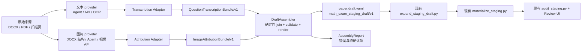
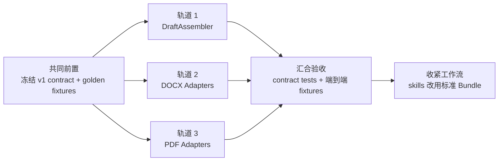

# 脚本化题目转录架构

## 1. 文档状态

- 状态：实施原型；P1–P3 已实现，P4 部分通过
- 适用范围：DOC/DOCX、可检索 PDF、扫描 PDF、单页图片试卷
- 下游目标：现有 `math_exam_staging_draft/v1`（`paper.draft.yaml`）
- 来源专项设计：
  - `docs/question-transcription-docx-design.md`
  - `docs/question-transcription-pdf-design.md`
- 核心公式：

  ```text
  图片归属（ImageAttributionBundle）
                  +
  转录文本（QuestionTranscriptionBundle）
                  ↓
       确定性 DraftAssembler
                  ↓
            paper.draft.yaml
  ```

本设计不改变 `paper.draft.yaml`、Review UI API、正式 staging 或题库 schema。它只把
当前由 Agent 同时承担的“识别、转录、搬运、拼装”拆成可替换的上游 provider 和一个
确定性的组装脚本。

## 2. 问题

当前 DOCX 和 PDF 流程都要求 Agent 直接编写 `paper.draft.yaml`。这使四种职责混在
一起：

1. 识别题号、章节、题型与分值；
2. 转录题干、选项、答案和解答；
3. 判断图片属于哪道题、是题图还是解答图；
4. 按 draft schema 搬运字段、生成路径和重复样板。

前三项可能需要 Agent、视觉 API、OCR、DOCX 段落结构或其他策略；第四项是纯机械
工作，不应由 Agent 完成。

这种混合有两个直接后果：

- 上游明明已经识别出图片归属，写 draft 时仍可能漏图；
- 原解答已经完整转录，写 draft 时仍可能被压缩、合并或丢失步骤。

因此，问题不在于某一种识别策略不够好，而在于缺少统一的模块类型和确定性的汇合点。

## 3. 设计目标

### 3.1 目标

- DOCX 和 PDF 共用同一个 DraftAssembler。
- 图片归属和文本转录可以由不同 provider 独立产生。
- Agent、API、规则脚本和人工录入都遵守相同输入类型。
- DraftAssembler 只校验、关联和渲染，不做 OCR、数学推理或摘要。
- 相同输入必须生成字节稳定、顺序稳定的 `paper.draft.yaml`。
- `solution_steps` 原样保留上游提供的有序步骤，禁止自动概括。
- 图片只关联到题目，不要求图片 provider 知道“解题第几步”。
- 所有已接受的“图片—题目归属关系”必须被消费一次，不能静默漏掉；图片资产本身
  可以明确标记为不属于任何题目。
- 继续使用现有展开、物化、结构审计和人工审核流程，不增加新的审核 gate。

### 3.2 非目标

- 不统一规定必须使用哪一种 OCR、视觉模型或 Agent。
- 不在 DraftAssembler 中判断数学答案是否正确。
- 不让 DraftAssembler 从连续长文本中猜题号或拆解步骤。
- 不自动把解答图绑定到某个 `solution_step`。
- 不新增 `solution_images` 等下游字段。
- 不取代 Review UI 的人工内容审核。

## 4. 总体架构



这里的 Adapter 只负责把某种 provider 的原始输出转换为标准类型。DraftAssembler
不认识 `docx`、`pdf`、具体模型名称或 Agent prompt。

## 5. 模块边界

| 模块 | 输入 | 输出 | 可以做什么 | 不可以做什么 |
|---|---|---|---|---|
| Source Normalizer | DOCX/PDF/图片 | 不可变来源页、媒体与索引 | 渲染页面、提取媒体、计算哈希 | 生成 draft |
| Text Provider | 来源页或结构化文本 | provider 自有结果 | OCR、视觉转录、公式转 LaTeX、识别题目边界 | 写 `paper.draft.yaml` |
| Transcription Adapter | provider 自有结果 | `QuestionTranscriptionBundle` | 字段归一化、类型转换 | 改写或概括解答 |
| Image Provider | 页面、媒体或段落结构 | provider 自有归属 | 识别题号、角色、裁框、置信度 | 绑定解题步骤 |
| Attribution Adapter | provider 自有归属 | `ImageAttributionBundle` | 统一资源引用、角色和裁框 | 生成题目正文 |
| DraftAssembler | 两个标准 Bundle | draft + report | join、校验、排序、确定性输出 | OCR、数学推理、图片识别 |
| 现有 staging 工具 | draft | 正式 staging | 展开、裁图、哈希、结构审计 | 回头猜测漏掉的上游内容 |

## 6. 标准类型

推荐使用 Pydantic 定义以下两个 v1 contract，同时输出 JSON Schema。YAML 和 JSON
只是序列化格式，语义由 contract 决定。

### 6.1 通用标识

`question_ref` 是两个 Bundle 的 join key。它是来源内稳定标识，不依赖最终的
`Q018` 文件名：

```yaml
question_ref: "18"
```

v1 约束：

- 一份试卷内唯一；
- 默认使用十进制题号字符串；
- DraftAssembler 根据题目顺序生成 `Q001`、`Q002`；
- provider 不得各自生成不一致的 item ID。

如果以后支持附加题或重复编号，可以扩展为 `18-a`，但不改变 join 机制。

### 6.2 来源证据 `EvidenceRef`

转录内容必须带来源证据。DOCX 整页证据和 PDF 裁框证据使用显式联合类型：

```yaml
# 整页证据：典型 DOCX 渲染页
kind: page
source: documents/.../word/pages/014.png
page_number: 14

# 区域证据：典型 PDF/扫描页
kind: region
source: documents/.../014.png
page_number: 14
box_px: [80, 210, 1010, 860]
```

`kind` 是显式字段，DraftAssembler 不通过文件路径猜来源类型。

### 6.3 转录文本 `QuestionTranscriptionBundle`

```yaml
schema: math_question_transcription/v1
paper:
  id: 2025-YANGPU-ERMO
  title: 2025 年杨浦区初三数学二模试卷
  grade: 九年级
  subject: 数学
  source_archive: documents/初三/2025届-上海市杨浦区-初三二模数学-试卷及解析
  question_bank: ../../question-bank.yaml

sections:
  - section_ref: fillin
    title: 二、填空题
    questions:
      - question_ref: "18"
        question_number: 18
        question_type: short_answer
        points: 4

        content:
          stem_latex: >-
            $\triangle ABC$ 中，$\angle C=90^\circ$，……
          answer: $4\leqslant BE\leqslant 6$
          clue: 取 $AC$ 中点并使用三角形中位线。
          solution_steps:
            - 取 $AC$ 的中点 $F$，连接 $EF$。
            - 因为 $E,F$ 分别为 $DC,AC$ 的中点，所以 $EF$ 是中位线。
            - 因此 $EF=\dfrac12AD=1$。
            - 点 $E$ 在以 $F$ 为圆心、1 为半径的圆上运动。
            - 由勾股定理得 $BF=5$。
            - 所以 $4\leqslant BE\leqslant6$。
          solution_notes: []

        evidence:
          question:
            - kind: page
              source: documents/.../word/pages/013.png
              page_number: 13
          solution:
            - kind: page
              source: documents/.../word/pages/014.png
              page_number: 14
          solution_start_anchor: "【解答】解：取AC的中点F"
          solution_end_anchor: "19．"

provider:
  kind: agent
  name: codex
  version: "workflow-v1"
```

#### 内容规则

- `sections[].questions[]` 的顺序就是最终试卷顺序。
- `question_number`、`question_type`、`points` 是转录结构的一部分。
- 选择题必须提供四个纯正文 `choices`，答案必须是 `A/B/C/D`。
- `problem` 和 `short_answer` 必须提供有序 `solution_steps`。
- 每个 step 是上游已经确认的转录单位。Assembler 不拆分、不合并、不润色。
- `clue` 是下游 draft 的必需内容，可以由同一个或另一个文本 provider 生成；
  Assembler 不从答案自动杜撰 clue。
- `solution_notes` 记录原解答疑点，不用于偷偷修正原文。
- `evidence.question` 和 `evidence.solution` 至少各有一条。

v1 要求传给 Assembler 的 Bundle 已经选定唯一版本。多模型投票、字段级合并或人工
择优属于 provider/orchestrator 的策略，不放进 Assembler。

### 6.4 图片归属 `ImageAttributionBundle`

```yaml
schema: math_image_attribution/v1
paper_id: 2025-YANGPU-ERMO

assets:
  - asset_id: word-image-10
    source: documents/.../word/media/image10.png
    sha256: sha256:a8ab...
    media_type: image/png
    width_px: 510
    height_px: 512
    disposition: attributed

attributions:
  - attribution_id: attr-word-image-10-q18-solution
    asset_id: word-image-10
    question_ref: "18"
    role: solution
    crop:
      kind: full
    order: 0
    confidence: high
    state: accepted
    provider:
      kind: docx_structure
      name: extract_docx_source
      version: "v1"
      evidence:
        paragraph_index: 192
```

PDF/扫描页图片使用区域裁框：

```yaml
assets:
  - asset_id: page-008
    source: documents/.../008.png
    sha256: sha256:...
    media_type: image/png
    width_px: 1240
    height_px: 1754
    disposition: attributed

attributions:
  - attribution_id: attr-page-008-q24-prompt
    asset_id: page-008
    question_ref: "24"
    role: prompt
    crop:
      kind: region
      box_px: [650, 315, 1000, 690]
      whiteout_px: []
    order: 0
    confidence: medium
    state: accepted
    provider:
      kind: agent
      name: visual-attributor
      version: "prompt-v3"
```

#### 字段语义

`role` v1 只有两个值：

- `prompt`：学生完成题目所必需的独立题图；
- `solution`：属于该题官方解答的图片。

`role: solution` 只表达“这张图属于哪道题的解答”，不表达它对应第几个解题步骤。

`confidence` 和 `state` 分开：

- `confidence` 是 provider 对判断可靠性的估计；
- `state` 是编排策略是否接受该归属，取值为 `accepted`、`needs_review`、
  `rejected`。

例如 DOCX 规则 provider 可以把满足确定性条件的 `high` 直接设为 `accepted`；
视觉模型的 `medium` 可以先设为 `needs_review`，经 Agent 或人工确认后再改为
`accepted`。DraftAssembler 只消费 `accepted`。

`assets[].disposition` 描述资产级处理结论：

- `attributed`：至少有一条归属关系；
- `ignored`：确认不属于任何题目，例如 Logo、二维码、章节装饰、公式对象或扫描噪声；
- `needs_review`：暂时无法判断是否属于某题，等待 Agent 或人工确认。

例如一个不属于任何题目的装饰图只保留资产记录，不创建 attribution：

```yaml
assets:
  - asset_id: word-image-3
    source: documents/.../word/media/image3.png
    sha256: sha256:...
    media_type: image/png
    width_px: 320
    height_px: 80
    disposition: ignored
    disposition_reason: section_decoration
```

#### 图片归属约束

- `asset_id` 必须存在于 `assets`。
- `question_ref` 必须存在于转录 Bundle。
- 同一个 `attribution_id` 唯一。
- `order` 决定同一题同一角色的稳定顺序。
- `crop: full` 自动使用资产完整尺寸。
- `crop: region` 必须在资产边界内。
- 一条 `accepted` 归属必须且只能被 Assembler 消费一次。
- `disposition=attributed` 的资产必须至少有一条 attribution，但 attribution 可以处于
  `needs_review`，不要求立刻进入 draft。
- `disposition=ignored` 的资产允许没有任何 attribution，且不会进入 draft。
- `disposition=needs_review` 的资产允许没有 attribution，Assembler 只在 report 中
  给出警告。
- 相同资产可以有多条归属，因为同一图片可能在题干和解答中重复出现；关系不能因
  像素相同而被去重。

### 6.5 组装结果 `AssemblyReport`

Assembler 除 draft 外返回一个简短报告：

```yaml
schema: math_draft_assembly_report/v1
paper_id: 2025-YANGPU-ERMO
draft_path: artifacts/.../staging/2025-YANGPU-ERMO/paper.draft.yaml
question_count: 25
accepted_attributions: 10
consumed_attributions: 10
ignored_assets: 3
unresolved_assets: 1
errors: []
warnings:
  - code: image_needs_review
    attribution_id: attr-page-008-q24-prompt
```

这不是新的审核 gate。它只是脚本执行结果：`errors` 非空则不写最终 draft；
`warnings` 随产物进入现有人工审核流程。

## 7. DraftAssembler 的确定性规则

DraftAssembler 可以概括为：

```python
PaperDraft = assemble(
    transcription: QuestionTranscriptionBundle,
    images: ImageAttributionBundle,
    policy: AssemblyPolicy,
)
```

`AssemblyPolicy` 是版本化的程序配置，不是第三份内容输入。v1 规则固定如下。

### 7.1 题目与章节

- 按 `sections/questions` 顺序生成 `sections/items`。
- 按全卷顺序生成 `Q001`、`Q002`，不按 provider 自带文件名生成。
- 原样复制题型、分值、题干、选项、答案、clue、steps 和 notes。
- 不修改 LaTeX，不压缩空格以外的语义内容。

### 7.2 来源证据

- `EvidenceRef(kind=page)`：
  - question → `question_word_evidence`
  - solution → `official_solution.word_evidence`
- `EvidenceRef(kind=region)`：
  - question → `question_evidence`
  - solution → `official_solution.crops`
- solution anchors → `official_solution.start_anchor/end_anchor`

因此 DOCX 和 PDF 的差异只体现在 `EvidenceRef` 具体 variant，不体现在组装流程。

### 7.3 图片

- `role=prompt` → draft item 的 `prompt[]`
- `role=solution` → draft item 的 `official_solution.crops[]`
- `state=needs_review/rejected` → 不写图片，只记入 report
- `accepted` 归属未消费、重复消费或指向未知题号 → 硬错误
- `disposition=ignored` 的资产不消费；`disposition=needs_review` 的资产只报告

v1 不自动生成 draft 的 `solution[]`，因为该字段要求布局层面的 step 绑定。题目转录
阶段只知道图片属于哪道题；解答图作为该题的官方解答图片进入
`official_solution.crops`，后续生成 `source_solution_images`，Review UI 也按题目
展示。

如果未来确实需要把某张图排在特定步骤旁边，应由独立的可选
`SolutionLayoutEnricher` 在组装后处理，而不是污染通用图片归属类型。

### 7.4 路径与 crop

- `crop: full` → `box_px: [0, 0, width_px, height_px]`
- `crop: region` → 原样复制 `box_px` 和 `whiteout_px`
- `width`、默认输出文件名和哈希继续由现有 draft/物化规则处理
- 路径必须位于允许的 source archive 内，禁止 `..` 越界

### 7.5 冲突处理

Assembler 不做“最后一个覆盖前一个”的隐式合并：

- 两个 accepted attribution 使用相同 `order` → 报错；
- `paper_id` 不一致 → 报错；
- 图片指向未知 `question_ref` → 报错；
- 转录中 question_ref 重复 → 报错；
- 缺少 draft 必需文本字段 → 报错；
- `needs_review` 图片 → 警告，不阻塞其他题组装。

## 8. 来源策略

标准类型不限定 provider，可以形成多种策略组合。

### 8.1 DOC/DOCX

```text
DOCX
 ├─ extract_docx_source.py
 │   ├─ Word media
 │   └─ image_attribution
 │           ↓ adapter
 │     ImageAttributionBundle
 │
 └─ rendered pages
             ↓ Agent/API
     QuestionTranscriptionBundle
```

- 图片 provider：优先使用 OOXML 段落结构。
- 文本 provider：Agent、视觉 API 或 OCR + 公式识别。
- DOCX 图片使用原始 `word/media/*`，不是 PDF 二次栅格图。

### 8.2 PDF/扫描件

```text
PDF pages
 ├─ Agent/视觉 API：题干、答案、解答转录
 │                    ↓
 │       QuestionTranscriptionBundle
 │
 └─ Agent/检测模型：题图/解答图归属与 bbox
                      ↓
          ImageAttributionBundle
```

文本和图片可以由同一次视觉调用产生，但必须通过两个 Adapter 拆成两个标准 Bundle，
避免 DraftAssembler 依赖某个模型私有响应格式。

### 8.3 混合与回退

允许按卷或按题选择 provider：

- DOCX 结构提供图片，Agent 提供文本；
- OCR 提供普通文字，Agent 只补公式；
- API 先转录，Agent 只修正低置信题；
- Agent 判断 PDF 图片归属，人工只确认 `needs_review`。

无论采用哪种策略，进入 Assembler 前必须收敛为“一份已选定的转录 Bundle”和
“一份已决策的图片归属 Bundle”。Assembler 本身不负责模型投票。

## 9. 推荐 CLI

统一组装脚本：

```bash
./.venv/bin/python \
  scripts/question_transcription/assemble_paper_draft.py \
  --transcription build/2025-YANGPU-ERMO/transcription.yaml \
  --images build/2025-YANGPU-ERMO/image-attribution.yaml \
  --output artifacts/题库/.../staging/2025-YANGPU-ERMO/paper.draft.yaml \
  --report build/2025-YANGPU-ERMO/assembly-report.yaml
```

只检查不写：

```bash
./.venv/bin/python \
  scripts/question_transcription/assemble_paper_draft.py \
  --transcription ... \
  --images ... \
  --check
```

Provider Adapter 采用同样的显式输入输出方式，例如：

```bash
# 现有 DOCX image_attribution → 标准图片 Bundle
./.venv/bin/python \
  scripts/question_transcription/adapt_docx_images.py \
  --word-source documents/.../word/word-source.yaml \
  --output build/.../image-attribution.yaml
```

Adapter 可以有多个，Assembler 只能有一个。

## 10. 与现有流程的关系

改造前：

```text
来源 → Agent 直接写 paper.draft → expand → materialize → audit → Review UI
```

改造后：

```text
来源
 ├→ 任意文本 provider → QuestionTranscriptionBundle ┐
 └→ 任意图片 provider → ImageAttributionBundle     ├→ assemble → paper.draft
                                                    ┘
paper.draft → 原有 expand → 原有 materialize → 原有 audit → 原有 Review UI
```

保持不变的部分：

- `math_exam_staging_draft/v1`
- `expand_staging_draft.py`
- `materialize_staging.py`
- `audit_staging.py`
- `source.yaml` 和 assignment schema
- Review UI API 和人工审核凭证

需要改变的 skill 指令：

- Agent 不再直接写 `paper.draft.yaml`；
- 文本任务只交付 `QuestionTranscriptionBundle`；
- 图片任务只交付 `ImageAttributionBundle`；
- 统一调用 Assembler 生成 draft；
- DOCX 与 PDF skill 从 draft 之后继续共用原有脚本。

## 11. 并行实施计划

阶段 1、2、3 不应串行等待。只有“冻结 v1 类型”是共同前置；契约冻结后，组装器、
DOCX 接入和 PDF 接入可以由三条独立轨道并行开发。



### 共同前置：冻结接口

- 建立两个 Pydantic contract 和 JSON Schema。
- 准备一份 DOCX fixture 和一份 PDF fixture。
- 固定 `question_ref`、Evidence union、图片 disposition/attribution 和错误码。
- contract 冻结后，三条轨道不再直接修改对方实现；需要变更时先修改 contract 和
  fixtures。

### 并行轨道 1：DraftAssembler

- 实现 `assemble_paper_draft.py`。
- 使用手写标准 Bundle 验证可生成现有合法 draft。
- 加入确定性排序和 AssemblyReport。
- 不依赖真实 DOCX/PDF provider 完成开发。

### 并行轨道 2：DOCX 接入

- 为现有 `word-source.yaml.image_attribution` 编写 Adapter。
- 文本 Agent 改为输出 `QuestionTranscriptionBundle`。
- 用杨浦 18 题作为回归样例：`image10.png` 必须被消费为 Q18 解答图，六个转录步骤
  必须原样保留。
- 开发时只需通过 contract tests，不等待 Assembler 完成。

### 并行轨道 3：PDF 接入

- 定义 PDF 页面/区域 Evidence Adapter。
- 让现有 PDF 转录流程输出相同文本 Bundle。
- 让 Agent 或视觉 API 输出相同图片 Bundle。
- 开发时只需通过 contract tests，不等待 DOCX Adapter 或 Assembler 完成。

### 汇合验收

- 三条轨道分别通过同一套 schema/contract tests。
- 将 DOCX/PDF Bundle 输入真实 Assembler，验证端到端 draft。
- 对同一份题目分别使用 DOCX/PDF provider，验证输出结构等价。
- 杨浦 18 题验证解答图和完整步骤不会在汇合处丢失。

2026-07-28 的实际验收状态：

- 同题 DOCX/PDF 等价测试通过，两路均经过真实 adapter、共享 Assembler 和
  expand → materialize → audit；
- 2024 普陀二模 Q1–Q3 真实 DOCX 子集通过结构审计；
- 同卷 25 题整卷观察完整，但 17 题存在 unresolved conflict，默认 adapter 正确拒绝
  继续；
- 所以 P4 只能记为部分通过，不能进入“整卷生产可用”状态。

完整证据和冻结后基线对照见
`docs/question-transcription-p4-acceptance-2026-07-28.md`。

### 最后阶段：收紧工作流

- 从 DOCX/PDF skill 中移除“Agent 直接写 draft”的职责。
- 禁止 provider 绕过标准 Bundle 写 staging。
- 保留现有 structural audit 和 Review UI，不增加额外复核层。

## 12. 最小测试集

只测试模块契约和不丢数据，不做新的细粒度内容审计：

1. 相同输入两次生成完全相同的 draft。
2. accepted 图片归属关系全部且仅消费一次；`ignored` 资产可以零消费。
3. 未知题号、重复题号、越界 crop 和重复 order 会失败。
4. `needs_review` 图片产生警告但不进入 draft。
5. `solution_steps` 的数量、顺序和文本与转录输入完全一致。
6. DOCX `full` 图片正确展开为完整像素框。
7. PDF `region` 图片正确保留 bbox。
8. 杨浦 18 题回归：解答图不丢、解答步骤不被压成 step1。

## 13. 核心设计决定

1. **统一的是类型，不是识别策略。** Agent、API、DOCX 结构和 PDF 视觉检测都只是
   provider。
2. **Assembler 是机械模块。** 它不理解数学，不识别图片，也不总结解答。
3. **文本和图片独立生产，通过 question_ref 汇合。**
4. **图片归属止于题目级。** 解答图不需要知道第几步。
5. **不改变现有下游 schema。** 解答图进入现有官方解答图片链路，不新增字段。
6. **不允许静默丢失已确认关系。** 已接受的图片归属关系漏消费和步骤数量变化都是
   组装错误；明确标记为 `ignored` 的图片不要求消费。
7. **只保留现有两层质量判断。** 组装 contract 保证结构完整，Review UI 负责内容
   人工确认。
