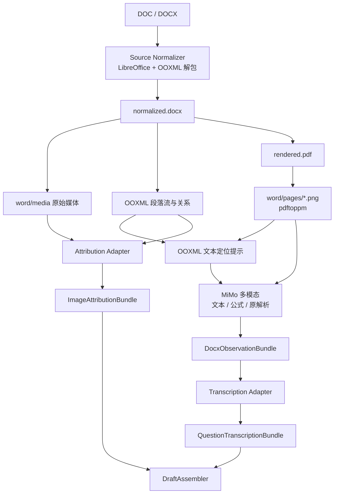

# DOC/DOCX 试卷转录与图片提取设计

## 1. 文档状态

- 状态：实施原型（DOCX 主 provider 为 MiMo，百炼 OCR 仅作显式降级）
- 上位架构：`docs/question-transcription-architecture.md`
- 输入：`.doc`、`.docx`
- 输出：
  - `QuestionTranscriptionBundle/v1`
  - `ImageAttributionBundle/v1`
- 下游：统一 `DraftAssembler`，再进入现有 expand/materialize/audit/Review UI

本文只设计 DOC/DOCX 来源如何产生两个标准 Bundle，不修改下游
`math_exam_staging_draft/v1` 和题库 schema。

## 2. 已确认的设计决定

1. `.doc` 先使用 LibreOffice 规范化为 `.docx`。
2. DOCX 使用 LibreOffice 渲染为 PDF，再使用 `pdftoppm` 生成不可变整页 PNG。
3. 独立题图和解答图优先直接提取 `word/media/*` 原图，不从 PDF 页二次裁切。
4. 文字和公式以渲染页为最终视觉凭证。
5. 文字、数学公式、题目边界和原解析统一由 MiMo 从渲染页转写。
6. OOXML 普通文字只作为低成本定位提示；低置信结果由 Agent 组织人工复核。
7. OOXML 段落结构提供图片归属候选；Agent 只组织不确定归属的人工复核，不重复提取原图。
8. Provider 不直接写 `paper.draft.yaml`，只输出标准 Bundle。

## 3. 不做什么

- 不把 WMF/EMF 公式对象当作题图。
- 不根据 `image10.png` 之类的文件名猜题号。
- 不让 OCR 或 Agent 直接生成 `Q001` 等最终 item ID。
- 不从 OCR 文本自动概括或合并 `solution_steps`。
- 不生成式重画低分辨率原图。
- 不在转录阶段把解答图强行绑定到某个解题步骤。

## 4. 总体流程



## 5. 阶段 A：确定性来源规范化

复用现有：

```bash
./.venv/bin/python \
  .codex/skills/math-docx-question-bank-ingestion/scripts/extract_docx_source.py \
  <paper.doc-or-docx> <source-archive>/word
```

现有脚本已经完成：

- `.doc` → `.docx` 规范化；
- DOCX ZIP 解包；
- 提取 `word/document.xml` 和关系文件；
- 提取 `word/media/*`；
- 建立段落流；
- 计算初步图片归属；
- LibreOffice：DOCX → PDF；
- `pdftoppm`：PDF → PNG；
- 记录来源 SHA-256、页面尺寸和媒体尺寸。

规范化结果必须不可变：

```text
word/
├── source.doc|source.docx
├── normalized.docx
├── rendered.pdf
├── word-source.yaml
├── ooxml/
├── media/
└── pages/
```

若输出目录已存在，脚本不得覆盖。要重跑必须创建新归档版本，避免已有 bbox 和证据路径
漂移。

## 6. 阶段 B：文本与公式初稿

### 6.1 Provider 分层

固定职责：

1. OOXML 普通文字：低成本定位提示，不作为权威转录。
2. MiMo：从整页 PNG 统一识别中文、题号、分值、答案锚点、
   数学公式、题目边界和原解析步骤。
3. 百炼 `qwen3.5-ocr`：仅在 MiMo 不可用且操作者显式选择时作为逐页降级 provider。
4. Agent：只编排调用、检查 contract/merge 冲突并组织人工复核，不亲自读取页面转写。

这样做的原因：

- OOXML 普通文字几乎没有推理成本；
- 数学试卷中的普通文字、公式和版面无法可靠预切分，统一用 MiMo 避免重复识别；
- 同图合成测试中 MiMo 完整识别公式，而百炼 OCR 出现漏平方；
- 最终证据始终指向 `word/pages/*.png`，不把 OOXML/OCR 当成原卷。

### 6.2 页面处理粒度

MiMo 默认使用 3 页、重叠 1 页：

```text
窗口 1：P1 P2 P3
窗口 2：      P3 P4 P5
窗口 3：            P5 P6 P7
```

重叠窗口用于观察跨页题干和解析，并用重复页发现转写冲突。跨页范围仍由题号 seed 和
现有 `word_evidence_pages.py` 展开器最终补齐，不把模型页码判断直接视为权威。
DOCX 不消费模型 bbox。

窗口结果用于识别：

- 跨页题干；
- 跨页官方解答；
- 下一题题号；
- `【答案】/【分析】/【详解】` 边界；
- 题目与解析是 interleaved 还是 separated。

相同题号出现在重叠窗口时不能用“最后一个覆盖前一个”。编排器应按页码、题号和视觉
锚点做确定性合并；文本冲突进入 report。

## 7. 阶段 C：图片提取与归属

### 7.1 原图提取

位图原图直接来自：

```text
normalized.docx!/word/media/*
```

支持 PNG/JPEG/GIF/BMP/TIFF/WebP。每个资产记录：

- 路径；
- SHA-256；
- media type；
- width/height；
- OOXML relationship id；
- 出现段落索引。

WMF/EMF 默认视为公式或矢量对象候选，不自动进入题图资产。无法判定时标为
`needs_review`，不能静默忽略。

### 7.2 归属策略

OOXML 段落状态机先给出候选：

```yaml
media: media/image10.png
question_ref: "18"
role: solution
paragraph_index: 192
confidence: high
```

状态策略：

| 条件 | 建议状态 |
|---|---|
| 单一题号区间、角色锚点明确、图数吻合 | `accepted` |
| 合成图、多图选择题、多小问、角色可能错位 | `needs_review` |
| orphan、跨段重复、无法确定题号 | `needs_review` |
| 明确为 Logo、二维码、装饰或公式对象 | 资产 `ignored` |

Agent 对 `needs_review` 项组织人工核对：

- 渲染页；
- 原始媒体图；
- 前后段落文字；
- 当前题号区间；
- MiMo 转录。

它只返回归属决定，不产生新的图片副本。DOCX 原图统一使用：

```yaml
crop:
  kind: full
```

Assembler 根据原图尺寸展开为 `[0, 0, width_px, height_px]`。

## 8. 联合观察类型

MiMo 与 OOXML 定位提示先收敛为内部类型
`DocxObservationBundle/v1`，再拆成两个公共 Bundle。

建议结构：

```yaml
schema: math_docx_observation/v1
paper_id: 2025-YANGPU-ERMO
pages:
  - page_number: 13
    source: documents/.../word/pages/013.png
    width_px: 1489
    height_px: 2105
    sha256: sha256:...
questions:
  - question_ref: "18"
    question_number: 18
    question_type: short_answer
    points: 4
    content:
      stem_latex: ...
      answer: ...
      clue: ...
      solution_steps: [...]
      solution_notes: []
    evidence:
      question_pages: [13]
      solution_pages: [14]
      solution_start_anchor: "【解答】"
      solution_end_anchor: "19．"
    transcription_confidence:
      stem: high
      formula: medium
      solution_steps: high
assets:
  - asset_id: word-image10
    source: documents/.../word/media/image10.png
    question_ref: "18"
    role: solution
    confidence: high
    decision: accepted
    evidence:
      paragraph_index: 192
```

这是 provider/orchestrator 的联合工作结果，不是下游稳定接口。两个 Adapter 分别输出：

- `QuestionTranscriptionBundle/v1`
- `ImageAttributionBundle/v1`

## 9. 转录规则

- 题目顺序来自文档视觉顺序，不来自媒体编号。
- 选择题必须输出四个纯选项正文，答案为 `A/B/C/D`。
- `problem` 和 `short_answer` 必须有有序 `solution_steps`。
- 原解答分几步，输出就保留几步；不自动总结。
- 模型识别疑点写入 `solution_notes`，不擅自纠正原解答。
- `clue` 可以由 Agent 生成，但必须与原文转录字段分离。
- Question/Solution evidence 必须覆盖完整连续页区间。
- 题干与解答同页时，同一页允许出现在两个 evidence 数组。

## 10. 失败和降级

| 失败 | 处理 |
|---|---|
| LibreOffice 转换失败 | 硬错误，不进入模型阶段 |
| `pdftoppm` 失败或页面为空 | 硬错误 |
| DOCX ZIP/关系文件损坏 | 硬错误 |
| 媒体尺寸无法读取 | 保留在 observation/report 中并标 `needs_review`；补齐尺寸前不进入标准图片 Bundle |
| MiMo 无结果 | 重试；仍失败时可由操作者显式选择百炼 OCR 降级 |
| 重叠窗口文本冲突 | 保留双方证据，题目进入人工确认 |
| 图片归属不确定 | attribution `needs_review`，不进入 draft |
| 公式低置信 | 局部重识别，不重新处理整卷 |
| 跨页边界不确定 | 请求人工确认 layout/seed page |

模型调用失败可以重试，但同一 `page_sha256 + provider_version + prompt_version` 必须使用
缓存，避免重复计费和结果漂移。

## 11. 计划新增模块

建议新增而非扩张现有 Adapter：

```text
scripts/question_transcription/
├── observe_docx_pages.py
├── docx_observation_contracts.py
├── merge_docx_observations.py
├── adapt_docx_transcription.py
└── adapt_docx_images.py
```

职责：

- `observe_docx_pages.py`：默认调用 MiMo；百炼 OCR 为显式降级；
- `merge_docx_observations.py`：合并重叠窗口；
- `adapt_docx_transcription.py`：产生文本 Bundle；
- `adapt_docx_images.py`：消费媒体和已决策归属；
- `DraftAssembler`：保持 provider 无关。

## 12. 最小验收集

1. `.doc` 和 `.docx` 都能产生不可变页图和媒体清单。
2. 同一输入重复运行，标准 Bundle 字节稳定。
3. PNG/JPEG 原图直接来自 `word/media/*`。
4. WMF/EMF 不会被误作题图。
5. MiMo 重叠窗口冲突不能静默覆盖。
6. 跨页题干和解答 evidence 完整。
7. accepted 图片归属全部且仅消费一次。
8. `needs_review` 图片不进入 draft。
9. 杨浦 Q18：`image9` 为 prompt、`image10` 为 solution，六个步骤原样保留。
10. Bundle → Assembler → expand → materialize → audit 全链通过。

## 13. 实施阶段与通报点

每个阶段开始编码前都应先提交样例产物供确认：

1. **D1 来源规范化确认**：展示真实 `word-source.yaml`、页图和媒体目录。
2. **D2 MiMo 输出确认**：展示一题普通题、一题复杂公式题、一题跨页题。
3. **D3 图片归属确认**：展示 high/medium/low 各一个案例。
4. **D4 Bundle 确认**：展示完整 `QuestionTranscriptionBundle` 和
   `ImageAttributionBundle`。
5. **D5 端到端验收**：只有 audit 真正返回 0 才算完成。

未经前一通报点确认，不把下一阶段称为完成。

## 14. Provider 验证

当前 DOCX 主 provider 使用系统环境中的 `MIMO_API_KEY` 和 `mimo-v2.5`。验证只允许
发送 `/tmp` 生成的合成数学页，未经授权不发送仓库真实试卷。

调用只用于验证 DOCX 渲染页上的题干、公式和解答转录。模型即使额外返回了图形
bbox，也会被严格 contract 拒绝且不会被图片 Adapter 消费：DOCX 独立题图来自
`word/media/*` 原图并使用 `crop: full`，图片归属来自 OOXML 段落结构。

2026-07-28 使用同一张 `/tmp` 1400×1800 合成数学页对比：

- MiMo 正确识别 Q18 题干、最终答案 `23` 和全部 `1/x²`；
- 百炼 `qwen3.5-ocr` 把解答中的一处 `1/x²` 误写为 `1/x`；
- 因此 MiMo 作为数学试卷统一主 provider；百炼保留为显式故障降级，不参与正常主链。
- 完整 observation 调用中 MiMo 曾把空分值/单条解析返回为 `""`/字符串；脚本现已
  无损规范化为 `0`/单元素数组，公式和解答正文保持原样。

当前实现仅允许 OOXML 结构判断为 `high` 的 DOCX 原媒体归属自动 accepted；
`medium/low` 均为 `needs_review`。

2026-07-28 已获授权使用 2024 普陀二模真实 DOCX 验证：

- LibreOffice 重新渲染出 38 页，MiMo 完成 19 个标准重叠窗口和 1 个补充窗口；
- Q1–Q3 的完整 Bundle → Assembler → expand → materialize → audit 链路通过；
- 整卷 25 题均能由 partial window 合并成完整候选，但 17 题存在内容或 evidence 冲突，
  默认 adapter 拒绝继续；
- 与冻结后才读取的已有结构化结果对照，Q18 和 Q25 出现实质差异；回看原始来源页后，
  Q18 判定为已有基线整题错配、盲跑正确，Q25 判定为基线正确、盲跑候选选择错误；
- 因而真实页“可观察、可恢复、可阻断错误”，但尚未达到整卷无人值守验收标准。

详细记录见 `docs/question-transcription-p4-acceptance-2026-07-28.md`。
