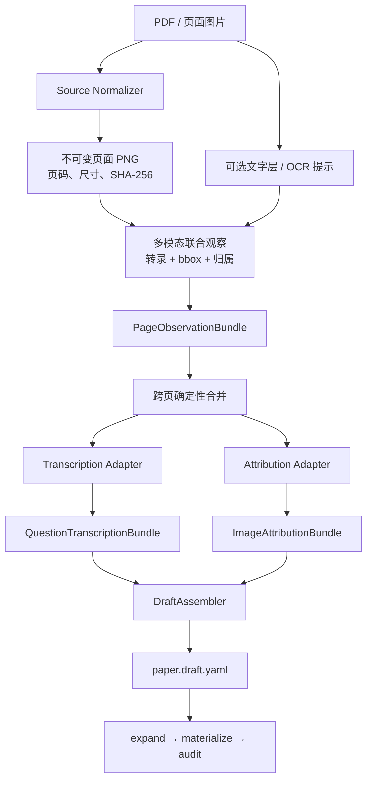

# PDF/扫描试卷联合转录与图片裁切设计

## 1. 文档状态

- 状态：实施原型（已通过合成页 MiMo 验证，真实试卷页待授权验证）
- 上位架构：`docs/question-transcription-architecture.md`
- 输入：可检索 PDF、扫描 PDF、已编号 PNG/JPEG 页面
- 输出：
  - `QuestionTranscriptionBundle/v1`
  - `ImageAttributionBundle/v1`
- 下游：统一 `DraftAssembler`，再进入现有 expand/materialize/audit/Review UI

本文设计真正的 PDF ingestion 链路。现有 `adapt_pdf_images.py` 只是
“检测 YAML → 标准 Bundle”的 Adapter，不等于 PDF 解析器，也不等于图片检测器。

## 2. 已确认的设计决定

1. PDF 首先确定性渲染为不可变整页 PNG。
2. 普通 PDF 使用现有 `render_pdf_pages.py`，底层为 `pdftoppm`，不使用 LibreOffice。
3. 多模态 Agent 以整页图为主要输入。
4. 一次多模态调用同时返回文本/公式转录和图片 bbox。
5. PDF 题图不优先提取内部 image object，而是从页面渲染图按 bbox 裁切。
6. Agent 只返回 bbox 和语义，不直接返回裁切后的图片字节。
7. Python 负责 bbox 校验、确定性裁切、哈希、排序和 Bundle 组装。
8. 文本与图片可以来自同一次模型调用，但必须经两个 Adapter 拆成标准 Bundle。

## 3. 为什么不直接提取 PDF 内部图片

数学试卷里的“一个题图”在 PDF 中可能是：

- 一个嵌入位图；
- 多个矢量 path；
- 位图加独立文字标签；
- 多个对象组合；
- 整页扫描图的一部分。

直接提取 PDF image object 可能丢失点名、坐标轴刻度或文字标签，也无法覆盖扫描件。
因此 v1 统一使用页面视觉 bbox。内部对象提取未来只能作为清晰度增强或诊断信息，不能
作为主归属链路。

## 4. 总体流程



## 5. 阶段 A：页面规范化

复用现有：

```bash
./.venv/bin/python \
  .codex/skills/math-pdf-question-bank-ingestion/scripts/render_pdf_pages.py \
  <paper.pdf> <source-archive-dir>
```

底层命令：

```text
pdftoppm -png -r <dpi> input.pdf page
```

### 5.1 DPI

- 默认沿用 180 DPI。
- 若小字号公式、上下标或根号明显不可辨，可按卷提升到 240 DPI。
- 一卷只能选择一个主 DPI；进入模型和下游的 bbox 均基于主页面图。
- 不允许识别使用 180 DPI、裁切却使用另一套 240 DPI 图而不转换坐标。

### 5.2 不可变页面记录

建议新增页面 manifest：

```yaml
schema: math_pdf_source/v1
source:
  path: documents/.../source.pdf
  sha256: sha256:...
render:
  engine: pdftoppm
  dpi: 180
pages:
  - page_number: 1
    source: documents/.../001.png
    width_px: 1489
    height_px: 2105
    sha256: sha256:...
```

页面一旦被 Bundle 引用不得覆盖。新 DPI 或重新渲染必须产生新来源版本。

## 6. 阶段 B：联合多模态观察

### 6.1 一次调用的职责

多模态 Agent 查看整页图，同时完成：

- 识别章节、题号、题型和分值；
- 转录题干、选项、答案和原解答步骤；
- 识别 question/official-solution 证据区域；
- 识别独立 prompt/solution 视觉对象；
- 返回每个视觉对象的 bbox；
- 判断图片属于哪道题及其角色；
- 标记跨页延续、低置信公式和疑点。

这样可以共享题号和版面上下文，避免“文本模型认为是 Q18，图片模型认为是 Q19”的
二次对齐问题。

### 6.2 页面窗口

默认使用 2–3 页重叠窗口，而不是完全孤立单页：

```text
P1 P2 P3
      P3 P4 P5
            P5 P6 P7
```

对试卷和答案分册，可分别建立窗口，再按题号合并。窗口必须带：

- 每页明确的 `page_number`；
- 页面像素尺寸；
- 页图 SHA-256；
- 当前文档角色：question、solution 或 mixed；
- 可选 OCR/文字层提示。

### 6.3 坐标契约

Agent 输出统一使用原始页图像素坐标：

```yaml
box_px: [left, top, right, bottom]
```

必须满足：

```text
0 <= left < right <= width_px
0 <= top < bottom <= height_px
```

若模型 API 只能返回 0–1000 归一化坐标，Provider Adapter 必须转换为像素坐标，并在
provenance 中记录转换前坐标；标准 Bundle 中只允许像素坐标。

### 6.4 联合观察示例

```yaml
schema: math_pdf_page_observation/v1
paper_id: 2024-FENGXIAN-ERMO
provider:
  kind: vision_api
  name: multimodal-transcriber
  version: prompt-v1
pages:
  - page_number: 4
    source: documents/.../004.png
    width_px: 1240
    height_px: 1754
    sha256: sha256:...
questions:
  - question_ref: "24"
    question_number: 24
    section_title: 三、解答题
    question_type: problem
    points: 12
    content:
      stem_latex: ...
      choices: []
      answer: ...
      clue: ...
      solution_steps:
        - ...
      solution_notes: []
    evidence:
      question:
        - page_number: 4
          box_px: [80, 210, 1010, 860]
      solution:
        - page_number: 8
          box_px: [80, 120, 1010, 700]
      solution_start_anchor: "24．"
      solution_end_anchor: "25．"
    figures:
      - local_id: q24-prompt-1
        page_number: 4
        role: prompt
        box_px: [650, 315, 1000, 690]
        confidence: high
        state: accepted
    confidence:
      stem: high
      formula: medium
      solution_steps: high
    continues_from_previous: false
    continues_to_next: false
```

这个联合类型是 provider/orchestrator 的内部接口。随后拆为两个公共 Bundle，避免
DraftAssembler 依赖某个模型响应格式。

## 7. 阶段 C：文本与公式转录

### 7.1 辅助输入

可检索 PDF 可以提供文字层，扫描件可以提供 OCR 初稿。它们只作为模型提示：

- 不能替代页面视觉证据；
- 不能用文字层坐标直接当作最终 bbox；
- 公式冲突时以页图核对结果为准；
- OCR 缺字、乱码必须保留低置信标记。

### 7.2 内容规则

- `stem_latex` 忠实转录，不把题图内容编造成文字条件。
- 选择题输出四个纯选项正文。
- 答案保持原卷表达；选择题答案标准化为 `A/B/C/D`。
- 原解答分几步，`solution_steps` 就保留几步。
- 不自动补证明、不修正原答案；疑点进入 `solution_notes`。
- `clue` 与原文转录分离，可以由同一次 Agent 调用生成。
- 每题必须有完整 question 和 solution evidence。

## 8. 阶段 D：图片检测与裁切

### 8.1 图片角色

联合观察只产生两种独立视觉对象：

- `prompt`：学生完成题目必需的题图、表格、照片或强排版材料；
- `solution`：官方解答中的独立解答图。

整题来源区域不是 prompt：

- `question_evidence`：原题审计证据；
- `official_solution` evidence：完整原解答审计证据。

因此一页上可能同时出现：

```text
大框：question_evidence
小框：prompt
```

两者用途不同，允许重叠。

### 8.2 Python 的职责

Agent 返回 bbox 后，Python 必须：

1. 校验 bbox 为整数且在页面范围内；
2. 校验正面积；
3. 生成稳定 `asset_id` 和 `attribution_id`；
4. 按 `(question_ref, role, order)` 排序；
5. 将页图作为 asset；
6. 只在 materialize 阶段真正裁出 PNG；
7. 记录页图 SHA-256 和输出图 SHA-256；
8. 检查 accepted attribution 全部且仅消费一次。

不要让模型返回 base64 裁图，也不要在 Adapter 中使用非确定性的图像增强。

### 8.3 状态策略

| 观察结果 | state |
|---|---|
| 题号、角色、主体和必要标签均明确 | `accepted` |
| bbox 可用但边界、水印或少量邻近文字不理想 | `accepted`，下游 `needs_human_crop` 提示 |
| 题号、角色、主体完整性不确定 | `needs_review` |
| 明确不是题图/解答图 | `rejected` 或资产 `ignored` |

`medium confidence` 不应无条件转为 accepted。状态由编排策略显式决定，confidence 只描述
模型自信程度。

## 9. 阶段 E：跨页合并

重叠窗口可能产生重复观察。确定性合并规则：

1. 以 `question_ref` 为主键。
2. 页码和 bbox 完全相同的观察去重。
3. 相同字段文本完全相同则合并 provenance。
4. 文本不同不得最后写入者覆盖；产生 `transcription_conflict`。
5. 相同 `(question_ref, role, order)` bbox 不同，产生 `figure_conflict`。
6. `continues_*` 必须形成闭合的连续页链。
7. solution evidence 从答案锚点覆盖到下一题答案锚点。
8. 最后一题使用 `<END_OF_SOURCE>`。

冲突解决属于 provider/orchestrator，不进入 DraftAssembler。

## 10. Provider 缓存与可重复性

模型结果缓存键至少包含：

```text
page_sha256
+ neighbor_page_sha256[]
+ provider_name/version
+ prompt_version
+ observation_schema_version
```

缓存保存原始 provider 响应和标准化 observation。重试不能覆盖旧响应，应建立 attempt
记录并由 orchestrator 选择唯一版本。

相同已选 observation 必须生成字节稳定的两个标准 Bundle。

## 11. 失败和降级

| 失败 | 处理 |
|---|---|
| PDF 无法渲染 | 硬错误 |
| 加密 PDF | 报告需要密码，不尝试绕过 |
| 页面旋转错误 | 确定性旋转后生成新页面版本 |
| 模型调用失败 | 按缓存键重试 |
| 某页 OCR 失败 | 仍可交给多模态 Agent |
| 文本成功、bbox 失败 | 保留文本观察，图片标 `needs_review` |
| bbox 成功、公式失败 | 保留图片观察，公式局部重识别 |
| 题号边界冲突 | 不组装该题，进入人工确认 |
| bbox 越界 | Adapter 硬错误 |
| 只有轻微裁框问题 | 保留并标 `needs_human_crop` |
| 主体或必要标签缺失 | 硬错误，允许重做一次 |

联合调用不意味着联合成败：文本和图片字段必须能独立降级。

## 12. 计划新增模块

```text
scripts/question_transcription/
├── pdf_source_manifest.py
├── observe_pdf_pages.py
├── pdf_observation_contracts.py
├── merge_pdf_observations.py
├── adapt_pdf_transcription.py
└── adapt_pdf_images.py
```

职责：

- `pdf_source_manifest.py`：记录不可变页面、尺寸和哈希；
- `observe_pdf_pages.py`：调用多模态 Agent；
- `merge_pdf_observations.py`：合并重叠窗口；
- `adapt_pdf_transcription.py`：输出文本 Bundle；
- `adapt_pdf_images.py`：输出图片 Bundle；
- `DraftAssembler`：保持 provider 无关。

现有 `adapt_pdf_images.py` 可保留为底层标准化函数，但它的输入必须来自真实
observation pipeline，不能再用手写 detection fixture 代表 P3 完成。

## 13. 最小验收集

1. 可检索 PDF 和扫描 PDF 都能生成不可变页图 manifest。
2. 同一页面重复处理命中缓存。
3. 一次 provider 响应同时包含转录和图片 bbox。
4. Adapter 能将联合观察拆成两个合法 Bundle。
5. bbox 使用原始页图像素坐标并通过边界检查。
6. question evidence 和 prompt bbox 正确区分。
7. 文本成功/bbox 失败与 bbox 成功/文本失败可独立降级。
8. 跨页题干和跨页解答正确合并。
9. `solution_steps` 数量、顺序和文本不变。
10. PDF region bbox 经 Assembler 和 materialize 后像素位置不漂移。
11. Bundle → Assembler → expand → materialize → audit 返回码必须为 0。
12. 同一道题以 PDF 和 DOCX 来源处理后，除 evidence variant 和图片 source 外，
    题目结构等价。

## 14. 实施阶段与通报点

1. **P1 页面规范化确认**：展示真实 PDF 页图、尺寸、DPI 和 manifest。
2. **P2 联合响应确认**：用 3 个代表页面展示模型原始响应：
   - 纯文字/公式题；
   - 含独立题图题；
   - 跨页题或解答页。
3. **P3 bbox 物化确认**：展示原页、bbox 数据和确定性裁图。
4. **P4 Bundle 确认**：展示从同一响应拆出的两个 Bundle。
5. **P5 端到端验收**：只有 audit 返回 0 且 Review UI 可对照来源时才算完成。

每个通报点需要确认后再进入下一阶段。测试允许已知失败只能记为未完成，不能记为验收
通过。

## 15. 合成页 MiMo 验证结果

使用系统环境中的 `MIMO_API_KEY` 和官方 `mimo-v2.5`，仅发送 `/tmp` 生成的
1200×1600 合成中文数学页，未发送仓库真实试卷：

- 返回结果通过严格 observation contract；
- Q18 题干、答案、公式和三步原解答转写正确；
- question evidence 为 `[30, 32, 1170, 224]`；
- solution evidence 为 `[30, 976, 1170, 1216]`；
- 独立题图 bbox 为 `[444, 240, 1020, 832]`；
- 人工完整图框约为 `[565, 240, 1065, 690]`，IoU 约 `0.567`；
- 右侧 C 标签少约 45 px，且左侧、下侧留白偏大。

结论是文本转录可用，但模型即使自报 `high/accepted`，bbox 也不足以直接消费。当前
Adapter 默认将模型 accepted 降级为 `needs_review`；只有人工确认后显式使用
`--allow-model-accepted` 才保留 accepted。
